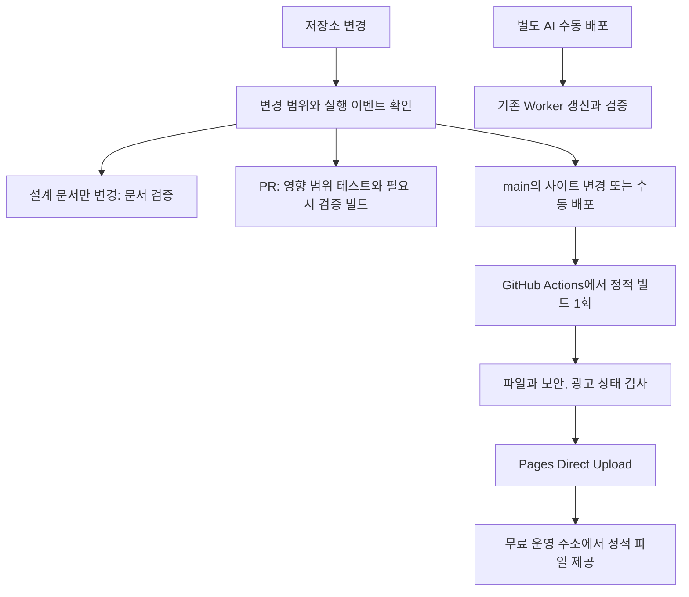
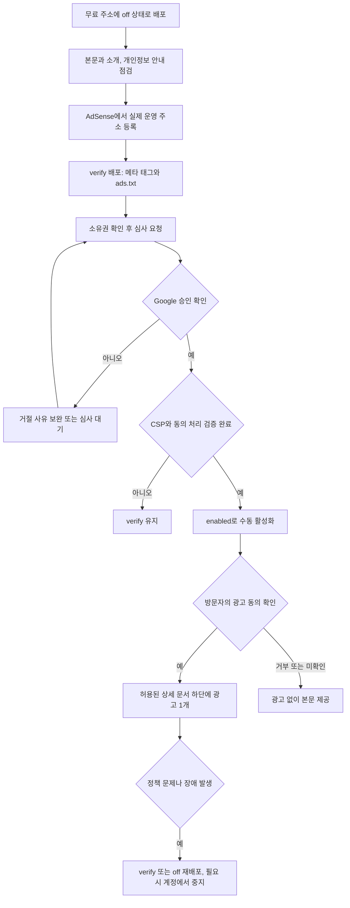

# 정적 사이트와 AdSense 도입 명세

작성일: 2026-09-28

상태: 구현 전 설계. 이 문서의 추가는 호스팅 이전, 광고 활성화, 보안 완화의 실행을 뜻하지 않습니다.

기준 코드: `main`의 `abfe15881f1f090e02c9da732c690aa140aec886`.

구현 순서는 [실행 계획](../plans/2026-09-28-static-adsense-minimal-cloudflare.md)에 둡니다.

## 1. 목표와 범위

현재 VitePress 이력 사이트를 유지하면서 무료 `pages.dev` 주소에 배포합니다. Cloudflare는 정적 파일 제공에만 사용합니다. AdSense 사이트 등록, 소유권 확인, 심사, 동의 처리, 승인 후 실제 광고 표시, 광고 중단까지 연결합니다.

이번 문서 PR에는 명세와 실행 계획만 포함합니다. 앱 코드, 워크플로, 계정 설정, 토큰, 운영 배포는 변경하지 않습니다. 기존 워크플로는 문서만 변경한 `main` 푸시에도 배포하므로, 이 PR을 병합하는 것만으로 아래의 사용량 절감이 적용되지는 않습니다.

이력서 첫 화면과 목록은 광고 없이 유지합니다. 운영자가 검토한 프로젝트 상세 문서에만 본문 하단 반응형 광고 1개를 배치합니다. 광고 승인이나 수익을 보장하지 않습니다. 자동 광고, 전면 광고, 광고 클릭 유도는 초기 범위에서 제외합니다.

## 2. Cloudflare 사용 원칙

다음 값은 구현 후의 목표입니다. 현재 설정에 이미 적용된 값이 아닙니다.

| 항목 | 결정 |
| --- | --- |
| Cloudflare 빌드 | 0회. Git 연동 빌드 대신 Direct Upload 사용 |
| PR과 작업 브랜치의 Cloudflare 배포 | 0회. 검증은 GitHub Actions에서 수행 |
| Pages Functions | 0개. `functions/`, `_worker.js`, HTML 재작성 미들웨어를 배포하지 않음 |
| 광고용 신규 Worker와 저장소 | 0개. 광고 프록시, KV, D1, R2, Durable Object 추가 금지 |
| 정적 사이트 빌드 | 배포할 `main` 커밋당 GitHub Actions에서 1회 |
| 정적 운영 배포 | 관련 파일 변경 후 검증에 통과한 `main` 또는 명시적 수동 실행만 허용 |
| 설계 문서만 변경 | 문서 검증만 실행. 사이트 빌드, 배포, Worker 호출 없음 |
| 기존 AI Worker | 별도 수동 배포로 분리. 광고와 정적 사이트 제공의 필수 의존성에서 제외 |
| 정기 작업 | 자동 재빌드, 광고 상태 폴링, 배포용 Cron 추가 금지 |
| 요금제 | 무료 플랜 유지. 유료 전환이나 도메인 구매를 자동 수행하지 않음 |

Direct Upload는 외부에서 만든 파일을 업로드하는 방식입니다. Cloudflare 빌드 서비스를 쓰지 않는다는 뜻이지, 배포 API 호출이나 플랫폼 한도가 없어지는 뜻은 아닙니다. 정적 요청도 Functions를 거치지 않을 때에만 정적 요청으로 취급합니다. 기존 AI Worker의 요청과 저장소 사용량은 별도로 남습니다. [Direct Upload](https://developers.cloudflare.com/pages/get-started/direct-upload/), [정적 요청과 Functions 과금](https://developers.cloudflare.com/pages/functions/pricing/)

신규 Pages 프로젝트는 Direct Upload로 생성합니다. 이미 Git 연동 프로젝트가 있으면 운영과 미리보기 자동 배포를 모두 끄는 절차부터 확인합니다. 프로젝트 유형을 바로 바꿀 수 있다고 가정하지 않습니다. [Git 연동과 자동 배포 중지](https://developers.cloudflare.com/pages/configuration/git-integration/)

PR 미리보기 배포를 만들지 않아도 플랫폼이 운영 배포별 주소를 제공할 수 있습니다. 광고와 Clarity는 확정된 운영 Origin에서만 실행합니다. `*.pages.dev` 전체를 허용하지 않습니다.

## 3. 현재 코드에서 바꿀 지점

| 현재 파일 | 확인한 상태 | 구현 방향 |
| --- | --- | --- |
| `.github/workflows/pages.yml` | 모든 `main` 푸시에서 Worker 배포와 실제 AI 검증 후 사이트 빌드 | 변경 범위 판정, 정적 배포와 AI 배포 분리 |
| `.github/workflows/docs-check.yml` | PR에서 Markdown 관련 경로를 검증 | 사이트 코드와 보안 설정 변경도 놓치지 않도록 검증 범위 보완 |
| `site/.vitepress/config.mjs` | `/work-history/`와 Clarity 호스트 고정 | 배포 대상별 base, Origin, canonical, sitemap 분리 |
| `scripts/prepare-site.mjs` | `site/content` 삭제 후 원본 문서 복사 | 소개와 개인정보 안내 원본을 별도 보관하고 생성 대상에 포함 |
| `scripts/prepare-chat.mjs` | 검색 결과 URL에 `/work-history/` 고정 | 사이트와 동일한 base 사용. 공개 검색 자료와 광고 설정 분리 |
| `scripts/secure-site.mjs` | 해시 기반 CSP와 `frame-src 'none'` | 비광고 정책 유지, 광고 정책은 6절의 승인 조건에 따라 분리 |
| `worker/index.mjs` | GitHub Origin만 허용 | 실제 새 Origin만 추가. 와일드카드 허용 금지 |
| `scripts/deploy-chat.mjs` | 배포 결과를 `GITHUB_ENV`에 전달 | 정적 배포가 매번 Worker를 배포해야 API 주소를 알게 되는 결합 해소 |

관련 원본은 [배포 워크플로](../../../.github/workflows/pages.yml), [사이트 설정](../../../site/.vitepress/config.mjs), [보안 설정](../../../scripts/secure-site.mjs), [AI 색인 생성](../../../scripts/prepare-chat.mjs)에 있습니다.

## 4. 배포 구조

### 변경 범위와 실행 횟수

`docs/**`, 작성 가이드, 템플릿만 바뀌면 문서 검증만 수행합니다. `experience.md`, `timeline.md`, `projects/**`, `site/**`, 정적 생성 스크립트, 의존성, 배포 설정이 바뀌면 사이트 변경으로 판정합니다. 파일 삭제와 이름 변경도 포함합니다.

필수 PR 검사는 항상 결과를 남깁니다. 무거운 작업은 job 또는 step 조건으로 생략하며, 워크플로 전체를 건너뛰어 필수 검사가 계속 대기하는 구조를 만들지 않습니다. PR 검증 빌드와 병합된 `main`의 운영 빌드는 서로 다른 검증 대상입니다. PR 산출물을 운영 산출물로 그대로 승격하지 않습니다.

Pages 업로드 단계만 배포 토큰을 받습니다. PR, fork, 테스트 단계에는 Cloudflare 토큰과 AI 키를 전달하지 않습니다. `pull_request_target`에서 PR 코드를 실행하지 않습니다. 취소 가능한 PR 검사와 중간 취소하지 않는 운영 배포의 concurrency를 분리합니다. 자동 배포 직전에 대상 SHA가 현재 `main`인지 확인해 오래된 실행의 역전 배포를 방지합니다.

빌드는 `npm ci`와 잠금 파일을 사용합니다. 기존 Node 22와 VitePress를 유지하고, 이번 작업을 이유로 프레임워크나 의존성을 일괄 갱신하지 않습니다. Pages 명령은 `wrangler pages deploy`를 사용하며 기존 Worker의 `wrangler deploy` 설정과 섞지 않습니다. 정적 업로드용 설정에는 Worker `main`, bindings, migrations를 넣지 않습니다.

### 기존 GitHub Pages와 전환

새 주소에서 먼저 광고 없이 수동 검증합니다. 기존 GitHub Pages는 검증이 끝날 때까지 유지합니다. 전환 시 두 base의 확인을 위한 별도 빌드는 일시적으로 허용하지만, 정상 운영에서 같은 변경을 두 플랫폼에 계속 자동 배포하지 않습니다.

최종 운영 대상은 Pages 하나입니다. 기존 GitHub Pages는 마지막 정상본을 보존하고 이전 안내를 남기는 대상으로 둡니다. 주소를 바꿀 때마다 오래된 주소의 canonical, 내부 링크, AI 검색 결과를 함께 점검합니다. 별도 루트 저장소나 DNS는 이 작업에서 임의로 변경하지 않습니다.

### 기존 AI 기능

정적 사이트의 `VITE_CHAT_API_URL`은 등록된 공개 API 주소를 사용합니다. Worker 배포 실패가 사이트 배포를 막지 않아야 합니다. 키는 계속 Worker Secret에만 둡니다.

Worker에는 문서 색인이 번들로 들어가므로 문서 변경 후 Worker를 배포하지 않으면 AI 자료가 오래될 수 있습니다. 사이트와 Worker가 각각 공개 색인의 SHA-256을 보유하고 `/health`에서 일치 여부를 확인하는 방식으로 보호합니다. 확인은 사용자가 질문을 보낼 때만 수행하며 주기적으로 호출하지 않습니다. 불일치, 장애, 시간 초과에는 실제 AI 호출 없이 최신 정적 `chat-docs.json`의 로컬 검색으로 전환합니다. API 주소가 비어 있어도 문서와 광고는 동작해야 합니다.

## 5. AdSense 상태와 전체 흐름

| `ADS_MODE` | 정적 산출물과 동작 |
| --- | --- |
| `off` | 기본값. 소유권 메타 태그, Google 광고 로더, 광고 슬롯, 게시자 정보가 담긴 `ads.txt`를 생성하지 않음 |
| `verify` | 실제 게시자 ID의 소유권 메타 태그와 `ads.txt`만 생성. 광고 로더와 슬롯은 생성하지 않음 |
| `enabled` | 승인과 보안 검토, 동의 설정 확인 후에만 사용. 운영 Origin의 허용된 상세 문서에 광고 1개 표시 |

위 상태 이름은 이 사이트의 설정이며 Google의 심사 상태와는 별개입니다. ID가 있거나 코드가 배포됐다는 이유로 Google 승인 완료로 표시하지 않습니다.

무료 주소는 플랫폼의 하위 도메인입니다. Google은 Public Suffix List에 포함된 플랫폼의 하위 도메인을 사이트 등록 유형으로 안내하며 `pages.dev`가 목록에 있습니다. 실제 주소의 등록과 승인 여부는 본인 계정에서 확인합니다. 거절되었다고 도메인을 구매하거나 다른 주소를 자동 생성해 재신청하지 않습니다. [Google의 사이트 등록 유형](https://support.google.com/adsense/answer/12170421?hl=ja), [Public Suffix List](https://publicsuffix.org/list/public_suffix_list.dat)

소유권 확인은 우선 메타 태그 또는 `ads.txt`를 사용합니다. Google은 홈페이지에 광고 코드를 넣지 않는 메타 태그 방식도 안내합니다. `ads.txt`는 운영 주소의 `/ads.txt`에서 실제 텍스트로 응답해야 하며, SPA의 HTML 대체 응답이면 실패로 판단합니다. 사이트 추가, 확인, 심사 요청은 운영자가 수행합니다. [사이트 추가와 확인 방법](https://support.google.com/adsense/answer/12169212?hl=en)

본문 분량이나 게시글 수만으로 승인 가능성을 보장하지 않습니다. 짧은 목록, 오류 페이지, 소개와 개인정보 안내, 근무 기록은 광고 대상에서 제외합니다. 충분한 설명과 자체 작업 기록이 있는 상세 문서를 운영자가 검토해 허용 목록에 넣습니다. 콘텐츠를 광고보다 우선합니다.

## 6. CSP와 정적 호스팅의 보안 판단

현재 CSP는 광고 스크립트와 iframe을 차단합니다. Google은 자원 도메인이 바뀔 수 있어 CSP 연동에 nonce 기반 strict CSP를 안내하고, 더 허용적인 정책을 선택할 수도 있다고 설명합니다. 고정된 Google 도메인 목록만 추가하거나 현재 해시에 `strict-dynamic`만 붙인 설정을 공식 호환 방식이라고 단정하지 않습니다. [AdSense CSP 안내](https://support.google.com/adsense/answer/16283098?hl=th)

요청마다 생성하는 nonce를 위해 Functions를 추가하는 이전 제안은 기본안에서 제외합니다. 빌드 시 고정한 nonce나 브라우저가 생성한 nonce를 요청별 보안 nonce로 취급하지 않습니다.

`off`와 `verify`, 광고 대상이 아닌 페이지는 기존 해시 기반 정책을 유지합니다. 광고 대상 페이지는 별도의 정적 광고 정책을 검토합니다. 이 정책은 광고 스크립트와 하위 자원의 실행을 허용하므로 기존 CSP의 스크립트 차단 보호를 동일하게 유지하지 못할 수 있습니다.

**보안 완화는 아직 승인되지 않았습니다.** 적용할 지시문, 추가로 허용되는 실행과 연결, 남는 보호 항목, 영향 URL을 `SECURITY.md`와 구현 PR에 명시하고 운영자의 별도 승인을 받아야 합니다. 이 확인 전에는 `ADS_CSP_MODE=strict`와 `ADS_MODE=verify`를 유지합니다. `enabled`와 `strict`의 조합은 빌드 오류로 중단합니다. 단순히 CSP 전체를 삭제하거나 Report-Only로 바꿔 검증을 통과시키지 않습니다.

광고용 정적 정책의 검토에서는 `object-src`, `base-uri`, `form-action` 등 유지 가능한 보호를 남깁니다. 제한을 유지하면서 광고가 동작하는지 실제 브라우저로 확인합니다. 정적 정책의 보안 저하를 수용하지 않으면 광고는 활성화하지 않고 설계를 다시 결정합니다. 함수 추가나 유료 기능 사용으로 자동 우회하지 않습니다.

HTTP 헤더는 빌드 결과의 `_headers`로 제공할 수 있습니다. 페이지별 CSP와 기존 meta CSP가 동시에 더 엄격하게 적용되지 않도록 하나의 정책 생성기에서 관리합니다. 모든 페이지에 강한 `/*` CSP를 추가한 뒤 상세 경로에서 완화할 수 있다고 가정하지 않습니다. [Pages 정적 헤더](https://developers.cloudflare.com/pages/configuration/headers/)

VitePress는 페이지를 새로 받지 않는 탐색이 있으므로, URL만 바꿔 CSP가 바뀌거나 이미 실행된 광고 코드가 제거된다고 가정하지 않습니다. 광고가 활성화된 페이지로 들어가거나 그 페이지에서 다른 문서로 이동할 때는 전체 문서 탐색을 사용합니다. 비광고 페이지끼리는 기존 탐색을 유지합니다. 같은 문서의 해시 이동은 광고를 새로 요청하지 않습니다. [VitePress 라우터 API](https://vitepress.dev/reference/runtime-api)

## 7. 동의, 광고 표시, 장애 처리

개인정보 안내에는 Google 광고와 쿠키, 거부 방법, Clarity, 선택적으로 사용하는 AI API의 데이터 처리 내용을 실제 구성에 맞게 적습니다. 안내 원본은 `site/pages/privacy.md`에 보관하고 생성 과정으로 복사합니다. [Google 개인정보 안내 필수 내용](https://support.google.com/adsense/answer/1348695?hl=en)

EEA, 영국, 스위스의 맞춤 광고에는 Google 인증 CMP 요건을 적용합니다. 단순한 자체 확인 버튼을 인증 CMP 대신 사용하지 않습니다. 초기 정책은 광고 동의가 미확인 또는 거부이면 광고를 요청하지 않는 것입니다. 지역을 추측해 동의를 생략하거나 비맞춤 광고가 모든 동의 요건을 없앤다고 가정하지 않습니다. [Google CMP 요건](https://support.google.com/adsense/answer/13554116?hl=en)

CMP의 초기화 코드와 광고 요청을 분리합니다. 동의를 받기 위한 CMP 코드까지 광고 동의 뒤로 미뤄 화면이 뜨지 않는 교착을 만들지 않습니다. 실제 선택한 인증 CMP의 초기화 순서를 따른 뒤 광고 요청이 동의보다 먼저 나가지 않는지 확인합니다. CMP 실패 시 본문은 유지하고 광고는 중단합니다.

광고 동의와 분석 동의를 별도로 취급합니다. Clarity의 동의를 AdSense 동의로 대신하지 않으며, Clarity에 동의 변경을 전달합니다. 새 Origin 허용만 추가한 채 쿠키 동작을 그대로 둬도 된다고 가정하지 않습니다. [Clarity Consent V2](https://learn.microsoft.com/en-us/clarity/setup-and-installation/clarity-consent-api-v2)

광고 슬롯은 서버 렌더링 중 외부 호출을 하지 않습니다. 브라우저에서 운영 Origin, 활성 상태, 허용 문서, 광고 동의, 슬롯 크기를 확인한 뒤 한 번만 초기화합니다. 중복 mount, 해시 이동, 뒤로 가기에서 같은 슬롯을 반복 등록하지 않습니다. 광고가 없거나 차단되면 빈 공간을 정리하고 본문과 탐색은 유지합니다. 자동 새로고침과 무한 재시도는 넣지 않습니다.

CI와 브라우저 자동 검증은 광고 SDK와 CMP를 모의 처리합니다. 실제 광고 클릭, 노출을 늘리기 위한 반복 방문, 실제 AI 호출은 테스트에 포함하지 않습니다. 승인 후 운영 확인은 필요한 수동 확인만 수행하고 수익 발생 여부와 광고 통합 동작 여부를 구분합니다.

## 8. 설정과 운영자 입력

| 설정 | 기본값과 용도 |
| --- | --- |
| `SITE_TARGET` | `github`. 기존 배포를 유지하고 전환할 때 `pages` 선택 |
| `SITE_ORIGIN` | 대상별 실제 HTTPS Origin. 경로, query, hash 없음 |
| `SITE_BASE` | GitHub는 `/work-history/`, Pages는 `/` |
| `CLOUDFLARE_PAGES_PROJECT` | 실제 생성한 프로젝트명. 사용 가능 여부를 추정하지 않음 |
| `CLOUDFLARE_ACCOUNT_ID` | 기존 계정 ID를 Variables로 사용 |
| `CLOUDFLARE_PAGES_API_TOKEN` | 해당 계정의 Pages Edit 배포용 Secret. 기존 Worker 토큰과 분리 |
| `ADS_MODE` | `off`. `verify`, `enabled`는 운영자가 명시적으로 선택 |
| `ADS_PUBLISHER_ID` | 비어 있음. 확인과 활성화 시 실제 `ca-pub-` ID 필수 |
| `ADS_SLOT_ID` | 비어 있음. 활성화 시 실제 광고 단위 ID 필수 |
| `ADS_CSP_MODE` | `strict`. 보안 검토 승인 후에만 `static-ads` 선택 |
| `VITE_CHAT_API_URL` | 기존 공개 API 주소 또는 빈 값. 광고와 무관 |

게시자 ID와 슬롯 ID는 공개 식별자이며 API Secret이 아닙니다. 반대로 배포 토큰과 `ORCAROUTER_API_KEY`는 공개 설정, 생성 HTML, Git 기록에 넣지 않습니다. Pages 토큰에 Worker 편집이나 Billing 권한을 광고 배포를 위해 추가하지 않습니다. [Pages 배포 토큰](https://developers.cloudflare.com/pages/how-to/use-direct-upload-with-continuous-integration/)

프로젝트명, 최종 Origin, 게시자 ID, 광고 단위 ID, 인증 CMP 설정, Google 심사 결과는 운영자가 제공하거나 직접 확인할 값입니다. 존재하지 않는 값이나 예시 ID로 운영 배포하지 않습니다. 계정 생성, 약관 동의, 결제와 세금 정보 입력, 심사 요청, 보안 완화 승인은 자동화하지 않습니다.

## 9. 완료와 복구 기준

코드 준비 완료, 무료 주소 배포 완료, Google 심사 승인, 실제 광고 표시 확인을 서로 다른 상태로 기록합니다. 코드 준비만으로 전체 광고 도입 완료라고 보고하지 않습니다.

완료 확인 항목은 다음과 같습니다.

- 무료 운영 주소에서 문서, 정적 자원, 직접 URL 접근, 새로고침, 검색, Mermaid가 정상 동작합니다.
- 설계 문서 PR과 변경에서 Cloudflare 배포와 실제 AI 호출은 0회입니다. 사이트 운영 배포는 빌드 1회와 정적 업로드만 수행합니다.
- 정적 업로드에 Functions나 Worker 산출물이 없고, 정적 사이트가 기존 AI 배포 성공을 기다리지 않습니다.
- `verify`에서 메타 태그와 루트 `ads.txt`를 확인하고 광고 네트워크 요청은 발생하지 않습니다.
- `enabled`는 승인, CSP 검토, CMP 검증 후에만 허용됩니다. 광고 대상 외 문서, 비운영 호스트, 동의 거부에서는 광고를 요청하지 않습니다.
- CSP 경계를 넘는 탐색, 광고 차단, 빈 광고, 동의 철회, AI 색인 불일치에서도 본문과 로컬 검색이 유지됩니다.
- 대표 URL의 canonical과 sitemap, robots의 Google 광고 크롤러 접근을 확인합니다. 기존 AI 학습 수집 제한은 새 base에 맞게 보존합니다.

문제가 생기면 광고는 `verify` 또는 `off`로 바꾸고 새로 빌드해 배포합니다. 정적 환경이므로 저장소 변수만 바꿔서는 이미 배포한 파일이 바뀌지 않습니다. 기존 브라우저 문서와 오래된 배포 주소의 코드도 즉시 회수된다고 보장하지 않습니다. 긴급한 광고 차단은 AdSense 계정의 광고 중지 조치도 함께 검토합니다.

사이트 자체는 Pages의 이전 정상 배포로 복구할 수 있습니다. 광고 기능을 끄기 위해 Worker나 개인정보 안내를 삭제하지 않습니다. 운영 배포 직전 SHA 검사에 의해 복구가 막히지 않도록, 과거 배포를 선택하는 수동 복구와 최신 `main` 자동 배포를 구분합니다. [Pages 배포 복구](https://developers.cloudflare.com/pages/configuration/rollbacks/)
