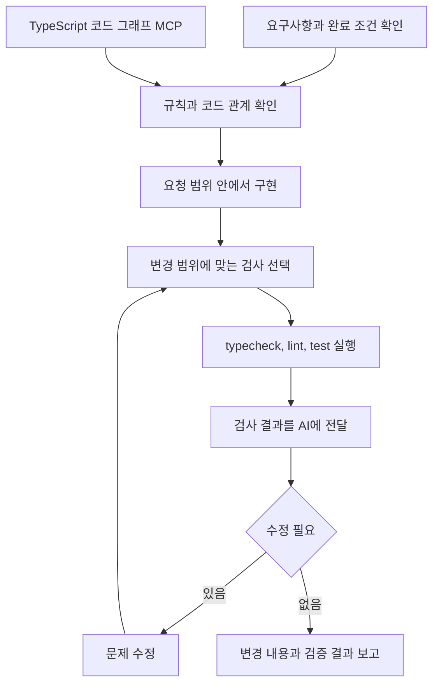

# AI 개발 품질 자동화 환경

[전체 작업 목록](../README.md)으로 돌아갑니다.

AI가 코드를 생성하는 것에서 끝나지 않고 요구사항 확인, 구현, 검사, 실패 분석, 수정과 재검증까지 이어가도록 개발 환경을 설계했습니다.
Codex와 Claude Code의 작업 규칙과 검증 흐름을 재사용할 수 있게 만들고, 기존 TypeScript 프로젝트의 의존성을 바꾸지 않으면서 코드 관계를 MCP로 탐색하는 분석 환경을 연결했습니다.

## 기본 정보

| 항목 | 내용 |
| --- | --- |
| 프로젝트 구분 | 사이드 |
| 회사 설명 | 해당 없음 |
| 참여 기간 | 2026-05 ~ 현재 |
| 맡은 범위 | AI 작업 규칙과 안전장치 설계, 검증 루프 자동화, 설치와 회귀 테스트 도구 개발, TypeScript 코드 그래프 MCP 환경 구성 |

## 설계 목표

AI의 자유도를 높이는 것보다 검증 가능한 결과를 만드는 데 초점을 맞췄습니다.
공통 작업 기준과 프로젝트별 검사 명령을 분리하고, 실제 typecheck와 lint, test 결과를 다시 AI의 수정 입력으로 사용하는 반복 구조를 구성했습니다.

| 구성 | 해결한 문제 |
| --- | --- |
| Codex 개발 및 검증 루프 | 변경 범위에 필요한 검사를 선택하고 실패를 수정한 뒤 다시 검증 |
| Claude Code 개발 워크플로 | Rules, Skills, Hooks로 작업 전후 안전장치와 검증 절차 구성 |
| TypeScript 코드 그래프 분석 | 대상 저장소의 의존성을 바꾸지 않고 심볼, 타입과 호출 관계를 MCP로 탐색 |

## 전체 흐름

## AI에게 맡기지 않은 것

- 최종 완료 판단은 AI의 설명이 아니라 프로젝트의 타입 검사, 린트, 테스트와 실제 변경 내용을 기준으로 합니다.
- MCP 그래프는 코드 탐색을 돕지만 함수 내부 동작과 최종 검증을 대신하지 않습니다.
- 프로젝트마다 다른 규칙과 명령을 하나의 고정 설정으로 강제하지 않고 적용 대상에 맞게 분리합니다.
- 효과를 측정하지 않은 품질 향상률이나 토큰 절감률을 성과로 사용하지 않습니다.

## 작업 목록

| 작업 | 요약 |
| --- | --- |
| [Codex 개발 및 검증 루프 자동화](codex-quality.md) | 변경 범위에 맞는 검사를 선택하고 문제 수정과 재검증까지 이어가는 품질 루프 구성 |
| [Claude Code 개발 워크플로 자동화](claude-workflow.md) | Rules, Skills, Hooks로 요구사항 확인부터 타입 검사와 테스트 피드백까지 연결 |
| [AI용 TypeScript 코드 그래프 분석 환경](typescript-graph.md) | 대상 프로젝트 의존성을 변경하지 않고 심볼, 타입과 호출 관계를 MCP로 탐색 |
