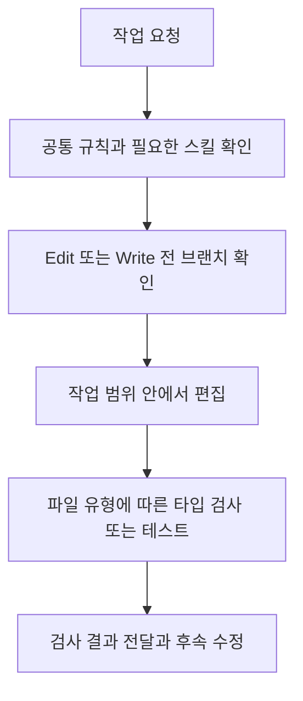

# Claude Code 작업 규칙과 검증 설정

[AI 개발 환경 작업 목록](README.md)으로 돌아갑니다.

Claude Code의 작업 규칙과 반복 작업 절차를 나누고, 코드 편집 전후 검사를 연결한 설정 템플릿을 만들었습니다.

## 기본 정보

| 항목 | 내용 |
| --- | --- |
| 작업 기간 | |
| 맡은 범위 | 규칙과 스킬 구조 설계, 검사 훅, 변경 내용 수집 도구와 회귀 테스트 구성 |
| 개발 상태 | 유지보수 중 |
| 운영 상태 | 대상 프로젝트에 맞춰 적용하는 로컬 설정으로 구성 |

## 왜 시작했는지

AI가 요청 범위를 넘어 수정하거나 검사 없이 작업을 마치는 문제를 줄이고자 했습니다.
리뷰, 마이그레이션과 커밋 절차를 매번 다시 설명하지 않고 프로젝트에 맞춰 재사용할 필요가 있었습니다.

## 기술 스택

| 구분 | 기술 |
| --- | --- |
| 언어와 스크립트 | Bash, Python |
| AI 개발 도구 | Claude Code Rules, Skills, Hooks, Commands |
| 설정과 데이터 처리 | Markdown, JSON, jq |
| 변경 이력 조회 | Git, GitHub CLI |
| 프로젝트 검사 연동 | Yarn 타입 검사와 테스트 명령 |

## 어떻게 해결했는지

### 필요한 시점에 규칙 사용

항상 필요한 기준은 공통 규칙에 두고, 파일 유형별 규칙과 반복 작업 명령을 분리했습니다.
스킬 본문에는 작업 유형을 고르는 기준을 두고 자세한 절차는 참조 문서로 나눴습니다.
규칙을 추가하거나 제거한 이유는 별도 문서로 관리했습니다.

### 편집 전후 검사

`Edit`와 `Write` 사용 전 대상 브랜치를 확인해 `main`과 `master`에서 직접 편집하지 않도록 훅을 구성했습니다.
일반 TypeScript 파일 편집 후에는 타입 검사를, 테스트 파일 편집 후에는 해당 테스트를 실행하도록 연결했습니다.
검사 결과는 모델에 전달하며, 실패했다고 이미 수행한 편집을 자동으로 되돌리지는 않습니다.
이 훅은 셸을 통한 모든 수정이나 원격 저장소의 브랜치 보호를 대신하지 않습니다.

### 반복 작업 도구

동작을 유지하는 코드 정리와 입력 또는 응답이 바뀌는 수정을 구분했습니다.
DB Entity 변경은 추가, 삭제와 타입 변경 등으로 나눠 확인하도록 했습니다.
변경 내용과 커밋, PR 규칙을 수집하는 스크립트를 추가했습니다.
규칙 문서와 PR 양식이 있으면 우선 사용하고, 실제 이력은 부족한 내용을 보완하는 용도로 두었습니다.

## 처리 흐름

## 결과와 현재 상태

작업 규칙, 검사 훅과 반복 작업 도구를 다른 프로젝트에 적용할 수 있는 템플릿으로 정리했습니다.
임시 저장소를 이용한 훅과 스크립트 테스트, 지침 분량 측정 도구를 구성했습니다.
프로젝트별 명령과 규칙은 적용할 환경에 맞춰 조정해야 합니다.
토큰 측정값은 정적 문서 분량을 비교하는 용도이며 실제 사용 비용 절감 실적으로 보지 않았습니다.
