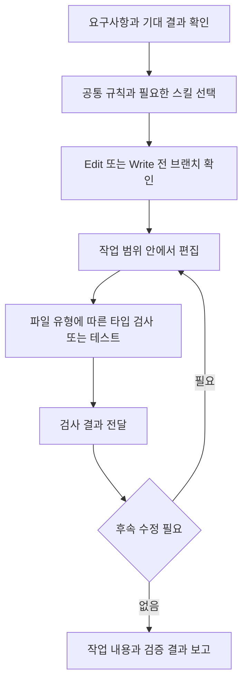

# Claude Code 개발 워크플로 자동화

[AI 개발 품질 자동화 환경](README.md)으로 돌아갑니다.

Claude Code가 요구사항을 확인하고 안전한 범위에서 코드를 수정한 뒤 타입 검사와 테스트 결과를 다음 행동에 반영하도록 Rules, Skills, Hooks를 묶은 재사용 가능한 개발 워크플로를 만들었습니다.

[코드 저장소](https://github.com/KimHG1995/local-claude-setup)

## 기본 정보

| 항목 | 내용 |
| --- | --- |
| 작업 기간 | 2026-05 ~ 현재 |
| 맡은 범위 | 규칙과 스킬 구조 설계, 검사 훅, 변경 내용 수집 도구와 회귀 테스트 구성 |
| 개발 상태 | 유지보수 중 |
| 운영 상태 | 대상 프로젝트에 맞춰 적용하는 로컬 설정으로 구성 |

## 왜 시작했는지

새 프로젝트마다 스킬과 작업 규칙을 다시 설치하고, 개발과 검증 순서를 반복해서 설명하는 일을 줄이고자 했습니다.
AI가 요구사항을 충분히 확인하지 않고 구현하거나, 검사 결과를 확인하기 전에 완료를 보고하는 문제도 줄일 필요가 있었습니다.

요구사항과 기대 결과를 먼저 확인하고, 개발 후 검사 결과를 다음 수정에 반영하는 작업 루프를 공통 설정으로 정리했습니다.
이 흐름을 프로젝트마다 처음부터 만들지 않고, 필요한 규칙과 검사 명령만 바꿔 재사용하도록 구성했습니다.

## 기술 스택

| 구분 | 기술 |
| --- | --- |
| 언어와 스크립트 | Bash, Python |
| AI 개발 도구 | Claude Code Rules, Skills, Hooks, Commands |
| 설정과 데이터 처리 | Markdown, JSON, jq |
| 변경 이력 조회 | Git, GitHub CLI |
| 프로젝트 검사 연동 | Yarn 타입 검사와 테스트 명령 |

## 어떻게 해결했는지

### 범용 설정 설치와 프로젝트별 조정

`.claude/` 아래에 규칙, 스킬, 명령과 훅을 묶어 다른 프로젝트에 복사해 사용할 수 있도록 했습니다.
공통 작업 원칙은 유지하고, 프로젝트 경로와 기술별 규칙, 검사 명령은 적용할 환경에 맞게 조정하도록 나눴습니다.

### 요구사항 확인부터 검증까지 연결

루프 엔지니어링 관점에서 작업 전 확인할 내용, 실행 단계와 검사 결과를 다음 행동으로 연결하는 기준을 정리했습니다.
구현 전에 요구사항과 기대 입출력을 확인하고, 필요한 스킬을 선택해 요청 범위 안에서 개발하도록 했습니다.
코드 편집 후 실행한 검사의 결과를 Claude에 전달해 후속 수정에 활용하도록 연결했습니다.
명세 문서를 자동 생성하고 모든 단계를 순서대로 강제 실행하는 별도 엔진이 아니라, 규칙과 스킬 및 편집 훅으로 작업 흐름을 안내하는 구성입니다.

### 필요한 시점에 규칙 사용

항상 필요한 기준은 공통 규칙에 두고, 파일 유형별 규칙과 반복 작업 명령을 분리했습니다.
스킬 본문에는 작업 유형을 고르는 기준을 두고 자세한 절차는 참조 문서로 나눴습니다.
규칙을 추가하거나 제거한 이유는 별도 문서로 관리했습니다.

### 편집 전후 검사

`Edit`와 `Write` 사용 전 대상 브랜치를 확인해 `main`과 `master`에서 직접 편집하지 않도록 훅을 구성했습니다.
일반 TypeScript 파일 편집 후에는 타입 검사를, 테스트 파일 편집 후에는 해당 테스트를 실행하도록 연결했습니다.
검사 결과는 모델에 전달하며, 실패했다고 이미 수행한 편집을 자동으로 되돌리지는 않습니다.
이 훅은 셸을 통한 모든 수정이나 원격 저장소의 브랜치 보호를 대신하지 않습니다.

### 반복 작업 도구

동작을 유지하는 코드 정리와 입력 또는 응답이 바뀌는 수정을 구분했습니다.
DB Entity 변경은 추가, 삭제와 타입 변경 등으로 나눠 확인하도록 했습니다.
변경 내용과 커밋, PR 규칙을 수집하는 스크립트를 추가했습니다.
규칙 문서와 PR 양식이 있으면 우선 사용하고, 실제 이력은 부족한 내용을 보완하는 용도로 두었습니다.

## 처리 흐름

## 결과와 현재 상태

요구사항 확인부터 개발과 검증까지 이어가는 작업 규칙을 다른 프로젝트에 적용할 수 있는 템플릿으로 정리했습니다.
main과 master 직접 편집 차단, 편집 후 타입 검사와 테스트 피드백, Git 이력 기반 커밋과 PR 규칙 수집 같은 안전장치를 구성했습니다.
훅과 워크플로 도구의 계약은 임시 저장소를 사용하는 42개 회귀 테스트로 검증했습니다.
프로젝트별 명령과 규칙은 적용할 환경에 맞춰 조정하며, 정적 토큰 추정값을 실제 비용 절감 실적으로 사용하지 않았습니다.
