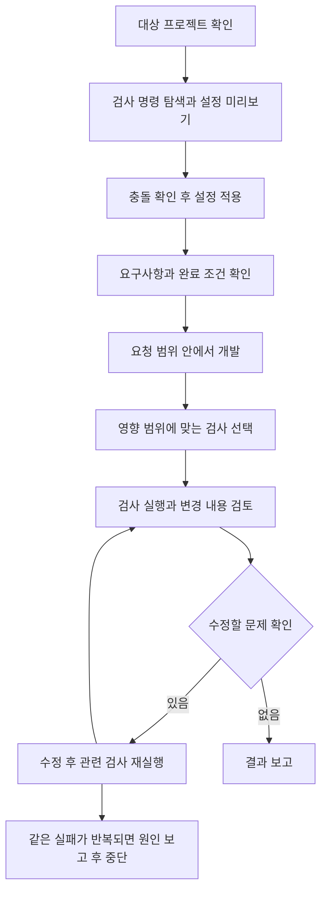

# Codex 코드 검사 설정

[AI 개발 환경 작업 목록](README.md)으로 돌아갑니다.

Codex가 작업 범위를 확인하고 개발, 검증과 후속 수정을 이어가도록 공통 스킬과 프로젝트별 검사 설정을 설치하는 도구를 개발했습니다.

[코드 저장소](https://github.com/KimHG1995/codex-quality-setup)

## 기본 정보

| 항목 | 내용 |
| --- | --- |
| 작업 기간 | |
| 맡은 범위 | 설정 초기화, 플러그인 설치와 확인, 검사 실행 도구, 검토 기준과 테스트 구성 |
| 개발 상태 | 유지보수 중 |
| 운영 상태 | 로컬 개발 환경에 적용하는 도구로 구성 |

## 왜 시작했는지

프로젝트마다 스킬, 코드 검토 기준과 검사 명령을 반복해서 설정하는 작업을 줄이고자 했습니다.
AI가 요청 범위를 벗어나 수정하거나, 검증을 생략하고 완료를 보고하지 않도록 공통 작업 기준도 필요했습니다.

요구사항과 완료 조건을 확인한 뒤 개발하고, 검사와 리뷰에서 발견한 문제를 수정한 후 다시 확인하는 작업 루프를 재사용하도록 구성했습니다.
모든 작업에 같은 검사를 반복하기보다, 변경 범위에 필요한 검사를 선택하고 언제 작업을 마칠지 기준을 두었습니다.

## 기술 스택

| 구분 | 기술 |
| --- | --- |
| 언어 | Python |
| AI 개발 도구 | Codex Skills, Codex Plugin |
| 설정 | JSON, Markdown |
| 검증 | Python unittest |

## 어떻게 해결했는지

### 범용 스킬 설치

공통 스킬을 프로젝트에 복사하거나 Codex 플러그인으로 설치해 여러 프로젝트에서 사용할 수 있게 했습니다.
작업 원칙은 공통으로 두고, 실제 검사 명령과 적용 경로는 프로젝트별 설정으로 분리했습니다.

### 개발과 검증을 잇는 작업 루프

먼저 요청한 결과와 수정 범위를 확인하고, 개발 후 실제 변경 내용과 검사 결과를 검토하도록 기준을 정리했습니다.
작업 범위 안에서 확인된 문제는 수정한 뒤 영향을 받는 검사를 다시 실행하도록 했습니다.
새로운 변경이나 실패가 없으면 같은 검사를 반복하지 않고, 같은 실패가 해결되지 않으면 원인과 남은 문제를 보고하도록 종료 기준도 두었습니다.
명세 생성부터 개발까지 자동 실행하는 별도 엔진이 아니라, Codex의 작업을 안내하는 스킬과 검사 실행 도구를 구성한 작업입니다.

### 설정과 실행 분리

초기화 명령은 먼저 적용할 내용을 보여주고, 적용 옵션을 지정했을 때 파일을 생성하도록 했습니다.
기존 설정과 충돌하면 쓰기를 멈춰 덮어쓰지 않도록 구성했습니다.
설정을 추가하는 단계에서 프로젝트 검사를 임의로 실행하지 않도록 분리했습니다.

### 프로젝트별 검사 구성

`package.json`에서 타입 검사와 린트 명령을 찾아 프로젝트 검사 설정에 저장하도록 했습니다.
자동으로 찾지 못한 명령은 직접 지정할 수 있게 했습니다.
검사 도구는 작업 파일과 설정을 바탕으로 실행할 검사를 고르고, 계획 확인과 실제 실행을 나눴습니다.
작업 파일은 검사 선택에 사용하며, 선택된 명령에 따라 검사는 프로젝트 전체에 실행될 수도 있습니다.

### 재사용 가능한 검토 기준

기존 문제와 이번 변경에서 생긴 문제를 구분하고, 수정한 내용에 필요한 검사를 다시 실행하도록 기준을 정리했습니다.
스킬 파일을 프로젝트에 복사하는 방식과 플러그인으로 여러 프로젝트에서 사용하는 방식을 제공했습니다.
설치 상태 확인 명령과 임시 환경을 사용하는 테스트도 구성했습니다.

## 처리 흐름

## 결과와 현재 상태

프로젝트별 설정 차이를 분리하면서 같은 코드 검토 기준을 재사용할 수 있는 구조를 마련했습니다.
초기화, 검사 선택과 플러그인 설치 동작을 확인할 테스트를 작성했습니다.
코드 품질 향상이나 토큰 절감률은 별도로 측정하지 않았습니다.
