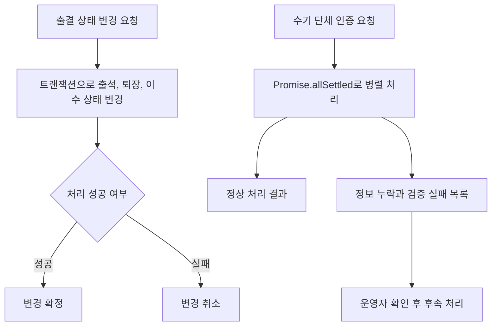

# 민방위 출결 상태와 단체 인증 처리 개선

[민방위 작업 목록](README.md)으로 돌아갑니다.

출석, 퇴장과 이수 상태를 함께 변경하도록 개선하고 단체 인증의 처리 결과를 건별로 구분했습니다.

## 기본 정보

| 항목 | 내용 |
| --- | --- |
| 작업 기간 | 2025-11 이후 근무 중 진행 |
| 맡은 범위 | 출결 서버 로직과 수기 단체 인증 처리 개선 |
| 개발 상태 | 개발 완료 |
| 운영 상태 | 운영 반영 완료 |

## 왜 시작했는지

출석, 퇴장과 이수 상태가 각각 변경돼 일부 단계가 실패하면 서로 다른 상태가 남을 수 있었습니다.
퇴장 직후 이수증을 확인해야 하므로 상태를 함께 반영할 필요가 있었습니다.
단체 인증은 순서대로 처리해 여러 지역에서 1,000건 단위 요청이 들어오면 지연과 실패 건 확인에 어려움이 있었습니다.

## 기술 스택

| 구분 | 기술 |
| --- | --- |
| 언어 | TypeScript |
| 백엔드 | NestJS, TypeORM |
| 데이터베이스 | MySQL |
| 인프라 | NCP |

## 어떻게 해결했는지

- TypeORM 트랜잭션으로 출석, 퇴장과 이수 상태 변경을 묶었습니다.
- 일부 처리가 실패하면 잘못된 상태가 남지 않도록 함께 되돌리게 했습니다.
- 수기 단체 인증의 `for...of` 순차 처리를 `Promise.allSettled` 기반 병렬 처리로 변경했습니다.
- 출석 정보가 없거나 추가 검증이 필요한 대상은 실패 목록으로 분리했습니다.
- 운영자가 실패 목록을 확인하고 수기로 후속 처리할 수 있도록 정리했습니다.

## 처리 흐름

## 결과와 현재 상태

출결과 이수 상태가 함께 반영되도록 개선해 퇴장 직후 이수증을 확인하는 운영 흐름에 대응했습니다.
단체 인증은 성공 건과 실패 건을 나눠 운영자가 후속 처리 대상을 확인할 수 있게 했습니다.
개선 내용을 운영 서비스에 반영했습니다.
