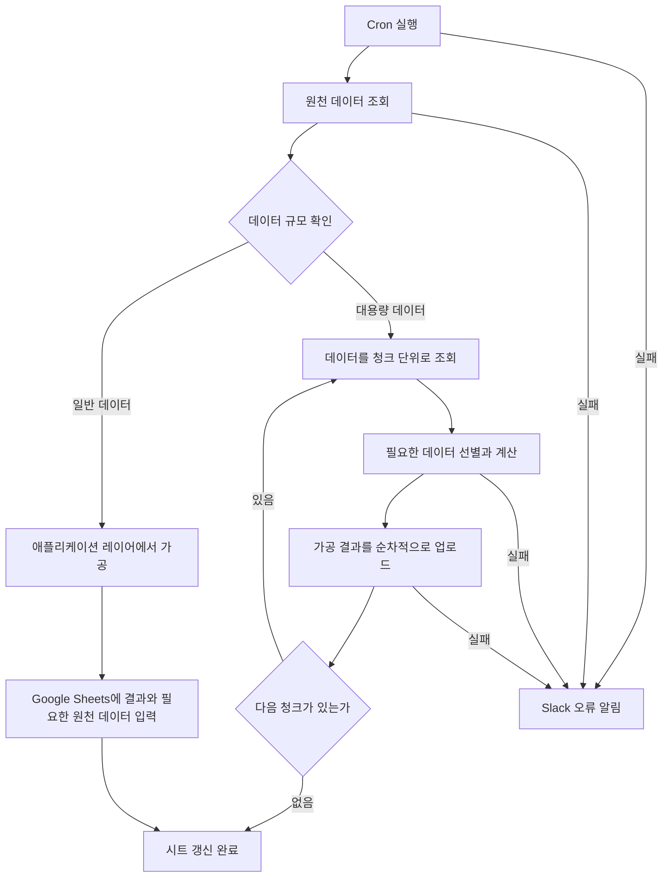

# 민방위 운영 데이터 집계와 Google Sheets 자동화

[민방위 작업 목록](README.md)으로 돌아갑니다.

수동으로 원천 데이터를 받아 다시 조합하던 반복 업무를 분석하고, 데이터 규모에 맞는 처리 방식으로 집계와 Google Sheets 이관을 자동화했습니다.
정기 실행과 오류 알림까지 연결해 18개 시트를 자동으로 생성하고 운영할 수 있게 했습니다.

## 기본 정보

| 항목 | 내용 |
| --- | --- |
| 작업 기간 | 2025-11 이후 근무 중 진행 |
| 맡은 범위 | 수동 데이터 업무 분석, 자동화 제안, 데이터 조회와 가공, Google Sheets 이관, 오류 알림 구성 |
| 개발 상태 | 개발 완료 |
| 운영 상태 | 운영 중 |

## 왜 시작했는지

운영에 필요한 데이터를 매번 수동으로 전달받아 다시 조합하고 Google Sheets에 정리하는 작업이 반복되고 있었습니다.
시트마다 필요한 데이터와 가공 방식이 달랐고, 일부 작업은 원천 데이터가 약 1천만 건 규모여서 전체 데이터를 한 번에 읽어 처리하기 어려웠습니다.

반복 작업을 줄이고 같은 기준으로 데이터를 생성할 수 있도록 기존 수동 업무를 분석한 뒤 자동화를 제안했습니다.

## 기술 스택

| 구분 | 기술 |
| --- | --- |
| 언어 | TypeScript |
| 데이터 처리 | SQL, 애플리케이션 레이어 집계, 청크 처리 |
| 자동화 | Cron |
| 외부 연동 | Google Sheets, Slack |

## 어떻게 해결했는지

### 수동 업무를 자동 실행 구조로 전환

- 기존에 수동으로 전달받던 원천 데이터와 시트별 가공 기준을 정리했습니다.
- 반복 실행이 필요한 작업을 Cron으로 구성해 정해진 시점에 데이터를 조회하고 시트를 갱신하도록 했습니다.
- 서로 다른 업무 기준에 맞춰 총 18개의 자동 시트를 구성했습니다.
- 가공 결과뿐 아니라 운영에서 확인이 필요한 원천 데이터도 함께 Google Sheets로 이관하도록 구성했습니다.

### 데이터 규모에 따른 처리 방식 분리

데이터 규모가 작은 작업은 조회한 데이터를 애플리케이션 레이어에서 필요한 형태로 정리하고 바로 Google Sheets에 입력했습니다.

원천 데이터가 약 1천만 건 규모인 작업은 전체 데이터를 한 번에 메모리에 올리지 않았습니다.

1. 데이터를 일정 단위로 나눠 조회했습니다.
2. 각 청크에서 시트에 필요한 데이터만 선별하고 계산했습니다.
3. 처리한 데이터는 다음 청크를 읽기 전에 정리했습니다.
4. 가공 결과와 필요한 원천 데이터를 순차적으로 Google Sheets에 업로드했습니다.

대용량 작업은 한 번에 전체 데이터를 보관하지 않고 조회와 계산, 업로드를 나눠 처리하도록 구성했습니다.

### 오류 확인

Cron 실행이나 데이터 처리 중 문제가 발생하면 Slack으로 오류 내용을 전달하도록 구성했습니다.
운영 중 자동 작업이 실패해도 담당자가 문제를 확인하고 후속 조치할 수 있게 했습니다.

## 처리 흐름

## 결과와 현재 상태

- 반복적으로 수동 생성하던 18개 Google Sheets를 자동 생성과 갱신 구조로 전환했습니다.
- 단순 데이터는 애플리케이션 레이어에서 바로 가공하고, 대용량 데이터는 청크 조회와 순차 업로드로 처리하도록 분리했습니다.
- 약 1천만 건 규모의 원천 데이터를 전체 메모리에 적재하지 않고 필요한 데이터만 나눠 계산하는 구조를 적용했습니다.
- 자동 작업 실패 시 Slack에서 바로 확인할 수 있게 했으며 현재 운영 중입니다.
