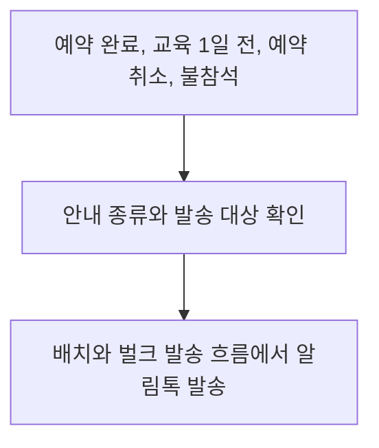

# 민방위 예약 메시지 발송 비용 개선

[민방위 작업 목록](README.md)으로 돌아갑니다.

예약 안내 메시지를 LMS에서 알림톡으로 전환해 발송 단가를 낮췄습니다.

## 기본 정보

| 항목 | 내용 |
| --- | --- |
| 프로젝트 구분 | 회사 |
| 작업 기간 | 2025-11 이후 근무 중 진행 |
| 맡은 범위 | 기존 발송 로직 분석, 전환 제안, 서버 발송 로직 개선 |
| 상태 | 운영 반영 완료 |

## 왜 시작했는지

예약 완료, 교육 1일 전, 예약 취소와 불참석 안내를 LMS로 발송하고 있었습니다.
여러 건을 배치와 벌크 방식으로 보내기 때문에 계약 지역과 대상 인원이 늘면 발송 비용도 커지는 구조였습니다.
같은 안내를 전달하면서 발송 단가를 낮추기 위해 알림톡 전환을 제안했습니다.

## 기술 스택

| 구분 | 기술 |
| --- | --- |
| 언어와 서버 | TypeScript, NestJS |
| 데이터베이스 | MySQL, TypeORM |
| 메시지 발송 | NCP SENS |

## 어떻게 개선했는지

1. 기존 LMS 발송 로직과 메시지별 발송 시점, 대상 규모를 확인했습니다.
2. 예약 완료, 교육 1일 전, 예약 취소와 불참석 안내를 정리했습니다.
3. 배치와 벌크 발송 흐름의 LMS 의존 구간을 알림톡 기반으로 변경했습니다.
4. 개선한 발송 구조를 운영 서비스에 반영했습니다.

## 발송 흐름

## 비용 산정

계약 지역 10곳, 대상 38,000명에게 예약 완료와 교육 1일 전 안내를 각각 한 번 보낸다고 가정했습니다.
총 발송량은 76,000건입니다.

| 항목 | LMS | 알림톡 |
| --- | --- | --- |
| 적용 단가 | 30원 | 7.5원 |
| 예상 발송 비용 | 2,280,000원 | 570,000원 |

이 조건에서 예상 절감액은 1,710,000원이며, 발송 단가와 예상 비용은 75% 낮아집니다.
실제 청구 금액을 비교한 실적이 아닌, 위 단가와 발송량을 적용한 예상 금액입니다.
취소와 불참석 안내는 이 계산에 포함하지 않았습니다.

## 결과

알림톡 전환을 운영 서비스에 반영했습니다.
계약 지역과 대상 인원이 늘어날 때 메시지 발송 비용의 증가를 줄일 수 있는 구조를 마련했습니다.
