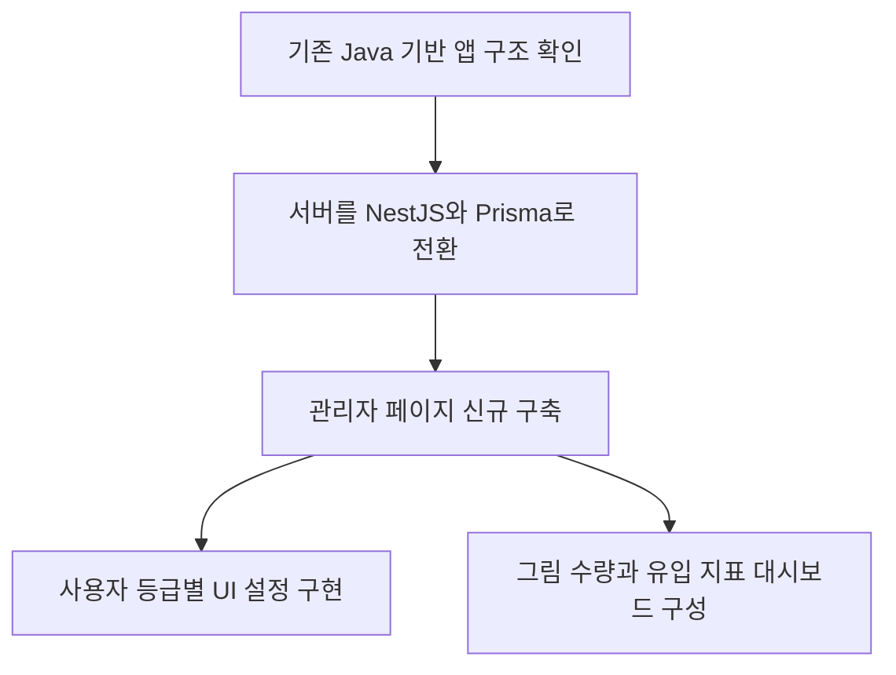

# 미술 교육 서비스 개편

[교육 서비스 작업 목록](README.md)으로 돌아갑니다.

Java 서버를 NestJS와 Prisma로 전환하고 관리자 페이지와 대시보드를 만들었습니다.

**작업 기간:** 정확한 작업 기간 확인 필요. 근무 기간은 2024-01 ~ 2025-10입니다.

## 시작한 이유와 문제

- 기존 Java 기반 앱은 새 요구사항 반영과 운영 도구 연결이 어려웠다.
- 관리자 기능도 실제 운영에 맞게 다시 정리할 필요가 있었다.

## 맡은 일과 역할 분담

- 백엔드 구조 전환과 관리자 페이지 신규 구축을 진행했다.
- 사용자 등급별 UI 설정과 운영 대시보드를 구현했다. 다른 담당자와의 역할 분담은 확인 필요.

## 사용 기술

TypeScript, NestJS, Prisma, MySQL, Next.js, TailwindCSS. 기존 전환 대상: Java 서버.

## 처리 방법

- 기존 Java 기반 앱의 서버를 NestJS와 Prisma 구조로 전환했다.
- 관리자 페이지를 새로 만들고 사용자 등급에 따라 UI를 설정하는 기능을 구현했다.
- 그림 수량과 유입 지표를 기준으로 운영 현황을 확인하는 대시보드를 만들었다.

## 작업 흐름

## 결과와 현재 상태

- 기능 추가와 운영 관리가 가능한 구조로 정리했다.
- 관리자 기능과 대시보드에서 운영 현황을 확인할 수 있게 했다.
- 실제 서비스 반영 범위와 날짜는 확인 필요.
