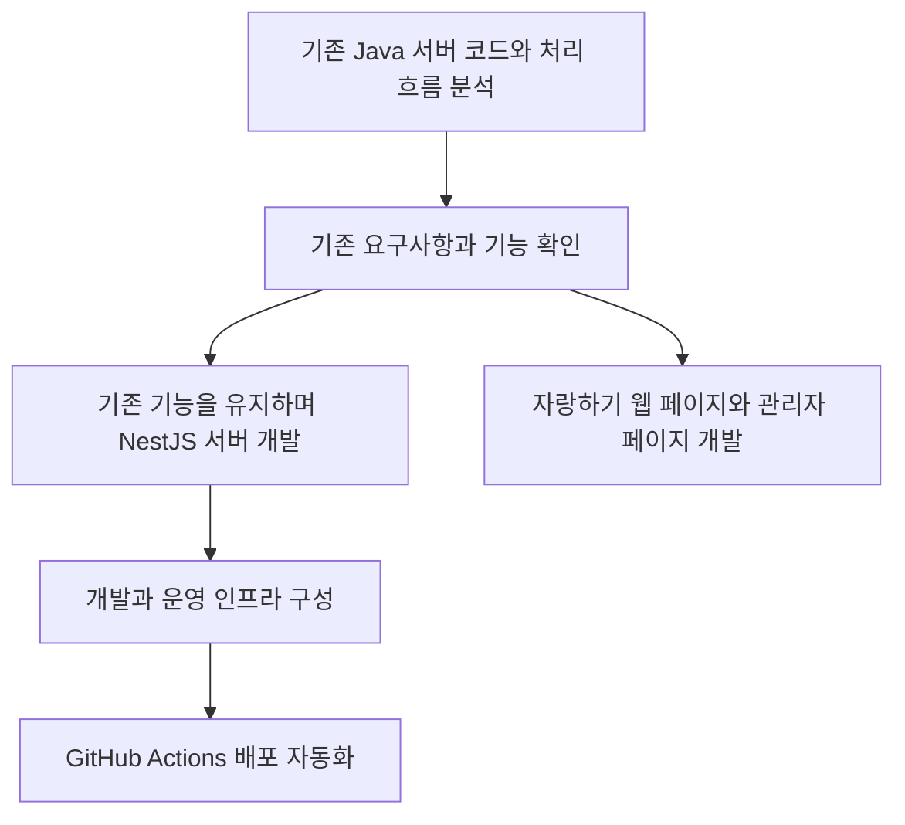
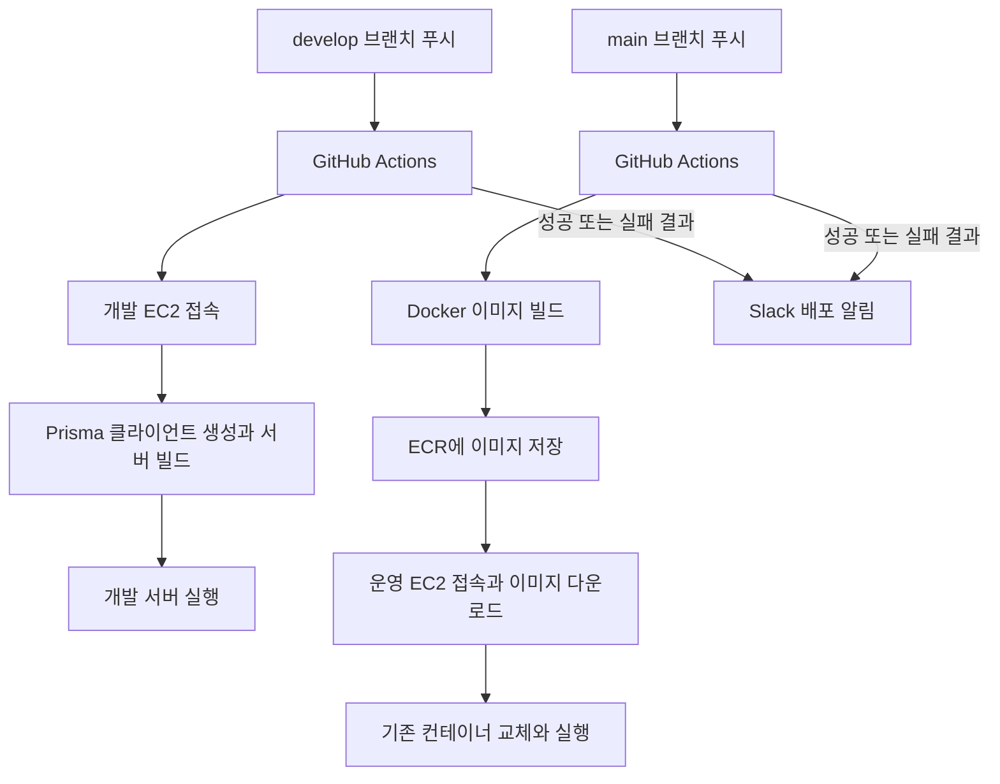

# 계열사 연동 서비스 서버 재구성과 관리자 페이지 개발

[교육 서비스 작업 목록](README.md)으로 돌아갑니다.

계열사 교육 플랫폼에 APK로 연동되는 서비스의 Java 서버를 분석하고, 기존 기능을 유지하며 NestJS로 재구성했습니다. 인프라 구성과 배포 자동화, 자랑하기 웹 페이지와 관리자 페이지 개발도 맡았습니다.

## 기본 정보

| 항목 | 내용 |
| --- | --- |
| 작업 기간 | 미확인. 2024-01 ~ 2025-10 근무 중 진행 |
| 맡은 범위 | 기존 서버 분석과 재구성, 인프라와 배포 자동화, 자랑하기 웹과 관리자 페이지 개발 |
| 개발 상태 | 개발 완료 |
| 운영 상태 | 운영 반영 완료 |

## 왜 시작했는지

- 기존 서비스를 계속 유지보수하기 위해 서버 구조를 정리할 필요가 있었다.
- 짧은 일정 안에 기존 Java 코드와 처리 흐름을 빠르게 분석해야 했다.
- 기존 요구사항과 기능을 유지하면서 서버를 재구성해야 했다.

## 역할 분담

| 담당 역할 | 맡은 일 |
| --- | --- |
| 본인 | 인프라 구성, 서버 개발, GitHub Actions와 ECR을 이용한 배포 자동화, 자랑하기 웹 페이지와 관리자 페이지 개발 |
| 기존 클라이언트 담당자 | 클라이언트 전체 개발 |
| 클라이언트 유지보수 담당자 | 클라이언트 유지보수와 추가 개발 |

## 기술 스택

| 구분 | 기술 |
| --- | --- |
| 언어 | TypeScript |
| 프론트엔드 | Next.js, Tailwind CSS, TanStack |
| 백엔드 | NestJS, Zod, Prisma |
| 데이터베이스 | MySQL |
| 인프라와 배포 | GitHub Actions, EC2, ECR, Docker |
| 배포 알림 | Slack |

TanStack은 관리자 페이지에 사용했습니다.

## 어떻게 해결했는지

### 기존 서버 분석과 재구성

- 기존 Java 코드의 구조와 처리 로직을 분석했다.
- 기존 요구사항과 기능을 유지하며 NestJS 서버를 개발했다.
- MySQL과 Prisma를 사용하고, 기존 기능을 유지보수할 수 있도록 서버 구조를 정리했다.

### 자랑하기 웹 페이지와 관리자 페이지 개발

- 자랑하기 웹 페이지를 Next.js로 개발했다.
- 관리자 페이지의 화면과 서버 기능을 개발했다.
- 사용자 등급별 화면 설정과 그림 수량, 유입 지표를 확인하는 대시보드를 구성했다.

### 인프라와 배포 자동화

- 개발과 운영 환경의 인프라를 구성하고 GitHub Actions로 배포를 자동화했다.
- 개발 환경은 `develop` 브랜치에 푸시하면 EC2에 접속해 Prisma 클라이언트를 생성하고 서버를 빌드한 뒤 실행하도록 구성했다.
- 운영 환경은 `main` 브랜치에 푸시하면 Docker 이미지를 빌드하고 ECR에 저장하도록 구성했다.
- 이어서 EC2에 접속해 이미지를 내려받고 기존 컨테이너를 교체해 실행하도록 했다.
- 배포 성공과 실패 결과를 Slack으로 전달하도록 연결했다.

## 작업 흐름

## 개발과 운영 배포 흐름

## 결과와 현재 상태

- 기존 기능을 유지하며 Java 서버를 NestJS로 재구성했다.
- 인프라를 구성하고 자랑하기 웹 페이지와 관리자 페이지를 개발했다.
- 개발과 운영 배포 과정을 자동화하고 결과를 확인할 수 있게 했다.
- 서비스에 반영하고 실제 운영까지 진행했다.
- 서비스 반영 날짜: 미확인.
