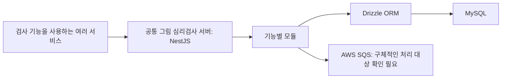

# AI 그림 심리검사 서비스 개편

[교육 서비스 작업 목록](README.md)으로 돌아갑니다.

기존 Java Spring 서버를 NestJS와 Drizzle로 전환하고, 여러 서비스에서 함께 사용할 수 있는 그림 심리검사 서버로 정리했습니다.

## 기간과 운영 상태

| 항목 | 내용 |
| --- | --- |
| 근무 기간 | 2024-01 ~ 2025-10 |
| 프로젝트 합류 | 2025-02-25 |
| 개발 서버 배포 | 2025-03-04 |
| 운영 서버 배포 | 2025-03-06 |

전체 작업 종료일은 확인 필요입니다.

## 시작한 이유와 문제

- 기존 Java Spring 서버는 기능 범위가 제한되어 새 요구사항을 반영하기 어려웠다.
- 불필요한 코드를 줄이고, 여러 서비스가 같은 검사 기능을 사용할 수 있게 구조를 바꿀 필요가 있었다.
- 짧은 일정 안에 서버를 전환하고 운영 가능한 상태로 만들어야 했다.

## 맡은 일과 역할 분담

| 담당 역할 | 맡은 일 |
| --- | --- |
| 본인 | 기존 서버 분석, 시스템 설계와 구현, 기능별 모듈 분리, 환경 설정과 배포 구성 정리 |
| 인프라 담당자 | 인프라 설계와 구성 검토 |

## 사용 기술

TypeScript, NestJS, Drizzle ORM, MySQL, AWS SDK v3, AWS SQS.
기존 분석 대상은 Java Spring 서버입니다. SQS의 구체적인 처리 대상은 확인 필요입니다.

## 처리 방법

- 기존 Java Spring 서버를 분석하고 NestJS와 Drizzle 기반으로 전환했다.
- 기능별로 모듈을 나누고, 다른 서비스에서도 검사 기능을 재사용하도록 설계했다.
- 환경별 설정과 배포 구성을 정리하고, 따로 처리해야 하는 작업에 SQS를 연결했다.
- 검사 질문은 질문 묶음, 질문 내용과 순서, 선택지를 구분해 구성했다.

질문의 최종 DB 저장 방식은 확인 필요입니다.

## 서버 구성

## 결과와 남은 개선

- Java Spring 서버를 NestJS 기반으로 전환하고 여러 서비스가 활용할 공통 구조를 마련했다.
- 2025-03-06 운영 서버에 배포했다.
- 한 서비스 메서드에 처리 로직과 예외 처리가 집중된 문제가 남아 있다.
- 역할별로 메서드를 나누고 구조를 정리하는 개선안은 기록되어 있으나, 이후 완료 여부는 확인 필요다.
