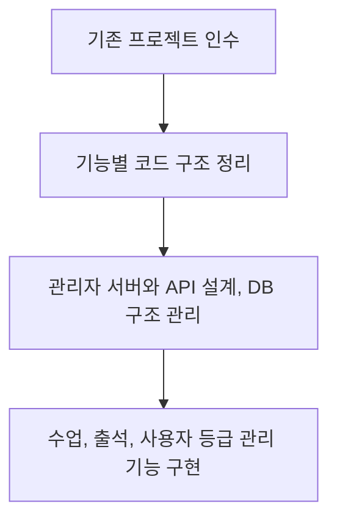

# 개인 고객 서비스 관리자 페이지

[교육 서비스 작업 목록](README.md)으로 돌아갑니다.

인수한 프로젝트의 구조를 정리하고 수업, 출석, 사용자 등급 관리 기능을 개발했습니다.

**작업 기간:** 정확한 작업 기간 확인 필요. 근무 기간은 2024-01 ~ 2025-10입니다.

## 시작한 이유와 문제

- 기존 담당자의 퇴사 후 유지보수와 구조 안정성이 부족한 프로젝트를 인수했다.
- 운영에 필요한 기능이 체계적으로 정리되어 있지 않았다.

## 맡은 일과 역할 분담

- 메인 개발자로 프로젝트를 인수하고 구조 개선을 주도했다.
- 수업 관리, 출석, 사용자 등급 분류 기능을 구현하고 관리자 서버, API, DB 구조 관리를 맡았다.
- 화면 개발의 구체적인 범위와 다른 담당자와의 역할 분담은 확인 필요.

## 사용 기술

TypeScript, NestJS, Prisma, MySQL, React, Refine, MUI Pro.

## 처리 방법

- 인수한 코드를 기능별로 관리할 수 있게 구조를 정리했다.
- 수업 관리, 출석, 사용자 등급 분류 등 운영에 필요한 기능을 구현했다.
- 관리자 서버와 API를 설계하고 DB 구조를 함께 관리했다.

## 작업 흐름

## 결과와 현재 상태

- 인수한 프로젝트를 운영 가능한 구조로 정리했다.
- 개인 고객 서비스 운영에 필요한 핵심 관리자 기능을 제공할 기반을 마련했다.
- 실제 서비스 반영 범위와 날짜는 확인 필요.
