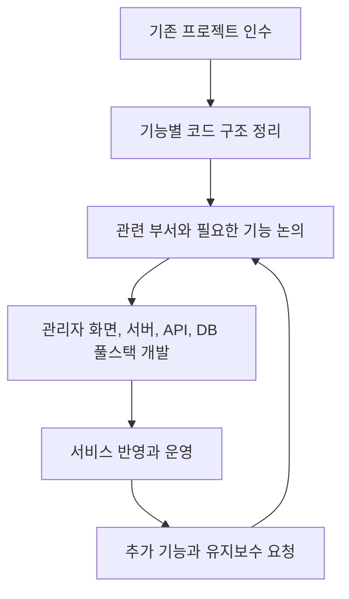

# 개인 고객 서비스 관리자 페이지

[교육 서비스 작업 목록](README.md)으로 돌아갑니다.

관련 부서와 필요한 기능을 논의하고, 관리자 화면부터 서버와 DB까지 풀스택으로 개발했습니다. 퇴사 전까지 기능 추가와 유지보수를 맡았습니다.

## 기본 정보

| 항목 | 내용 |
| --- | --- |
| 작업 기간 | 프로젝트 인수 후 2025-10까지 개발과 유지보수 |
| 맡은 범위 | 관리자 화면, 서버, API와 DB 풀스택 개발 및 유지보수 |
| 개발 상태 | 2025-10까지 개발과 유지보수 완료 |
| 운영 상태 | 운영 중 |

## 왜 시작했는지

- 기존 담당자의 퇴사 후 유지보수와 구조 안정성이 부족한 프로젝트를 인수했다.
- 운영에 필요한 기능이 체계적으로 정리되어 있지 않았다.

## 역할 분담

- 메인 개발자로 프로젝트를 인수하고 구조 개선을 주도했다.
- 본인: 관리자 화면, 서버, API, DB를 포함한 풀스택 개발과 유지보수를 맡았다.
- 관련 부서: 필요한 기능과 업무 흐름을 함께 논의했다.

## 기술 스택

| 구분 | 기술 |
| --- | --- |
| 언어 | TypeScript |
| 프론트엔드 | React, Refine, MUI Pro |
| 백엔드 | NestJS, Prisma |
| 데이터베이스 | MySQL |

## 어떻게 해결했는지

- 인수한 코드를 기능별로 관리할 수 있게 구조를 정리했다.
- 기능이 필요할 때 관련 부서와 논의해 요구사항을 정리했다.
- 수업 관리, 출석, 사용자 등급 분류 등의 화면과 서버 기능을 함께 개발했다.
- 관리자 서버와 API를 설계하고 DB 구조를 관리했다.
- 개발한 기능을 운영에 반영하고, 2025년 10월 퇴사 전까지 기능 추가와 유지보수를 이어갔다.

## 작업 흐름

## 결과와 현재 상태

- 인수한 프로젝트를 운영 가능한 구조로 정리했다.
- 수업, 출석, 사용자 등급 관리 기능을 서비스에 반영하고 운영했다.
- 2025년 10월 퇴사 전까지 기능 추가와 유지보수를 맡았으며, 서비스는 운영 중이다.
