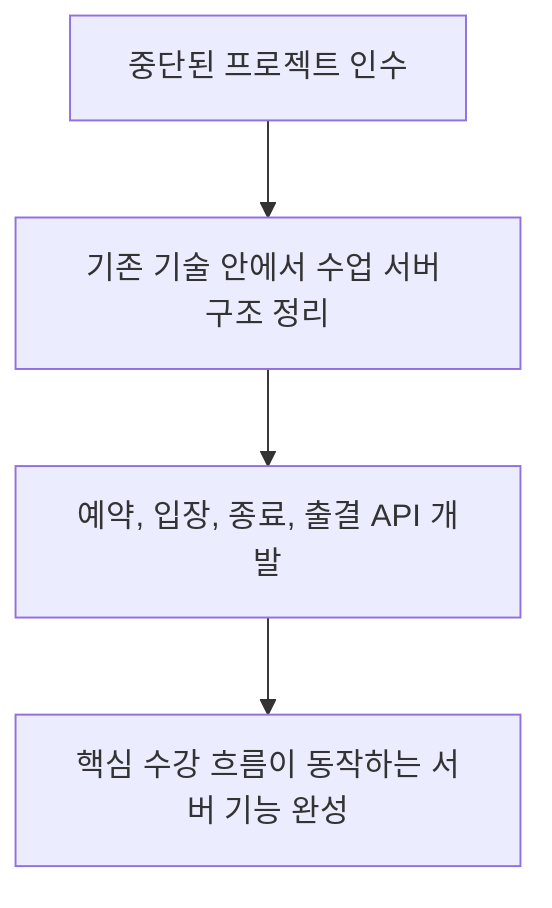

# 개인 고객 수강 앱 서버

[교육 서비스 작업 목록](README.md)으로 돌아갑니다.

중단된 프로젝트를 인수해 1:1 수업 예약부터 종료와 출결까지 서버 기능을 정리했습니다.

**작업 기간:** 정확한 작업 기간 확인 필요. 근무 기간은 2024-01 ~ 2025-10입니다.

## 시작한 이유와 문제

- 기존 개발팀이 DB 이전과 서비스 출시 과정에서 어려움을 겪은 뒤 프로젝트가 중단되어 있었다.
- 단계별 계획에 따라 진행하는 조직 특성상 기술을 바꾸기 어려워, 정해진 환경에서 빠르게 기능을 완성해야 했다.

## 맡은 일과 역할 분담

- 중단된 프로젝트를 인수해 실시간 1:1 수업의 백엔드 구조를 정리하고 API를 개발했다.
- 다른 담당자와의 역할 분담과 단독 개발 여부는 확인 필요.

## 사용 기술

TypeScript, NestJS, Prisma, MySQL.

## 처리 방법

- 기술을 바꾸기보다 기존 환경에서 수업 흐름과 API를 정리하는 데 집중했다.
- 수업 예약, 입장, 종료, 출결 관리에 필요한 서버 기능을 개발했다.
- 기존 DB 이전 문제로 중단된 프로젝트를 다시 정리하고 운영 가능한 서버 기능을 완성했다.

## 작업 흐름

## 결과와 현재 상태

- 핵심 수강 흐름이 동작하는 백엔드 구조를 만들었다.
- 중단된 프로젝트를 다시 이어가고 서비스 운영으로 연결할 기반을 마련했다.
- 실제 서비스 반영 범위와 날짜는 확인 필요.
