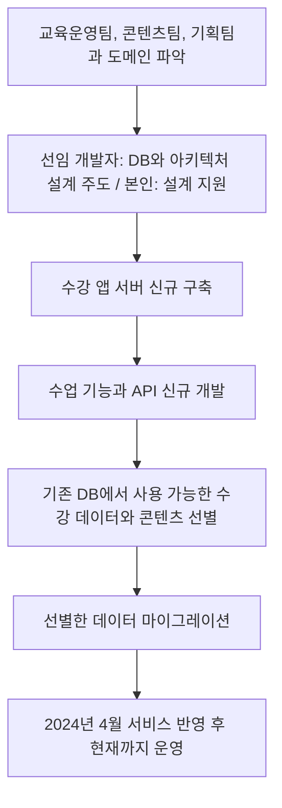

# 개인 고객 수강 앱 서버

[교육 서비스 작업 목록](README.md)으로 돌아갑니다.

기존 코드가 없는 상태에서 수강 앱 서버를 새로 개발했습니다. 기존 DB의 수강 데이터와 콘텐츠 중 사용 가능한 데이터를 골라 마이그레이션했습니다.

## 기본 정보

| 항목 | 내용 |
| --- | --- |
| 작업 기간 | 2024-01 ~ 2024-04 |
| 맡은 범위 | DB와 아키텍처 설계 지원, 서버 신규 개발, 수강 데이터와 콘텐츠 마이그레이션 |
| 개발 상태 | 개발 완료 |
| 운영 상태 | 2024-04 반영 후 현재까지 운영 중 |

## 왜 시작했는지

- 입사 당시 새 수강 앱 서버가 구축되지 않아 아키텍처와 기능을 처음부터 구성해야 했다.
- 수강 업무 흐름을 파악하고 필요한 서버 기능을 새로 개발해야 했다.
- 기존 DB의 수강 데이터와 콘텐츠 중 새 서비스에서 사용할 수 있는 데이터를 선별해 이전해야 했다.

## 역할 분담

| 담당 역할 | 맡은 일 |
| --- | --- |
| 본인 | 관련 부서와 도메인 파악, DB와 아키텍처 설계 지원, 서버와 API 신규 개발, 사용 가능한 수강 데이터와 콘텐츠 선별 및 마이그레이션 |
| 선임 개발자 | DB와 아키텍처 설계 주도 |
| 교육운영팀, 콘텐츠팀, 기획팀 | 서비스 도메인과 업무 흐름을 함께 논의 |

## 기술 스택

| 구분 | 기술 |
| --- | --- |
| 언어 | TypeScript |
| 백엔드 | NestJS, Prisma |
| 데이터베이스 | MySQL |

## 어떻게 해결했는지

- 교육운영팀, 콘텐츠팀, 기획팀과 서비스 도메인과 업무 흐름을 함께 파악했다.
- 선임 개발자가 주도한 DB와 아키텍처 설계를 지원하고, 설계에 맞춰 서버를 구축했다.
- 1:1 수업 예약, 입장, 종료, 출결 관리에 필요한 API를 개발했다.
- 기존 DB의 수강 데이터와 콘텐츠 중 사용 가능한 데이터를 선별해 새 환경으로 마이그레이션했다.

## 작업 흐름

## 결과와 현재 상태

- 2024년 4월까지 수강 앱 서버와 API를 새로 개발했다.
- 기존 DB에서 사용 가능한 수강 데이터와 콘텐츠를 선별해 이전했다.
- 2024년 4월 서비스에 반영했으며, 서비스는 현재까지 운영 중이다.
