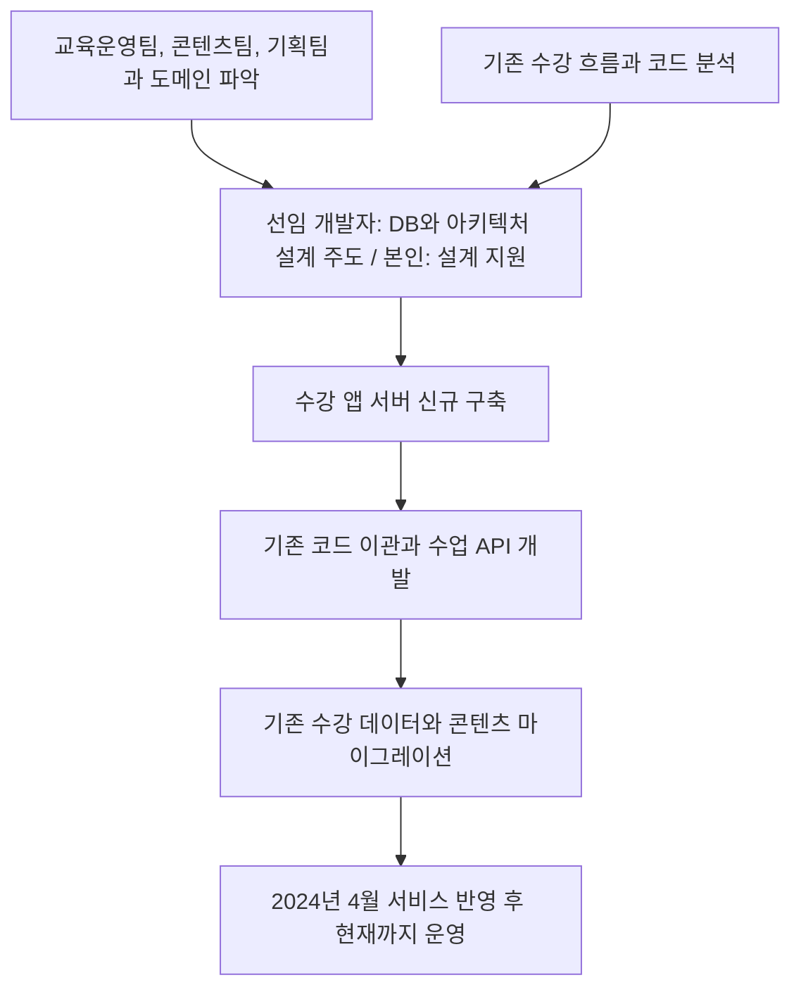

# 개인 고객 수강 앱 서버

[교육 서비스 작업 목록](README.md)으로 돌아갑니다.

수강 앱 서버를 처음부터 구축했습니다. 기존 수강 흐름을 분석해 코드를 이관하고, 기존 DB의 수강 데이터와 콘텐츠를 새 환경으로 마이그레이션했습니다.

**개발 기간:** 2024-01 ~ 2024-04.

**서비스 운영:** 2024-04 반영 후 현재까지 운영 중.

## 시작한 이유와 문제

- 입사 당시 새 수강 앱 서버가 구축되지 않아 아키텍처와 기능을 처음부터 구성해야 했다.
- 기존 수강 흐름과 코드를 분석해 새 서버에 옮겨야 했다.
- 서비스를 이어서 운영하기 위해 기존 DB의 수강 데이터와 콘텐츠도 이전해야 했다.

## 역할 분담

| 담당 역할 | 맡은 일 |
| --- | --- |
| 본인 | 관련 부서와 도메인 파악, DB와 아키텍처 설계 지원, 서버 구축과 API 개발, 기존 코드 이관, 수강 데이터와 콘텐츠 마이그레이션 |
| 선임 개발자 | DB와 아키텍처 설계 주도 |
| 교육운영팀, 콘텐츠팀, 기획팀 | 서비스 도메인과 업무 흐름을 함께 논의 |

## 기술 스택

TypeScript, NestJS, Prisma, MySQL.

## 처리 방법

- 교육운영팀, 콘텐츠팀, 기획팀과 서비스 도메인과 업무 흐름을 함께 파악했다.
- 선임 개발자가 주도한 DB와 아키텍처 설계를 지원하고, 설계에 맞춰 서버를 구축했다.
- 기존 수강 앱의 흐름과 코드를 분석하고 새 서버로 이관했다.
- 1:1 수업 예약, 입장, 종료, 출결 관리에 필요한 API를 개발했다.
- 기존 DB의 수강 데이터와 콘텐츠를 새 환경으로 마이그레이션했다.

## 작업 흐름

## 결과와 운영 상태

- 2024년 4월까지 수강 앱 서버 개발과 기존 코드 이관을 진행했다.
- 기존 수강 데이터와 콘텐츠를 이전하고 실제 서비스에 반영해 운영했다.
- 2024년 4월 서비스에 반영했으며, 서비스는 현재까지 운영 중이다.
