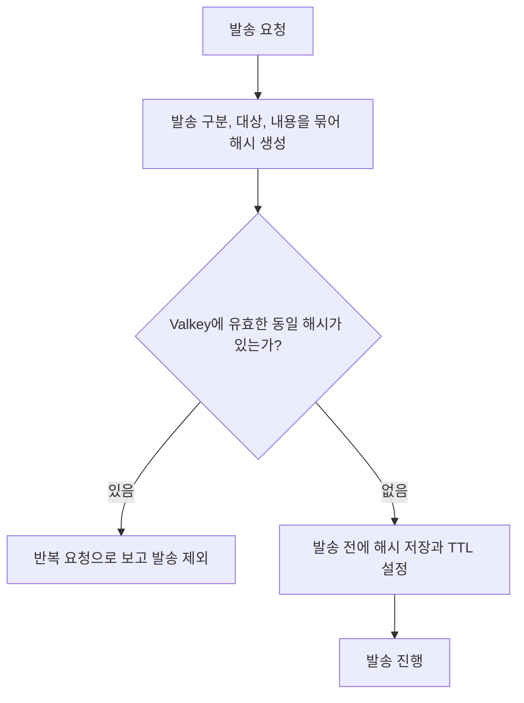
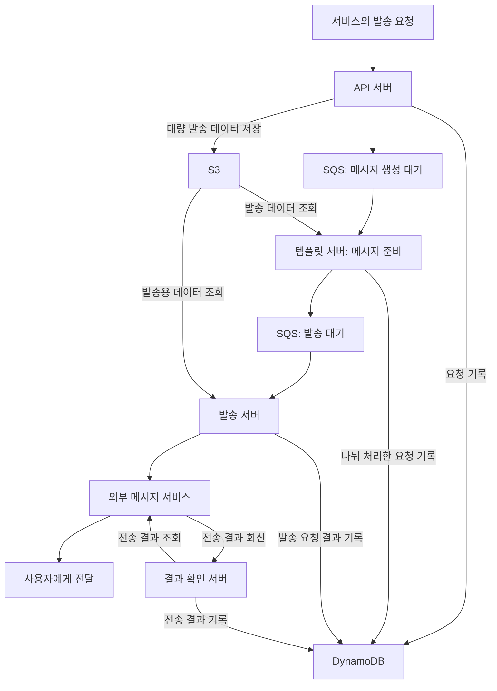

# 통합 알림 시스템

[교육 서비스 작업 목록](README.md)으로 돌아갑니다.

서비스마다 나뉜 알림 발송을 공통 시스템으로 모았습니다. 요청 접수, 메시지 생성, 발송, 결과 확인을 나누고 발송 이력을 추적할 수 있게 했습니다.

## 기간과 운영 상태

| 항목 | 내용 |
| --- | --- |
| 근무 기간 | 2024-01 ~ 2025-10 |
| 작업 기간 | 정확한 시작일과 종료일 확인 필요 |
| 개발 서버 배포 | 2025-02-19 |
| 운영 서버 배포 | 2025-03-01 |

## 시작한 이유와 문제

- 서비스마다 알림 서버가 따로 있어 발송 기능을 추가하거나 이력을 확인하기 어려웠다.
- 대량 발송 요청을 처리하고, 큐나 서버 장애가 나도 요청을 보관해 다시 처리할 구조가 필요했다.
- 정해진 일정 안에 개발해야 해 복잡한 구성과 학습이 필요한 Kafka는 제외하고 SQS를 선택했다.

## 맡은 일과 역할 분담

| 담당 역할 | 맡은 일 |
| --- | --- |
| 본인 | 기술 선택과 시스템 구조 설계, 공통 알림 기능 구현, GitHub Actions 배포 자동화 |
| 인프라 담당자 | 인프라 설계와 구성 검토 |

## 기술 스택

| 구분 | 기술과 용도 |
| --- | --- |
| 서버 | TypeScript, NestJS, NestJS Workspaces 기반 모노레포 |
| 작업 전달 | AWS SQS로 메시지 생성과 발송 작업 전달 |
| 데이터베이스와 스토리지 | DynamoDB로 요청, 템플릿, 발송 이력 관리. S3로 대량 발송 데이터 보관 |
| 발송 채널 | Biztalk로 문자와 알림톡, Twilio SendGrid로 이메일 |
| 배포 | GitHub Actions, ECR, ECS, Fargate |
| 중복 요청 검사 | Valkey에 발송 구분, 대상, 내용을 묶은 해시를 저장하고 TTL 안의 동일 요청 필터링 |

FCM을 통한 앱과 웹 푸시도 설계에 포함했습니다. 개발 완료 여부는 확인 필요입니다.

## 템플릿을 사용한 이유

- 서비스가 메시지 내용을 제각각 만들어 보내는 방식을 줄이고, 정해진 알림만 공통 규칙으로 발송하기 위해 사용했다.
- 가입 안내 같은 업무 구분 코드에 이메일, 문자, 알림톡 템플릿을 연결해 같은 목적의 알림을 채널별로 관리했다.
- 템플릿에는 제목, 본문, 필요한 변수와 사용 여부를 저장하도록 설계했다.
- 호출하는 서비스는 사용자 이름이나 인증값 등 필요한 데이터를 전달하고, 알림 시스템에서 템플릿에 맞춰 메시지를 준비하는 구조로 정리했다.

쿠폰 안내는 같은 문구에 이름, 쿠폰명, 코드, 등록 기한을 넣는 사례입니다. 다만 기존 구현에는 템플릿 변경 시 호출 서버나 클라이언트도 다시 배포해야 하는 제한이 남아 있었습니다.

## DynamoDB를 선택한 이유

| 고려한 조건 | 선택 이유 |
| --- | --- |
| 발송 로그는 추가 저장이 많고 수정이 적음 | 로그를 계속 쌓고 요청별 이력을 찾는 용도에 맞춰 검토 |
| 발송량이 시간대에 따라 달라짐 | 요청 증가에 대응하면서 서버 관리 부담을 줄이려는 목적 |
| 서비스와 메시지별 이력 조회 | PK와 SK로 조회 대상을 정하고, 추가 조회에는 GSI 사용 |
| 로그 보관 기간 관리 | 일정 기간 후 자동 삭제하는 TTL 기능을 고려 |
| 비용과 운영 관리 | MongoDB의 시간 순서 데이터 구조와 비교한 뒤 DynamoDB 선택 |

## 반복 발송 요청 필터링

- 동일한 발송 요청이 계속 들어오는 것을 막기 위해 발송 구분, 대상, 관련 내용을 묶어 해시를 만들었다.
- 발송 전에 해시를 Valkey에 저장하고 유효 시간(TTL)을 설정했다.
- TTL 안에 같은 해시의 요청이 다시 들어오면 중복 요청으로 보고 발송에서 제외했다.
- TTL이 지나면 저장된 해시가 만료되므로, 해당 시간 범위 안의 반복 요청을 걸러내는 용도로 사용했다.

Valkey 명령, 동시 요청 처리 방식, TTL 길이와 발송 실패 시 해시 처리 방식은 확인 필요입니다.

## 처리 방법

### 발송 단계 분리

- API 서버는 발송 요청을 받고, 대량 발송 데이터는 S3에 저장했다.
- 템플릿 서버는 SQS에서 작업을 받아 발송 데이터를 읽고 메시지를 준비했다.
- 발송 서버는 별도 SQS에서 작업을 받아 외부 메시지 서비스에 발송을 요청했다.
- 결과 확인 서버는 외부 서비스의 전송 결과를 받아 DynamoDB에 저장하도록 구성했다.
- 요청 데이터, 나눠 처리한 요청, 발송 요청 결과와 최종 전송 결과를 구분해 기록했다.

### 데이터 구조와 장애 대응

- 하나의 테이블에서 PK와 SK 키를 조합해 서비스 정보, 템플릿, 푸시 토큰, 이벤트 로그를 구분했다.
- 발송 상태와 오류, 요청과 응답 정보를 기록해 어느 단계에서 문제가 생겼는지 확인할 수 있게 했다.
- 큐에 넣지 못한 요청이나 서버 장애 후 다시 처리할 요청을 별도로 보관하도록 설계했다.
- 공통 예외는 한곳에서 처리하고, SQS 오류와 실패 메시지 보관 큐(DLQ), 재처리는 서비스 로직에서 다뤘다.
- Biztalk 웹훅만으로 사용자와 메시지를 찾기 어려운 문제는 DynamoDB의 추가 조회 기준인 GSI를 사용해 해결했다.

### 개발 API 배포 자동화

- 개발 API용 태그를 올리면 GitHub Actions가 실행되도록 작성했다.
- Docker 이미지를 만들고 ECR에 올린 뒤 ECS의 실행 설정에 새 이미지를 반영했다.
- ECS 배포 후 서비스가 안정된 상태가 될 때까지 확인하도록 구성했다.

## 시스템 구조와 발송 흐름

요청 보관과 큐 적재의 선후 관계, 재시도 횟수는 확인 필요입니다.

## 결과와 남은 개선

- 개별 서비스의 발송 기능을 공통 시스템으로 모으고, 템플릿에 따라 메시지를 발송하도록 했다.
- 대량 발송 데이터를 따로 보관하고, 요청부터 전송 결과까지 추적할 수 있는 구조를 마련했다.
- 발송 구분, 대상과 내용의 해시를 이용해 TTL 안에 반복되는 동일 발송 요청을 걸러냈다.
- 웹훅 결과를 원래 요청과 연결하는 문제를 해결했다.
- 개발 서버와 운영 서버에 배포하고 실제 서비스 운영까지 진행했다.

아래 개선 항목의 완료 여부는 확인 필요입니다.

- 한 서비스 메서드에 모인 처리 로직과 예외 처리를 역할별로 나누기.
- 실제 발송 시간에 맞춰 SQS에서 처리 중인 메시지를 다른 작업자가 가져가지 못하도록 숨기는 시간 정하기.
- UTF-8에서 EUC-KR로 바뀔 때 특수문자와 이모티콘의 발송 오류를 막는 검사 추가 검토.
- 템플릿 변경에도 다른 서버나 클라이언트를 다시 배포해야 하는 구조 개선 검토.
