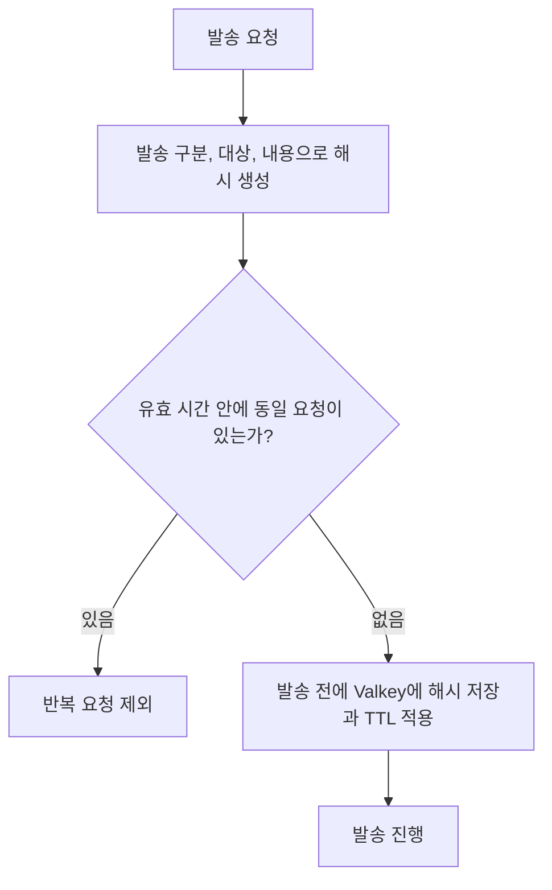
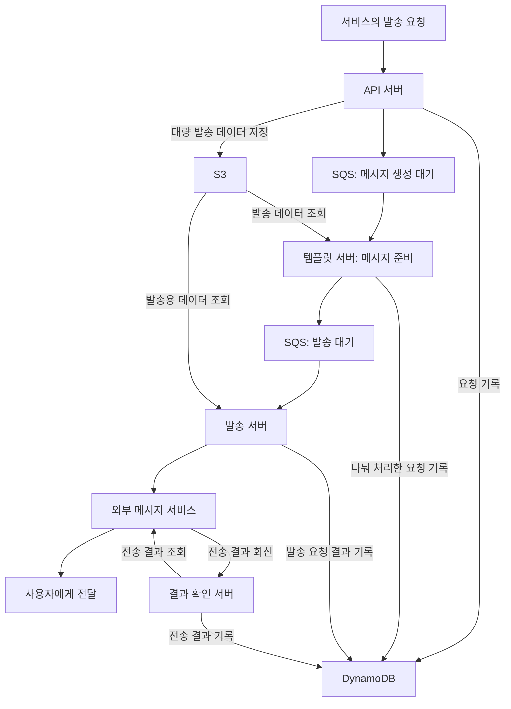

# 통합 알림 시스템

[교육 서비스 작업 목록](README.md)으로 돌아갑니다.

서비스마다 나뉜 알림 발송을 공통 시스템으로 모았습니다. 요청 접수, 메시지 생성, 발송, 결과 확인을 나누고 발송 이력을 추적할 수 있게 했습니다.

## 기본 정보

| 항목 | 내용 |
| --- | --- |
| 작업 기간 | 2025-02 운영 배포 진행 |
| 맡은 범위 | 기술 선택과 구조 설계, 공통 알림 구현, 배포 자동화 |
| 개발 상태 | 개발 완료 |
| 운영 상태 | 2025-03-01 운영 반영 후 운영 중 |

개발 서버 배포: 2025-02-19.

## 왜 시작했는지

- 서비스마다 알림 서버가 따로 있어 발송 기능을 추가하거나 이력을 확인하기 어려웠다.
- 대량 발송 요청을 처리하고, 큐나 서버 장애가 나도 요청을 보관해 다시 처리할 구조가 필요했다.
- 정해진 일정 안에 개발해야 해 복잡한 구성과 학습이 필요한 Kafka는 제외하고 SQS를 선택했다.

## 역할 분담

| 담당 역할 | 맡은 일 |
| --- | --- |
| 본인 | 기술 선택과 시스템 구조 설계, 공통 알림 기능 구현, GitHub Actions 배포 자동화 |
| 인프라 담당자 | 인프라 설계와 구성 검토 |

## 기술 스택

| 구분 | 기술 |
| --- | --- |
| 언어 | TypeScript |
| 백엔드 | NestJS, NestJS Workspaces |
| 메시지 처리 | AWS SQS |
| 데이터베이스 | DynamoDB |
| 스토리지 | AWS S3 |
| 중복 요청 검사 | Valkey |
| 발송 채널 | Biztalk, Twilio SendGrid |
| 인프라와 배포 | GitHub Actions, ECR, ECS, Fargate |

## 템플릿을 사용한 이유

- 서비스가 메시지 내용을 제각각 만들어 보내는 방식을 줄이고, 정해진 알림만 공통 규칙으로 발송하기 위해 사용했다.
- 가입 안내 같은 업무 구분 코드에 이메일, 문자, 알림톡 템플릿을 연결해 같은 목적의 알림을 채널별로 관리했다.
- 템플릿에는 제목, 본문, 필요한 변수와 사용 여부를 저장하도록 설계했다.
- 호출하는 서비스는 사용자 이름이나 인증값 등 필요한 데이터를 전달하고, 알림 시스템에서 템플릿에 맞춰 메시지를 준비하는 구조로 정리했다.

쿠폰 안내는 같은 문구에 이름, 쿠폰명, 코드, 등록 기한을 넣는 사례입니다. 다만 기존 구현에는 템플릿 변경 시 호출 서버나 클라이언트도 다시 배포해야 하는 제한이 남아 있었습니다.

## DynamoDB를 선택한 이유

| 고려한 조건 | 선택 이유 |
| --- | --- |
| 발송 로그는 추가 저장이 많고 수정이 적음 | 로그를 계속 쌓고 요청별 이력을 찾는 용도에 맞춰 검토 |
| 발송량이 시간대에 따라 달라짐 | 요청 증가에 대응하면서 서버 관리 부담을 줄이려는 목적 |
| 서비스와 메시지별 이력 조회 | PK와 SK로 조회 대상을 정하고, 추가 조회에는 GSI 사용 |
| 로그 보관 기간 관리 | 일정 기간 후 자동 삭제하는 TTL 기능을 고려 |
| 비용과 운영 관리 | MongoDB의 시간 순서 데이터 구조와 비교한 뒤 DynamoDB 선택 |

## Valkey를 선택한 이유

- 반복 요청을 빠르게 검사하고, TTL이 지나면 필터링 키를 자동으로 지우기 위해 사용했다.
- 오픈소스 사용과 운영 비용을 고려해 Valkey를 선택했다.
- AWS에서 운영할 때는 인프라 비용이 발생한다. ElastiCache는 Redis OSS 대비 Valkey의 서버리스 가격을 33%, 노드형 가격을 20% 낮게 안내한다. [AWS 요금 안내](https://aws.amazon.com/elasticache/pricing/)

## 반복 발송 요청 필터링

### 적용 정책

- 발송 구분, 대상, 템플릿 기반 발송 내용을 묶어 해시를 만들었다.
- 발송 전에 해시를 Valkey에 저장하고 TTL을 적용했다.
- 정책에 따른 유효 시간 안에 같은 요청이 들어오면 발송 대상에서 제외했다.
- TTL이 지나면 키가 만료되도록 해, 정해진 시간 동안 반복되는 요청을 걸러냈다.



### 권장 명령 예시

```text
SET notification:dedup:<hash> <request-token> NX EX <ttl-seconds>
```

- `NX`: 키가 없을 때만 저장한다. 동시에 같은 요청이 들어와도 먼저 저장한 요청만 통과시킨다.
- `EX`: 정책에 맞는 유효 시간을 초 단위로 지정한다.
- `OK`가 반환되면 발송하고, 키가 이미 있어 `nil`이 반환되면 반복 요청으로 제외한다.
- 조회 후 저장하거나 저장 후 TTL을 따로 설정하지 않고, 한 명령으로 처리한다. [Valkey SET 문서](https://valkey.io/commands/set/)

발송에 성공해도 키는 TTL까지 유지한다. 재시도가 필요한 경우에는 발송 결과를 먼저 확인하고 재시도 정책을 적용한다. 외부 발송 결과가 불명확한 상태에서 키를 지우고 바로 재발송하지 않는다. TTL 필터링은 일정 시간의 반복 요청을 제한하는 용도이며, 발송 성공 이력은 별도로 관리한다.

## 어떻게 해결했는지

### 발송 단계 분리

- API 서버는 발송 요청을 받고, 대량 발송 데이터는 S3에 저장했다.
- 템플릿 서버는 SQS에서 작업을 받아 발송 데이터를 읽고 메시지를 준비했다.
- 발송 서버는 별도 SQS에서 작업을 받아 외부 메시지 서비스에 발송을 요청했다.
- 결과 확인 서버는 외부 서비스의 전송 결과를 받아 DynamoDB에 저장하도록 구성했다.
- 요청 데이터, 나눠 처리한 요청, 발송 요청 결과와 최종 전송 결과를 구분해 기록했다.

### 데이터 구조와 장애 대응

- 하나의 테이블에서 PK와 SK 키를 조합해 서비스 정보, 템플릿, 푸시 토큰, 이벤트 로그를 구분했다.
- 발송 상태와 오류, 요청과 응답 정보를 기록해 어느 단계에서 문제가 생겼는지 확인할 수 있게 했다.
- 큐에 넣지 못한 요청이나 서버 장애 후 다시 처리할 요청을 별도로 보관하도록 설계했다.
- 공통 예외는 한곳에서 처리하고, SQS 오류와 실패 메시지 보관 큐(DLQ), 재처리는 서비스 로직에서 다뤘다.
- Biztalk 웹훅만으로 사용자와 메시지를 찾기 어려운 문제는 DynamoDB의 추가 조회 기준인 GSI를 사용해 해결했다.

### 개발 API 배포 자동화

- 개발 API용 태그를 올리면 GitHub Actions가 실행되도록 작성했다.
- Docker 이미지를 만들고 ECR에 올린 뒤 ECS의 실행 설정에 새 이미지를 반영했다.
- ECS 배포 후 서비스가 안정된 상태가 될 때까지 확인하도록 구성했다.

## 시스템 구조와 발송 흐름



## 결과와 현재 상태

- 개별 서비스의 발송 기능을 공통 시스템으로 모으고, 템플릿에 따라 메시지를 발송하도록 했다.
- 대량 발송 데이터를 따로 보관하고, 요청부터 전송 결과까지 추적할 수 있는 구조를 마련했다.
- 발송 구분, 대상과 내용의 해시를 이용해 TTL 안에 반복되는 동일 발송 요청을 걸러냈다.
- 웹훅 결과를 원래 요청과 연결하는 문제를 해결했다.
- 개발 서버와 운영 서버에 배포하고 실제 서비스 운영까지 진행했다.
