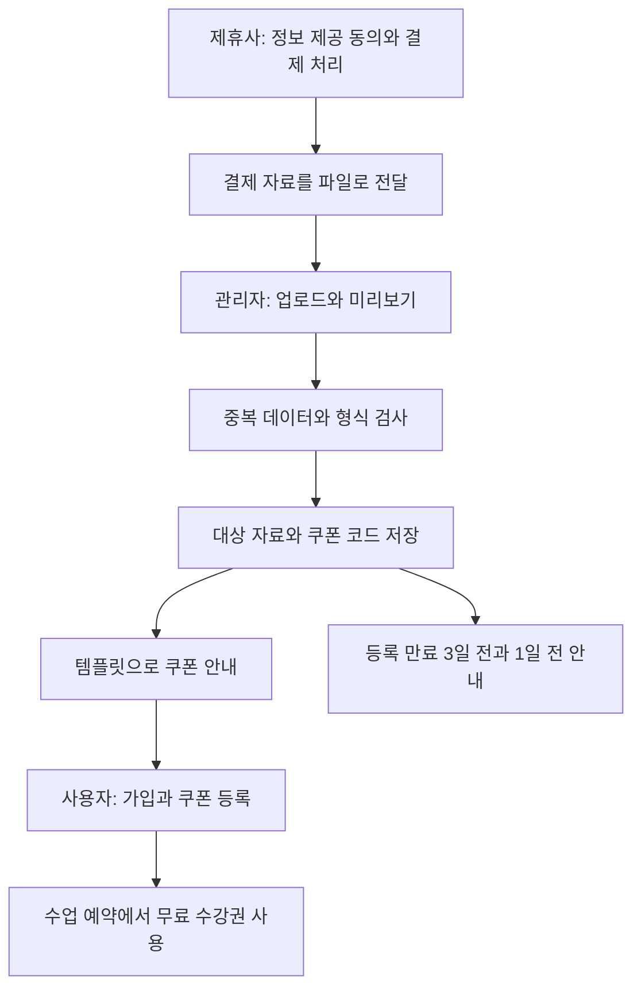

# 쿠폰 이벤트 시스템

[교육 서비스 작업 목록](README.md)으로 돌아갑니다.

쿠폰 정책과 발급 이력을 정리하고, 제휴사의 결제 자료를 받아 무료 수강권을 발급하는 관리자 기능을 만들었습니다.

## 기간과 운영 상태

| 항목 | 내용 |
| --- | --- |
| 근무 기간 | 2024-01 ~ 2025-10 |
| 제휴 쿠폰 연계 작업 시작 | 2025-06-02 |
| 개발 서버 배포 | 2025-06-13 |
| 운영 서버 배포와 최종 오픈일 | 2025-07-28 |

위 날짜는 제휴 쿠폰 연계 작업에 해당합니다. 공통 쿠폰 개선 전체의 작업 기간은 확인 필요입니다.

## 시작한 이유와 문제

- 쿠폰 만료 정책, 발급 대상, 발급 이력과 메시지 발송이 나뉘어 있어 운영이 복잡했다.
- 단기 대응으로 만든 테이블과 코드에 고정된 쿠폰과 상품 연결 방식을 정리할 필요가 있었다.
- 제휴사에서 결제한 사용자에게 무료 수강권을 제공해야 했다.
- 제휴사가 결제 자료를 수동 전달하는 방식을 원해, 관리자에서 자료를 등록하고 처리하는 기능이 필요했다.

## 맡은 일과 역할 분담

- 쿠폰 이벤트 백엔드와 DB를 설계하고 개발했다.
- 발급 대상 등록과 이력 관리 화면, 관리자 API를 구현했다.
- 제휴 쿠폰 작업에는 파일 업로드, 미리보기, 오류 검사, 개별 등록과 일괄 등록, 목록 조회, 개별 삭제가 기록되어 있다.
- 제휴사는 결제와 취소, 자료 추출과 전달을 맡았다. 개발 담당자 간 세부 역할 분담은 확인 필요다.

## 사용 기술

| 구분 | 기술 |
| --- | --- |
| 공통 쿠폰 작업 | TypeScript, NestJS, Prisma, MySQL, React, TailwindCSS, Biztalk, Twilio |
| 제휴 쿠폰 연계에 사용한 기술 | Refine, MUI Pro, Zod, xlsx와 csv 처리 모듈 |

## 처리 방법

### 쿠폰 정책과 운영 기능

- 쿠폰 정책, 대상자, 발급 이력을 나누고 공통 템플릿 테이블을 기준으로 DB를 정리했다.
- 인증일과 발급일을 기준으로 만료일을 정하는 등 여러 만료 정책을 반영했다.
- 발급 이력 검색, 필터링과 다운로드 기능을 만들었다.
- 쿠폰 상태 변경과 알림 발송을 연결했다.

### 제휴 결제 자료 등록

- 제휴사가 정보 제공 동의를 받은 대상자의 결제 자료를 xlsx 또는 csv로 전달하는 흐름으로 정했다.
- 관리자에서 파일을 올려 내용을 미리 보고, 중복 데이터와 형식을 검사한 뒤 등록하도록 구성했다.
- 개별 등록과 일괄 등록, 목록 조회, 개별 삭제 API를 만들었다.
- 쿠폰 코드와 수신 대상 식별값, 연결된 쿠폰, 만료일, 사용일, 마지막 발송 시각을 저장하는 구조를 마련했다.
- 쿠폰 코드는 영문 대문자와 숫자를 조합한 8자리로 만들며, 숫자 0은 제외하도록 정했다.

### 쿠폰 안내와 사용

- 알림톡 발송 시점은 코드 생성 시, 등록 만료 3일 전, 등록 만료 1일 전으로 정했다.
- 같은 안내 문구에 이름, 쿠폰명, 코드, 등록 기한을 넣는 템플릿을 사용했다.
- 사용자는 안내 링크로 가입하며 쿠폰을 등록하고, 수업 예약에서 무료 수강권을 적용하는 흐름이다.
- 초기에는 결제와 취소를 API로 자동 연동하는 방안을 검토했지만, 최종안은 자료를 전달받아 관리자에서 처리하는 방식이다. 환불과 취소의 세부 자동 처리 완료 여부는 확인 필요다.

## 중복 검사와 발송 이력

| 확인된 내용 | 적용 범위 |
| --- | --- |
| 업로드 데이터의 중복과 형식 검사 | 입력 자료 검사. 어떤 필드 조합으로 중복을 판단했는지는 확인 필요 |
| 쿠폰 코드의 DB 고유 제약 | 같은 쿠폰 코드가 두 번 저장되지 않도록 구성 |
| 수신 대상 식별값과 만료일에 조회용 인덱스 설정 | 대상자와 만료 대상 조회. 수신 대상 식별값의 고유 제약 여부는 확인 필요 |
| 마지막 발송 시각 저장 | 발송 이력 필드. 쿠폰 안내 단계별 재발송 차단 조건은 확인 필요 |

데이터 중복 검사와 쿠폰 코드 중복 방지를 알림 중복 발송 방지와 구분했습니다. 생성 안내, 만료 3일 전, 만료 1일 전 알림을 각각 한 번만 보내도록 검사한 기준은 추가 확인이 필요합니다.

## 제휴 쿠폰 처리 흐름

최종 운영 흐름과 발송 요건을 간단히 옮겼습니다. 만료 안내의 실행 도구와 재발송 차단 단계는 확인되지 않아 추가하지 않았습니다.

## 결과와 남은 일

- 쿠폰 정책, 발급 이력과 알림을 연결하고 관리자에서 제휴 자료를 처리할 수 있게 했다.
- 2025-07-28 운영 서버에 배포했다.
- 제휴사 자료 추출과 전달은 수동 방식으로 남았다. 전체 결제 연동이 자동화된 것으로 적지 않았다.
- 취소와 환불 세부 처리, 발송 단계별 중복 방지 조건은 확인 필요다.
