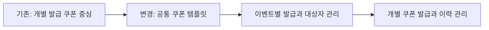
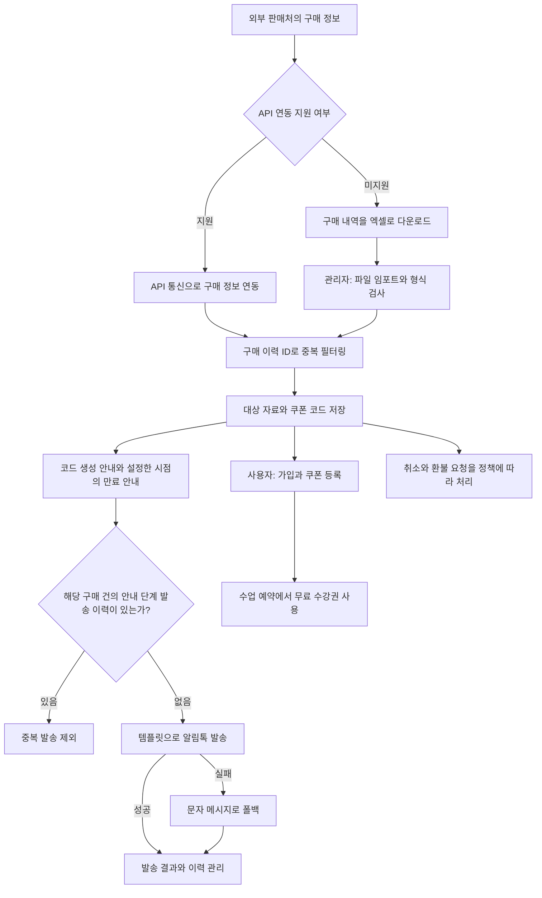

# 쿠폰 이벤트 시스템

[교육 서비스 작업 목록](README.md)으로 돌아갑니다.

여러 외부 판매처의 구매 정보를 내부 시스템으로 모아 쿠폰을 발급하고 관리하도록 만들었습니다. 개별 쿠폰 중심의 구조를 템플릿과 이벤트 기반으로 바꾸고, 관리자 풀스택 개발과 서버, DB 설계를 맡았습니다.

## 기간과 운영 상태

| 항목 | 내용 |
| --- | --- |
| 근무 기간 | 2024-01 ~ 2025-10 |
| 제휴 쿠폰 연계 작업 시작 | 2025-06-02 |
| 개발 서버 배포 | 2025-06-13 |
| 운영 서버 배포와 최종 오픈일 | 2025-07-28 |

공통 쿠폰 개선 전체의 작업 기간: 미확인.

## 시작한 이유와 문제

- 쿠폰 만료 정책, 발급 대상, 발급 이력과 메시지 발송이 나뉘어 있어 운영이 복잡했다.
- 기존에는 개별 쿠폰을 저장하는 인스턴스 테이블 중심이어서 공통 정책을 관리하고 다른 이벤트에 재사용하기 어려웠다.
- 코드에 고정된 쿠폰과 상품 연결 방식을 정리하고, 이벤트별 발급을 공통 구조로 처리할 필요가 있었다.
- 제휴사에서 결제한 사용자에게 무료 수강권을 제공해야 했다.
- 판매처마다 연동 방식이 달라 API 연동과 파일 임포트를 함께 지원해야 했다.
- API, 콜백, 웹훅을 제공하지 않는 판매처는 구매 내역을 엑셀로 내려받아 등록할 수 있어야 했다.

## 맡은 일과 역할 분담

| 담당 역할 | 맡은 일 |
| --- | --- |
| 본인 | 쿠폰 템플릿과 이벤트 기반 DB 설계, 쿠폰 서버와 API 개발, 관리자 화면과 서버를 포함한 풀스택 개발 |
| 프론트엔드 담당자 | 사용자용 서비스의 쿠폰 입력, 등록과 사용 화면 개발 |
| 외부 판매처 | 결제 처리와 구매 정보 제공 |

관리자에서는 파일 업로드, 미리보기, 오류 검사, 개별 등록과 일괄 등록, 목록 조회와 삭제 기능을 개발했다.

## 기술 스택

| 구분 | 기술 |
| --- | --- |
| 공통 쿠폰 작업 | TypeScript, NestJS, Prisma, MySQL, React, TailwindCSS, Biztalk, Twilio |
| 제휴 쿠폰 연계 | Refine, MUI Pro, Zod, xlsx와 csv 처리 모듈 |

## 처리 방법

### 개별 쿠폰 중심에서 템플릿과 이벤트 기반으로 전환

- 개별 발급 쿠폰을 저장하는 인스턴스 테이블에 상위 기준이 되는 템플릿 구조를 도입했다.
- 공통 쿠폰 정책은 템플릿으로 관리하고, 이벤트별 발급과 대상자 관리를 연결했다.
- 공통 정책과 개별 쿠폰의 발급 이력을 나눠, 비슷한 이벤트에서 같은 구조를 재사용할 수 있게 했다.

### 쿠폰 정책과 운영 기능

- 인증일과 발급일을 기준으로 만료일을 정하는 등 여러 만료 정책을 반영했다.
- 취소와 환불 처리 기준을 정책으로 정하고, 해당 정책에 따라 처리하도록 구현했다.
- 발급 이력 검색, 필터링과 다운로드 기능을 만들었다.
- 쿠폰 상태 변경과 알림 발송을 연결했다.

### 판매처 연동과 구매 정보 등록

- API를 제공하는 판매처는 API 통신으로 구매 정보를 연동했다.
- API, 콜백, 웹훅이 없는 판매처는 구매 내역을 엑셀로 내려받아 관리자에서 임포트했다. xlsx와 csv 형식을 지원했다.
- 관리자에서 파일을 올려 내용을 미리 보고, 중복 데이터와 형식을 검사한 뒤 등록하도록 구성했다.
- 개별 등록과 일괄 등록, 목록 조회, 개별 삭제 API를 만들었다.
- 쿠폰 코드와 수신 대상 식별값, 연결된 쿠폰, 만료일, 사용일, 마지막 발송 시각을 저장하는 구조를 마련했다.
- 쿠폰 코드는 영문 대문자와 숫자를 조합한 8자리로 만들며, 숫자 0은 제외하도록 정했다.

### 쿠폰 안내와 사용

- 초기 설정에서 안내 시점을 원하는 대로 변경할 수 있게 했다. 등록 만료 안내의 기본값은 3일 전과 1일 전으로 뒀다.
- 코드 생성 안내와 설정한 시점의 만료 안내를 알림톡으로 발송했다. 알림톡 발송 실패 시 문자 메시지로 폴백하도록 구성했다.
- 같은 안내 문구에 이름, 쿠폰명, 코드, 등록 기한을 넣는 템플릿을 사용했다.
- 사용자는 안내 링크로 가입하며 쿠폰을 등록하고, 수업 예약에서 무료 수강권을 적용하는 흐름이다.

## 중복 검사와 발송 이력

| 처리 방식 | 적용 범위 |
| --- | --- |
| 구매 이력 ID 기반 필터링 | 같은 구매 이력이 반복 유입될 때 중복 처리 방지 |
| 파일 형식 검사 | 임포트할 구매 정보의 형식 확인 |
| 쿠폰 코드의 DB 고유 제약 | 같은 쿠폰 코드가 두 번 저장되지 않도록 구성 |
| 수신 대상 식별값과 만료일에 조회용 인덱스 설정 | 대상자와 만료 대상 조회 |
| 구매 이력 ID와 발송 이력 확인 | 같은 구매 건에서 해당 안내 단계가 이미 발송됐는지 확인해 중복 발송 방지 |
| 마지막 발송 시각 저장 | 발송 이력 관리 |

## 제휴 쿠폰 처리 흐름

## 결과와 운영 상태

- 템플릿과 이벤트를 기준으로 쿠폰 구조를 정리해 공통 정책과 개별 발급 이력을 나눠 관리했다.
- 관리자 화면과 서버, DB를 개발해 제휴 자료 등록부터 쿠폰 발급과 안내까지 처리할 수 있게 했다.
- 2025-07-28 운영 서버에 배포하고 실제 서비스 운영까지 진행했다.
- API 연동과 파일 임포트를 함께 지원해 여러 판매처의 쿠폰 업무를 내부 시스템에서 처리했다.
- 취소와 환불 정책, 안내 시점 설정, 문자 폴백과 발송 이력 기반 중복 방지를 구현하고 운영했다.
