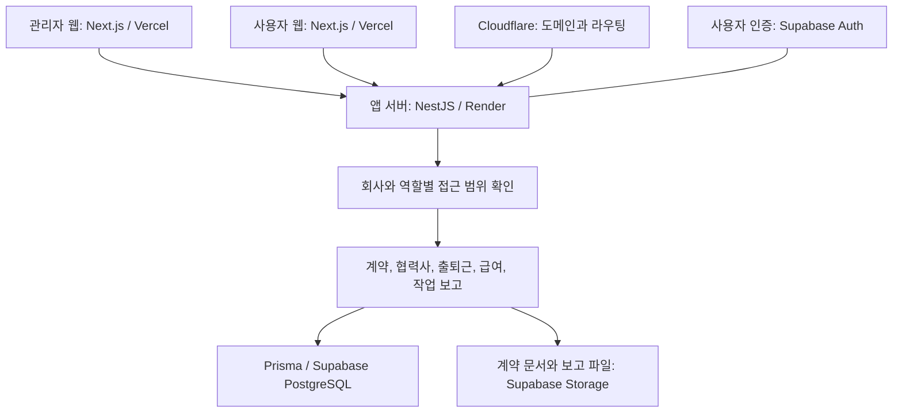
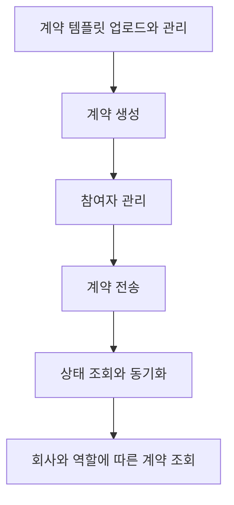

# HR 계약과 현장 운영 SaaS MVP 개발

[프로젝트 개요](README.md)로 돌아갑니다.

도급사와 하청사의 계약, 협력사 관리와 현장 업무를 검증하기 위한 HR 서비스 PoC를 개발했습니다.
관리자와 사용자가 핵심 기능을 직접 사용할 수 있는 MVP를 만들었습니다.

## 기본 정보

| 항목 | 내용 |
| --- | --- |
| 프로젝트 구분 | 사이드, 본업 병행 |
| 작업 기간 | 2025-09 ~ 2025-11 |
| 맡은 범위 | 관리자와 사용자 웹, 앱 서버, DB, 인증, 스토리지, 배포 |
| 개발 상태 | MVP 개발 완료 |
| 배포 상태 | 실제 접속 가능한 환경에 배포해 제품 흐름 검증 |

## 왜 시작했는지

- 계약, 발주, 협력사 관리와 작업 보고가 Excel, 팩스, 메신저에 흩어져 있었습니다.
- 업무 방식이 통일되지 않아 이를 SaaS로 처리할 수 있는지 검증해야 했습니다.
- 투자 검토를 위해 짧은 기간 안에 관리자와 사용자 양쪽의 핵심 흐름을 구현해야 했습니다.

## 맡은 역할

관리자와 사용자 웹부터 서버, DB, 인증, 파일 저장과 배포까지 설계하고 개발했습니다.

## 기술 스택

| 구분 | 기술 | 사용한 곳 |
| --- | --- | --- |
| 언어 | TypeScript | 웹과 서버 개발 |
| 프론트엔드 | Next.js | 관리자 웹과 사용자 웹 |
| 백엔드 | NestJS, Prisma | 앱 서버, 업무 로직, DB 접근 |
| 데이터베이스 | Supabase PostgreSQL | 사용자, 회사, 계약과 현장 업무 데이터 |
| 인증 | Supabase Auth | 사용자 인증 |
| 스토리지 | Supabase Storage, S3 방식 파일 저장 | 계약 문서와 작업 보고 파일 |
| 배포 | Vercel, Render | 웹 배포, 백엔드 무료 티어 배포 |
| 도메인과 라우팅 | Cloudflare | 백엔드 접속 경로 연결 |

## 어떻게 구현했는지

### 회사와 역할별 접근 범위

여러 회사가 하나의 서비스를 사용하는 멀티 테넌트 구조로 설계했습니다.
역할은 `WORKER`, `OWNER`, `ADMIN`, `MANAGER`, `SUPER_ADMIN`으로 구분했습니다.
회사와 역할에 따라 접근 범위와 조회할 수 있는 계약이 달라지도록 구현했습니다.

### 전자계약과 현장 업무

- 계약 템플릿 업로드와 관리, 계약 생성과 전송을 구현했습니다.
- 계약 참여자 관리, 상태 조회와 동기화 흐름을 연결했습니다.
- 협력사 관리, 작업 보고와 알림 기능을 구현했습니다.
- 계약 문서와 작업 보고 파일은 스토리지에 저장했습니다.
- API를 사용자, 회사, 초대, 계약, 출퇴근, 급여, 문의, 약관, 대시보드 영역으로 나눴습니다.

### 배포와 검증

Next.js 웹은 Vercel에 배포했습니다.
백엔드는 Render 무료 티어에 배포하고 Cloudflare로 도메인과 라우팅을 연결했습니다.
비용 제약 안에서 실제 접속해 업무 흐름을 검증할 수 있는 환경을 구성했습니다.

## 서비스 구성

## 계약 처리 흐름

## 결과와 현재 상태

- 관리자 운영 기능과 사용자 계약 흐름을 갖춘 MVP를 완성했습니다.
- 인증, 파일 저장, 백엔드 API와 배포 환경까지 연결했습니다.
- 실제 서비스 구조와 업무 흐름을 검증하고, 투자 검토에 사용할 제품 기반을 마련했습니다.
- 이후 운영 상태와 추가 개발 범위는 확인이 필요합니다.
