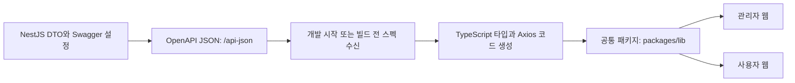
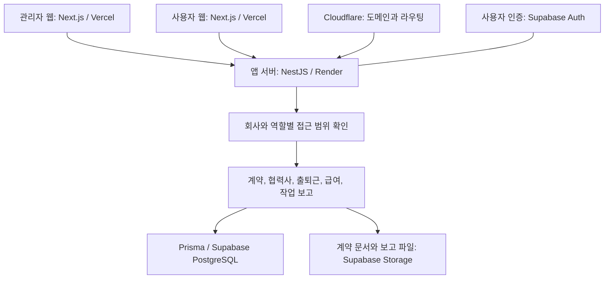
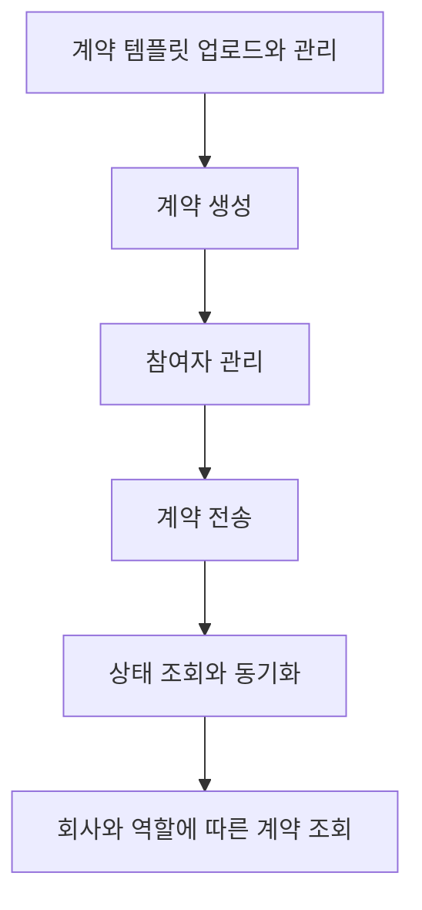

# HR 계약과 현장 운영 SaaS MVP 개발

[프로젝트 개요](README.md)로 돌아갑니다.

HR 서비스 PoC를 개발했습니다.
관리자와 사용자가 핵심 기능을 직접 사용할 수 있는 MVP를 만들었습니다.

## 기본 정보

| 항목 | 내용 |
| --- | --- |
| 작업 기간 | 2025-09 ~ 2025-11 |
| 맡은 범위 | 관리자와 사용자 웹, 앱 서버, DB, 인증, 스토리지, 배포 |
| 개발 상태 | MVP 개발과 작업물 전달 완료 |
| 운영 상태 | 접속 가능한 환경에 배포해 제품 흐름 검증 후 프로젝트 종료 |

## 왜 시작했는지

HR 서비스 PoC 개발을 위해 시작했습니다.

## 역할 분담

관리자와 사용자 웹부터 서버, DB, 인증, 파일 저장과 배포까지 설계하고 개발했습니다.

## 기술 스택

| 구분 | 기술 |
| --- | --- |
| 언어 | TypeScript |
| 프론트엔드 | Next.js |
| 백엔드 | NestJS, Prisma, Zod |
| API 스펙 | Swagger, OpenAPI, openapi-typescript-codegen |
| 공통 코드 관리 | pnpm workspace, Turborepo |
| 데이터베이스 | Supabase PostgreSQL |
| 인증 | Supabase Auth |
| 스토리지 | Supabase Storage, S3 방식 파일 저장 |
| 배포 | Vercel, Render |
| 도메인과 라우팅 | Cloudflare |

## 어떻게 해결했는지

### 서버와 프론트엔드 구조

서버는 업무별 NestJS 모듈로 나누고, 요청 처리와 업무 로직, DB 접근을 분리했습니다.

| 구성 | 맡은 일 |
| --- | --- |
| Controller | API 요청과 응답 처리 |
| Service | 계약, 출퇴근, 급여 등 업무 로직 처리 |
| Repository | Prisma를 통한 DB 조회와 저장 |
| DTO와 Zod | 요청 데이터 구조 정의와 입력값 검증 |
| 공통 처리 | 인증, 권한 검사, 응답 형식과 오류 처리 |

Prisma 스키마는 별도 저장소에서 관리하고 서버에 Git submodule로 연결했습니다.
전자계약은 Glosign 연동 코드를 분리해 계약 생성과 전송, 상태 동기화에 사용했습니다.

프론트엔드는 관리자 웹과 사용자 웹을 하나의 모노레포에서 관리했습니다.

| 경로 | 맡은 일 |
| --- | --- |
| `apps/admin` | 관리자 웹 |
| `apps/client` | 사용자 웹 |
| `packages/lib` | 인증, API 호출, 업무별 공통 로직 |
| `packages/ui` | 공통 UI |
| `packages/types`, `packages/config` | 공통 타입과 설정 |

### OpenAPI 기반 코드 생성

서버의 DTO와 Swagger 설정에서 API 스펙을 생성했습니다.
인증 방식, 성공 응답과 공통 오류 응답은 공통 데코레이터로 묶었습니다.
Swagger UI는 `/api`, JSON 스펙은 `/api-json`으로 제공하도록 구성했습니다.
운영 환경에서는 Swagger를 비활성화했습니다.

프론트엔드는 JSON 스펙을 받아 `openapi-typescript-codegen`으로 TypeScript 타입과 Axios 호출 코드를 생성했습니다.
생성 코드는 `packages/lib/src/generated/api`에 두고 관리자와 사용자 웹에서 함께 사용했습니다.
그 위에 업무별 서비스 코드를 두어 인증 토큰과 응답 처리를 연결했습니다.

개발 시작과 기본 빌드 전 단계에 스펙 수신과 코드 생성을 연결했습니다.
API 타입과 호출 코드를 각각 작성하는 작업을 줄이는 구조입니다.
자동화 범위는 스펙 생성, 수신과 클라이언트 코드 생성까지입니다.
예약 동기화와 자동 PR 생성은 실행 가능한 배포 흐름으로 완성하지 않았습니다.

### 회사와 역할별 접근 범위

여러 회사가 하나의 서비스를 사용하는 멀티 테넌트 구조로 설계했습니다.
역할은 `WORKER`, `OWNER`, `ADMIN`, `MANAGER`, `SUPER_ADMIN`으로 구분했습니다.
회사와 역할에 따라 접근 범위와 조회할 수 있는 계약이 달라지도록 구현했습니다.

### 전자계약과 현장 업무

- 계약 템플릿 업로드와 관리, 계약 생성과 전송을 구현했습니다.
- 계약 참여자 관리, 상태 조회와 동기화 흐름을 연결했습니다.
- 협력사 관리, 작업 보고와 알림 기능을 구현했습니다.
- 계약 문서와 작업 보고 파일은 스토리지에 저장했습니다.
- API를 사용자, 회사, 초대, 계약, 출퇴근, 급여, 문의, 약관, 대시보드 영역으로 나눴습니다.

### 배포와 검증

Next.js 웹은 Vercel에 배포했습니다.
백엔드는 Render 무료 티어에 배포하고 Cloudflare로 도메인과 라우팅을 연결했습니다.
비용 제약 안에서 실제 접속해 업무 흐름을 검증할 수 있는 환경을 구성했습니다.

## 서비스 구성

## 계약 처리 흐름

## 결과와 현재 상태

- 관리자 운영 기능과 사용자 계약 흐름을 갖춘 MVP를 완성했습니다.
- 인증, 파일 저장, 백엔드 API와 배포 환경까지 연결했습니다.
- HR 서비스의 핵심 흐름을 검증할 수 있는 PoC를 완성했습니다.
- 작업물을 전달하고 프로젝트를 완료했습니다.
