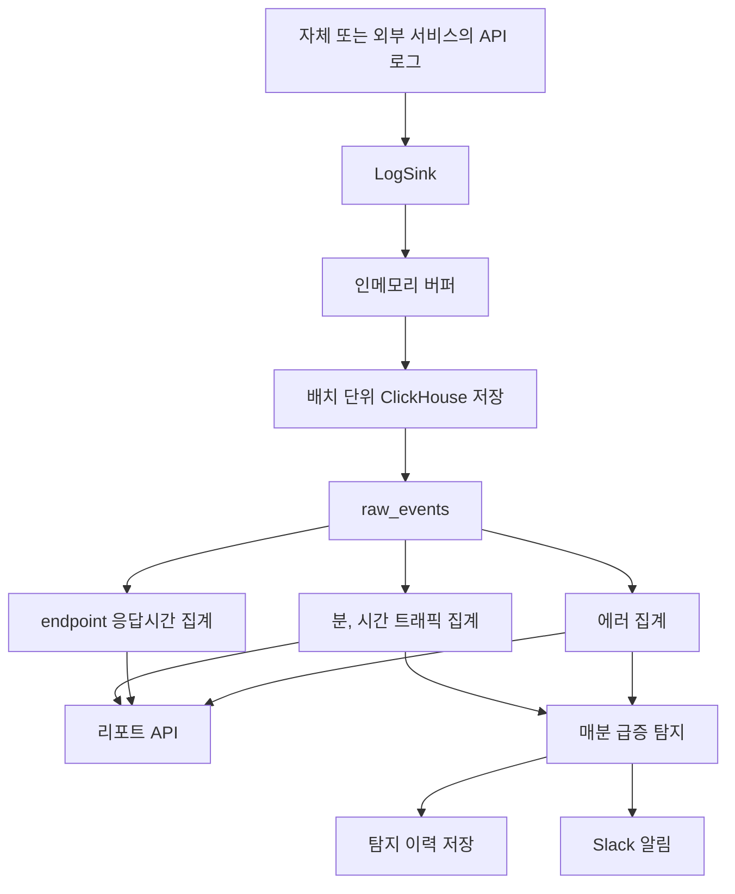

# loglens API 로그 분석 백엔드 MVP 개발

[프로젝트 개요](README.md)로 돌아갑니다.

API 로그를 매번 원본에서 집계하는 대신 ClickHouse Materialized View로 저장 시점에 집계하고, 운영자가 필요한 트래픽, 지연시간과 에러 리포트를 빠르게 조회하도록 만든 백엔드 프로젝트입니다.

[코드 저장소](https://github.com/KimHG1995/loglens)

## 기본 정보

| 항목 | 내용 |
| --- | --- |
| 작업 기간 | 2026-07 |
| 맡은 범위 | 요구사항과 데이터 구조 설계, 로그 수집 파이프라인, ClickHouse 집계, 리포트 API, 급증 탐지와 Slack 알림, 테스트와 CI |
| 개발 상태 | MVP 개발 완료 |
| 운영 상태 | 로컬 환경과 E2E 테스트에서 동작 검증 완료 |

## 왜 시작했는지

API 서버를 운영할 때 요청량, 느린 API와 반복되는 에러를 확인하려면 로그 원본을 계속 검색하고 집계해야 합니다.
대량 로그에서도 반복 계산을 줄이고 운영에 필요한 지표를 빠르게 조회하는 구조를 직접 설계해 보고자 시작했습니다.

Kibana 전체 기능을 구현하기보다 API 트래픽, 응답시간과 에러 분석에 범위를 좁히고 ClickHouse의 집계 기능을 활용하는 백엔드에 집중했습니다.

## 기술 스택

| 구분 | 기술 |
| --- | --- |
| 언어 | TypeScript |
| 백엔드 | NestJS 11, Zod, nestjs-cls, Pino |
| 데이터베이스 | ClickHouse 25.3 LTS |
| 데이터 처리 | MergeTree, SummingMergeTree, AggregatingMergeTree, Materialized View |
| API 문서와 타입 | Swagger, OpenAPI, openapi-typescript |
| 자동화와 알림 | NestJS Schedule, Slack Webhook, GitHub Actions |
| 개발 환경 | pnpm, Docker Compose, Jest |

## 어떻게 해결했는지

### 로그 수집과 배치 저장

자체 서비스 요청은 Access Log 미들웨어에서 수집하고, 외부 서비스는 `POST /v1/logs`로 최대 1,000건의 로그를 한 번에 받을 수 있도록 구성했습니다.

ClickHouse에 요청마다 단건으로 저장하지 않고 애플리케이션에 로그를 잠시 모은 뒤 기본 1,000건 또는 2초 단위로 배치 저장했습니다.
동시에 여러 flush가 실행되지 않도록 직렬화하고 애플리케이션 종료 시 남은 버퍼를 저장하도록 구성했습니다.

로그 저장 구현은 `LogSink` 인터페이스 뒤로 분리해 이후 Kafka 같은 다른 수집 구조로 교체할 수 있는 지점을 남겼습니다.

### 조회 비용을 저장 시점으로 이동

원본 로그는 `raw_events`에 저장하고 트래픽과 에러, 응답시간 통계는 ClickHouse Materialized View가 insert 시점에 별도 집계 테이블로 생성하도록 했습니다.

- 분, 시간 단위 요청 수는 `SummingMergeTree`로 집계했습니다.
- endpoint별 평균과 p50, p95, p99 응답시간은 `AggregatingMergeTree`와 quantile state로 관리했습니다.
- 4xx와 5xx 에러는 별도 집계 테이블에 저장했습니다.

리포트 API는 원본 로그 전체를 다시 스캔하지 않고 집계 테이블만 조회하도록 구성했습니다.

### 운영 리포트 API

운영자가 필요한 정보를 다음 API로 확인하도록 구현했습니다.

- 분, 시간 단위 트래픽과 상태코드별 요청 수
- endpoint별 평균, p50, p95, p99 응답시간
- 에러가 많은 API와 4xx, 5xx 필터
- 트래픽과 5xx 급증 탐지 이력

모든 리포트는 JSON 응답과 CSV 다운로드를 지원합니다.

### 급증 탐지와 Slack 알림

매분 직전 1분의 요청 수와 5xx 수를 이전 구간의 이동평균과 비교하도록 구성했습니다.

현재 값이 최소 건수와 이동평균 배율을 함께 고려한 임계값을 넘으면 급증으로 판단하고, 탐지 이력을 ClickHouse에 저장한 뒤 Slack Webhook으로 알립니다.
Slack이 설정되지 않았거나 전송에 실패해도 탐지 작업 자체는 계속 동작하도록 분리했습니다.

### 공통 API 규칙과 검증

- `x-request-id`를 기준으로 traceId를 생성하거나 이어받아 구조화 로그, 에러 응답과 저장 로그에 함께 전달했습니다.
- 모든 API 에러는 RFC 7807 `problem+json` 형식으로 통일했습니다.
- 환경 변수와 요청, 응답 스키마는 Zod를 기준으로 정의했습니다.
- Zod DTO에서 OpenAPI 문서를 생성하고 `openapi-typescript`로 프론트에서 사용할 타입을 자동 생성했습니다.
- GitHub Actions에서 lint, build, 단위 테스트, ClickHouse 기반 E2E 테스트와 OpenAPI 산출물 최신성을 확인하도록 구성했습니다.

## 처리 흐름

## 결과와 현재 상태

- ClickHouse Materialized View를 이용해 원본 로그 조회 대신 미리 집계한 데이터를 조회하는 구조를 구현했습니다.
- 로그 수집, 트래픽과 응답시간, 에러 리포트, CSV 다운로드와 급증 탐지까지 MVP 범위를 완성했습니다.
- 공통 traceId, RFC 7807 오류 응답과 Zod 기반 OpenAPI 타입 생성 흐름을 구성했습니다.
- 최종 구조 리팩터링 후 단위 테스트 24건과 E2E 테스트 21건을 통과했고, GitHub Actions에서도 같은 검증 흐름을 실행하도록 구성했습니다.
