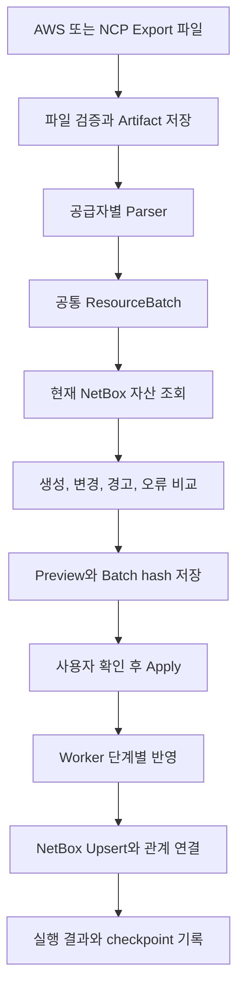

# NetBox Cloud Inventory 멀티클라우드 인프라 자산 관리 PoC 개발

[프로젝트 개요](README.md)로 돌아갑니다.

여러 AWS와 NAVER Cloud Platform 계정에 흩어진 인프라 자산을 한곳에서 조회하고 관계를 추적할 수 있도록 NetBox를 중앙 인프라 장부로 사용하는 PoC를 만들었습니다.
현재 구현은 클라우드 API 자동 수집 전 단계로, 실제 콘솔 Export 파일을 안전하게 업로드하고 변경 내용을 확인한 뒤 NetBox에 반영하는 수동 Import 흐름에 집중했습니다.

[코드 저장소](https://github.com/KimHG1995/netbox-cloud-inventory)

## 기본 정보

| 항목 | 내용 |
| --- | --- |
| 작업 기간 | 2026-07 |
| 맡은 범위 | 자산 모델과 동기화 정책 설계, FastAPI Import UI와 API, 파일 파서, PostgreSQL 작업 큐, NetBox 스키마와 반영 로직, 테스트와 로컬 통합 환경 |
| 개발 상태 | 수동 Import PoC 개발 완료 |
| 운영 상태 | 합성 데이터와 테스트 계정 기준 로컬 통합 검증 완료, 실제 운영 계정 연동 미진행 |

## 왜 시작했는지

클라우드 계정이 늘어나면 서버, VPC, Subnet, IP, Load Balancer, DNS와 데이터베이스 관계를 각 공급자 콘솔에서 따로 확인해야 합니다.
특정 IP나 Domain이 어느 계정과 네트워크, 서버, 업무 서비스로 이어지는지 한 화면에서 확인하기 어렵고, 사람이 별도 문서로 관리하면 실제 인프라와 기록이 쉽게 어긋날 수 있습니다.

별도의 자산 관리 화면을 처음부터 만들기보다 인프라 Source of Truth 도구인 NetBox의 검색과 관계 기능을 활용하고, 공급자마다 다른 Export 데이터를 안전하게 NetBox 모델로 변환하는 수집 계층에 집중했습니다.

## 기술 스택

| 구분 | 기술 |
| --- | --- |
| 언어 | Python 3.12 |
| API와 UI | FastAPI, 서버 렌더링 HTML |
| 제어 데이터베이스 | PostgreSQL, SQLAlchemy, Alembic |
| 자산 관리 | NetBox 4.6, NetBox Custom Objects |
| 파일 처리 | CSV, XLSX, JSON Schema |
| 개발 환경 | uv, Docker Compose |
| 테스트와 자동화 | pytest, GitHub Actions |

## 어떻게 해결했는지

### NetBox를 중앙 인프라 장부로 사용

자산 자체를 별도 애플리케이션 데이터베이스에 다시 복제하지 않고 NetBox가 정규화된 인프라 자산과 관계를 저장하도록 했습니다.
PostgreSQL에는 Import 정보, 작업 큐, 실행 상태, Preview 결과와 파일 정보처럼 수집과 반영을 제어하기 위한 데이터만 저장했습니다.

클라우드 공통 자산은 NetBox 기본 모델을 사용하고 공급자 고유 개념은 Custom Object로 확장했습니다.

- Region과 Zone
- VPC와 Subnet
- Virtual Machine과 Network Interface
- 사설 IP와 공인 IP
- Load Balancer
- Domain과 DNS
- Managed Database
- Object Storage
- Business Service와 Owner

### 공급자별 입력을 공통 모델로 정규화

AWS와 NAVER Cloud Platform의 Export 형식이 달라도 이후 처리 로직은 같게 가져가기 위해 모든 Parser가 공통 `ResourceBatch`를 생성하도록 했습니다.

현재 수동 Import에서 지원하는 입력은 다음과 같습니다.

- AWS Resource Explorer CSV
- NAVER Cloud Platform Server 목록 XLSX
- NAVER Cloud Platform Public IP 목록 XLSX
- NAVER Cloud Platform Load Balancer 목록 XLSX
- NAVER Cloud Platform Object Storage 목록 XLSX
- 전체 관계를 표현하는 표준 JSON Import Bundle

각 리소스는 provider, realm, account ID, region, resource type과 external ID를 조합한 `cloud_uid`로 식별해 같은 데이터를 반복 업로드해도 동일 객체를 찾도록 했습니다.

### Preview 후 Apply하는 안전한 Import 흐름

업로드한 파일을 바로 NetBox에 쓰지 않고 먼저 파싱과 정규화, 현재 NetBox 데이터와의 비교를 수행해 생성, 변경, 경고와 오류를 Preview로 보여주도록 했습니다.

Preview 시점의 내용은 Batch hash로 고정하고 Apply 요청에서도 같은 hash인지 확인해 사용자가 확인한 변경 내용과 실제 반영 대상이 달라지는 것을 막았습니다.

반영 작업은 리소스 의존 순서에 따라 여러 단계로 나누고 checkpoint를 저장해 중간 실패 이후에도 이미 완료한 단계를 기준으로 다시 처리할 수 있게 했습니다.

### 기존 운영 정보와 수동 편집 보존

클라우드에서 관측한 값과 NetBox에서 운영자가 직접 관리하는 값을 구분했습니다.

- VM 상태, VPC, Subnet, IP 같은 클라우드 관측값은 수집 결과를 기준으로 갱신합니다.
- Owner, Business Service, 설명과 운영 메모처럼 사람이 보강한 정보는 Import가 덮어쓰지 않도록 했습니다.

이 방식으로 자동 수집 영역과 운영자가 관리하는 메타데이터의 책임을 분리했습니다.

### 불완전한 파일로 인한 잘못된 비활성화 방지

수동 Export는 전체 자산을 담고 있다고 보장할 수 없기 때문에 파일에서 리소스가 보이지 않는다는 이유만으로 기존 NetBox 객체를 비활성화하거나 삭제하지 않도록 했습니다.

후속 자동 Collector도 API 수집 범위가 완전하게 성공한 경우에만 미발견 여부를 판단하고, 첫 미발견은 후보 상태로 두고 연속 미발견 이후에만 inactive 처리하는 정책으로 설계했습니다.
수집기가 NetBox 객체를 최종 삭제하지 않는 것도 기본 원칙으로 정했습니다.

### 파일 업로드와 작업 처리를 API에서 분리

업로드 파일은 크기, 확장자와 실제 콘텐츠 형식을 검증하고 원본 Artifact로 별도 보관합니다.
파싱과 비교, NetBox 반영은 PostgreSQL 기반 작업 큐를 통해 Worker가 처리하도록 해 HTTP 요청과 긴 처리 작업을 분리했습니다.

Worker는 파일을 Parser에 전달해 `ResourceBatch`로 만들고 현재 NetBox 상태를 읽어 Preview를 생성합니다.
Apply 단계에서는 승인된 Preview만 사용해 NetBox에 create, update 또는 unchanged 결과를 기록합니다.

### 자동 Collector를 위한 확장 지점

최종 목표는 클라우드 API 기반 자동 수집이지만 PoC에서는 먼저 실제 Export 파일을 이용한 수동 수집과 조회 가치를 검증했습니다.

File Parser와 향후 API Collector가 같은 `ResourceBatch`를 출력하도록 경계를 잡아 AWS나 NAVER Cloud Platform API Collector를 추가해도 정규화, 비교와 NetBox 반영 코드는 재사용할 수 있게 설계했습니다.
현재 저장소에는 AWS와 NAVER Cloud Platform API Collector는 아직 구현하지 않았습니다.

## 처리 흐름

## 결과와 현재 상태

- 여러 클라우드 계정의 서버와 네트워크, IP, Load Balancer, DNS, Database, Object Storage 관계를 NetBox에서 조회할 수 있는 공통 모델을 구성했습니다.
- AWS CSV, NAVER Cloud Platform XLSX와 표준 JSON Bundle을 같은 정규화 흐름으로 처리하는 수동 Import PoC를 구현했습니다.
- Preview 승인, Batch hash 검증, 반복 업로드와 반복 Apply의 멱등성을 구현했습니다.
- 불완전한 수동 Export가 기존 자산을 삭제하거나 비활성화하지 않게 하고 Owner 같은 수동 운영 메타데이터를 보존하도록 했습니다.
- 합성 Fixture와 테스트 계정으로 전체 Docker Compose 흐름을 검증하고 GitHub Actions에서 기본 품질 검사를 수행하도록 구성했습니다.
- 클라우드 API 자동 Collector, 실제 운영 계정 연결, SSO와 Secret Manager 연동은 후속 작업으로 남아 있습니다.
