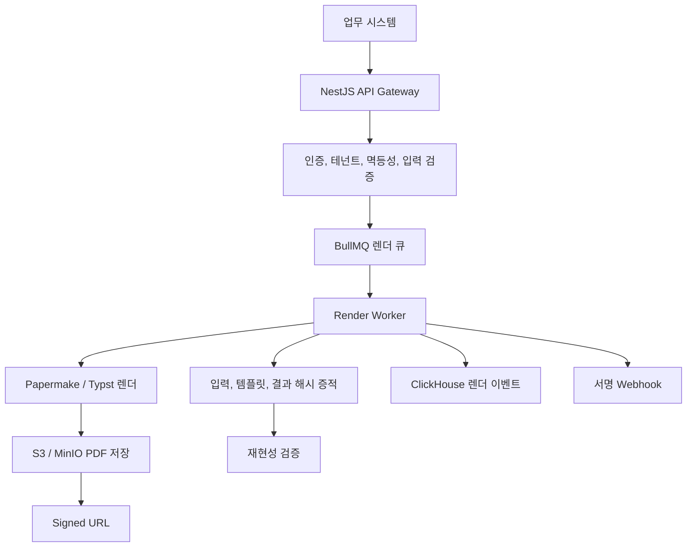

# PaperTrail 전자문서 생성과 증적 플랫폼 개발

[프로젝트 개요](README.md)로 돌아갑니다.

각 업무 시스템이 PDF 생성 로직과 렌더링 인프라를 따로 운영하지 않도록 문서 생성을 공용 서비스로 분리했습니다.
단순 PDF 생성보다 어떤 템플릿 버전과 입력으로 결과가 만들어졌는지 다시 확인할 수 있는 재현성과 감사 추적을 핵심 기능으로 설계했습니다.

[코드 저장소](https://github.com/KimHG1995/papertrail)

## 기본 정보

| 항목 | 내용 |
| --- | --- |
| 작업 기간 | 2026-07 |
| 맡은 범위 | 제품과 시스템 설계, NestJS 게이트웨이와 워커, 데이터 모델, 렌더 파이프라인, 보안과 증적, Next.js Admin, 로컬 인프라 구성 |
| 개발 상태 | 핵심 기능 개발 완료, 확장 기능 일부 진행 |
| 운영 상태 | 실제 렌더 엔진을 포함한 로컬 종단 검증 완료, 운영 배포 미진행 |

## 왜 시작했는지

업무 시스템마다 PDF 라이브러리와 템플릿, 렌더링 환경을 따로 관리하면 같은 문서를 다시 만들기 어렵고 생성 이력을 일관되게 남기기도 어렵습니다.
또한 PDF 렌더링과 PDF/A 변환은 CPU와 메모리를 많이 사용하는 작업이라 API 서버가 직접 처리하면 문서 생성량에 따라 일반 요청 처리 성능까지 영향을 받을 수 있습니다.
문서 생성 기능을 공용 서비스로 분리하고 템플릿 버전, 입력과 출력 해시를 함께 관리해 같은 조건의 문서를 다시 검증할 수 있는 구조를 만들고자 했습니다.

## 기술 스택

| 구분 | 기술 |
| --- | --- |
| 언어 | TypeScript |
| 프론트엔드 | Next.js 15 |
| 백엔드 | NestJS 11, Zod, Drizzle ORM |
| 데이터베이스 | PostgreSQL, ClickHouse |
| 큐 | Redis, BullMQ |
| 스토리지 | S3, MinIO |
| 렌더링 | Papermake, Typst, PDF/A |
| 보안 | API Key, HMAC-SHA256, AES-256-GCM |
| 관측성 | OpenTelemetry, Prometheus |
| 개발 환경 | pnpm workspace, Docker Compose |

## 어떻게 해결했는지

### 공용 문서 생성 API와 멀티테넌트

- NestJS 게이트웨이가 인증, 테넌트 격리, 입력 검증과 문서 상태를 관리하도록 했습니다.
- API Key와 스코프로 접근 범위를 나누고 테넌트별 데이터가 섞이지 않도록 조회와 저장 기준을 분리했습니다.
- 같은 요청이 반복돼도 문서가 중복 생성되지 않도록 멱등성을 적용했습니다.
- 테넌트별 분당 레이트 리밋과 월 렌더 쿼터를 두어 특정 사용자가 자원을 과도하게 사용하지 않도록 구성했습니다.

### 렌더링 책임과 서버 자원 분리

PDF와 PDF/A를 직접 생성하는 코드는 CPU와 메모리 사용량이 커질 수 있어 PaperTrail API 서버가 렌더링까지 직접 담당하지 않도록 했습니다.

PaperTrail은 인증, 멀티테넌트, 템플릿 버전, 문서 상태, 멱등성, 입력과 출력 해시, 감사 로그와 스토리지 위치 같은 메타데이터와 제어 흐름을 관리합니다.
실제 Typst 해석과 PDF 생성, PDF/A 변환은 별도 오픈소스 렌더 엔진인 Papermake에 위임했습니다.

이 구조로 API 서버와 렌더링 자원의 확장 단위를 분리했습니다.
문서 생성량이 늘어날 때 API 서버 전체 사양을 함께 키우는 대신 Render Worker와 Papermake 쪽만 별도로 확장할 수 있도록 했습니다.
실제 PDF 파일도 PostgreSQL에 저장하지 않고 S3 또는 MinIO에 두고, 애플리케이션은 상태와 해시, 객체 키 중심으로 관리하도록 구성했습니다.

### Papermake와 Rust, Typst를 선택한 이유

Papermake의 렌더 코어는 Rust로 구현되어 있고 Typst를 외부 CLI 프로세스로 매번 실행하는 방식이 아니라 Rust 라이브러리로 직접 사용합니다.
Papermake 서버도 Rust의 Axum과 Tokio 기반으로 구성되어 있어 문서 렌더 전용 서비스로 독립 실행할 수 있습니다.

이 선택에서 기대한 이점은 다음과 같습니다.

- Rust는 가비지 컬렉터가 없는 네이티브 실행 환경이라 렌더처럼 CPU와 메모리를 집중적으로 사용하는 작업을 별도 서비스에서 처리하기에 적합합니다.
- Typst를 라이브러리로 직접 호출하면 렌더마다 CLI 프로세스를 새로 실행하는 비용과 폰트 탐색 같은 시작 오버헤드를 줄일 수 있습니다.
- Typst 자체도 다중 코어 렌더 최적화를 지원해 문서 구조에 따라 여러 CPU 코어를 활용할 수 있습니다.
- PaperTrail과 렌더 엔진을 분리했기 때문에 렌더 부하가 증가하면 Rust 기반 Papermake 인스턴스만 별도로 늘릴 수 있습니다.

다만 Rust 기반이라는 이유만으로 모든 문서가 항상 더 빠르다고 보지는 않았습니다.
실제 처리 시간은 템플릿 복잡도, 이미지와 폰트, PDF/A 변환, 서버 CPU에 따라 달라질 수 있어 특정 배수의 성능 향상은 주장하지 않았습니다.
대신 API 서버의 자원 사용량과 렌더링 자원을 분리하고 렌더 엔진 자체의 실행 오버헤드를 줄이는 구조적 이점을 선택 기준으로 삼았습니다.

### 비동기 렌더 파이프라인

문서 요청은 HTTP 처리와 실제 PDF 렌더를 분리했습니다.

1. 게이트웨이에서 API Key와 테넌트를 확인합니다.
2. 템플릿 버전과 JSON Schema를 확인하고 입력을 검증합니다.
3. 입력과 템플릿 기준으로 증적용 해시를 계산하고 문서 상태를 `QUEUED`로 저장합니다.
4. BullMQ에 렌더 작업을 넣고 API는 202로 먼저 응답합니다.
5. 별도 NestJS 워커가 작업을 가져와 Papermake로 실제 PDF 또는 PDF/A를 생성합니다.
6. 결과 파일을 S3 호환 스토리지에 저장하고 outputHash와 상태를 갱신합니다.
7. 완료 결과를 서명된 Webhook과 만료형 Signed URL로 전달합니다.

실패한 작업은 재시도하고 초과한 작업을 DLQ로 분리했으며, Redis 기반 분산 세마포어로 테넌트별 동시 렌더 수를 제한했습니다.

### 템플릿 버전과 재현성 검증

- 템플릿을 등록하고 DRAFT, REVIEWING, APPROVED, PUBLISHED 상태로 관리하며 발행된 버전만 일반 렌더에 사용하도록 했습니다.
- 문서 생성 당시 template hash, input hash와 output hash를 증적으로 남겼습니다.
- 완료된 문서는 같은 템플릿과 입력으로 다시 렌더해 기존 outputHash와 비교하는 재현성 검증 API를 구현했습니다.
- 실제 Papermake를 사용한 종단 검증에서 동일 입력 재렌더 시 outputHash가 일치하는 것을 확인했습니다.

### 대량 생성과 외부 연동

- 단건 문서 생성뿐 아니라 CSV 기반 대량 생성과 배치 진행률을 지원했습니다.
- Webhook은 HMAC-SHA256으로 서명하고 재시도와 delivery 이력을 관리하도록 구성했습니다.
- 생성된 결과는 직접 스토리지를 공개하지 않고 만료 시간이 있는 Signed URL로 내려받도록 했습니다.

### 개인정보와 감사 추적

- 입력 원문을 기본적으로 그대로 저장하지 않고 사람이 확인할 값은 PII 마스킹된 미리보기로 남겼습니다.
- 재현 검증을 위해 원문 보관이 필요한 경우에는 AES-256-GCM으로 암호화해 S3 호환 스토리지에 저장하는 선택 기능을 구현했습니다.
- 인증된 변경 요청은 append-only 감사 로그에 남겨 테넌트, 행위자, 작업과 traceId를 추적할 수 있게 했습니다.

### 분석과 관측성

- PostgreSQL은 문서 상태와 테넌트, API Key, Webhook 같은 트랜잭션 데이터를 관리하도록 했습니다.
- ClickHouse에는 렌더 이벤트를 append-only로 적재하고 처리 시간과 성공률 같은 통계를 조회하도록 역할을 분리했습니다.
- Prometheus HTTP RED 메트릭을 제공하고 OpenTelemetry의 W3C trace context를 BullMQ 작업에 함께 전달해 게이트웨이와 워커를 하나의 트레이스로 연결했습니다.

### Admin 콘솔

Next.js 15 기반 Admin에서 다음 운영 기능을 구현했습니다.

- 사용량과 렌더 통계 대시보드
- 템플릿 등록과 승인 상태 전환
- 감사 로그 조회
- 변수값을 넣어 실제 문서를 렌더하고 PDF 확인과 다운로드
- 증적 해시와 재현성 검증, PII 마스킹 확인
- 문서와 배치 목록, 상태와 진행률 조회

브라우저에 API Key가 노출되지 않도록 서버 컴포넌트, 서버 액션과 라우트 핸들러가 게이트웨이를 호출하도록 구성했습니다.

## 처리 흐름

## 결과와 현재 상태

- 템플릿 등록과 승인, 문서 단건과 CSV 대량 생성, 비동기 렌더, Signed URL과 Webhook까지 핵심 문서 생성 흐름을 구현했습니다.
- CPU 사용량이 큰 PDF 렌더링을 Papermake로 분리하고 PaperTrail은 메타데이터와 작업 제어에 집중하도록 구성해 API와 렌더 자원을 독립적으로 확장할 수 있게 했습니다.
- Rust 기반 Papermake가 Typst를 라이브러리로 직접 사용하는 구조를 선택해 렌더 전용 서비스의 실행 오버헤드를 줄이고 별도 확장이 가능하도록 했습니다.
- 실제 Papermake를 이용해 PDF/A 렌더, 다운로드와 동일 입력 재렌더의 outputHash 일치를 종단으로 확인했습니다.
- 멀티테넌트, 멱등성, 레이트 리밋, 월 쿼터, 감사 로그, PII 마스킹과 선택적 암호화 저장을 구현했습니다.
- Next.js Admin에서 템플릿과 문서, 배치, 통계와 감사 정보를 확인하는 운영 화면을 구현했습니다.
- Prometheus 메트릭과 게이트웨이에서 워커까지 이어지는 OpenTelemetry 분산 트레이싱을 구성했습니다.
- 자동화 테스트와 CI, 실제 운영 배포는 추가 작업으로 남아 있습니다.
