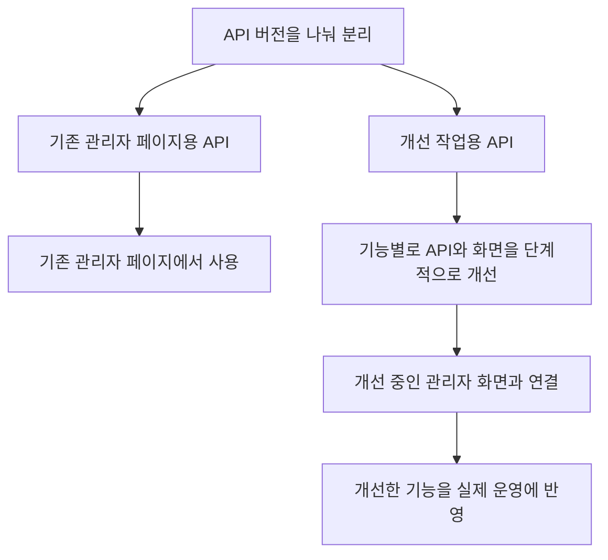

# 관리자 화면과 API 개선

[플랫폼 작업 목록](README.md)으로 돌아갑니다.

## 기본 정보

| 항목 | 내용 |
| --- | --- |
| 작업 기간 | 2021-07 ~ 2024-01 근무 중 진행 |
| 맡은 범위 | 인터널팀 리드, 기획, API 수정과 구조 전환 지원 |
| 개발 상태 | 개발 완료 |
| 운영 상태 | 운영 중 |

## 왜 시작했는지

- 시작한 이유: 기존 Vue.js 관리자 화면은 기능을 추가하고 수정하기 어려웠다.
- 해결할 문제: 화면에서 함께 쓸 코드와 서버 연결 방식이 정리되어 있지 않았다.

## 역할 분담

- 본인: 인터널팀 리드로 디자이너와 함께 기획하고 구조 전환을 지원했다.
- 프론트엔드 담당자: 신입 개발자가 화면 개선을 맡았다.
- 지원한 내용: 기존 코드의 동작을 설명하고, 필요한 API를 수정하며, 전환할 구조를 함께 논의했다.

## 기술 스택

| 구분 | 기술 |
| --- | --- |
| 프론트엔드 | React, TypeScript |
| API | REST API |

프로젝트에서 사용한 기술입니다. 화면 개선은 프론트엔드 담당자가 맡았습니다.

## 어떻게 해결했는지

- 팀에서 바꾼 내용: 관리자 화면을 React로 바꾸고 TypeScript를 적용했다. 함께 쓰는 화면 요소와 서버 요청 코드를 정리했다.
- API 전환 방식: 기존 관리자 페이지용 API와 개선 작업용 API를 버전으로 나눠 분리했다. 분리한 API를 바탕으로 단계적으로 구조를 개선했다.
- 작업 단위: 기능별로 나눠 순차적으로 개선하고, 개선한 기능을 실제 운영에 반영했다.

## 결과와 현재 상태

- 결과: 화면을 수정하고 새 기능을 추가하기 쉬운 구조로 바꾸고, 개선한 기능을 서비스에 반영해 운영했다.

## API 버전을 나눈 전환 흐름

