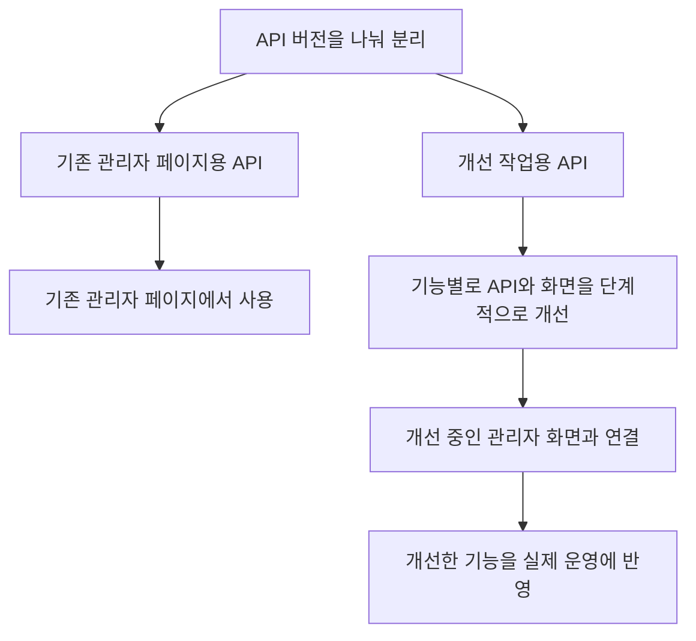

# 관리자 화면과 API 개선

[플랫폼 작업 목록](README.md)으로 돌아갑니다.

**작업 기간:** 근무 기간인 2021-07 ~ 2024-01 중 진행. 정확한 작업 기간은 확인되지 않았다.

## 시작한 이유와 문제

- 시작한 이유: 기존 Vue.js 관리자 화면은 기능을 추가하고 수정하기 어려웠다.
- 해결할 문제: 화면에서 함께 쓸 코드와 서버 연결 방식이 정리되어 있지 않았다.

## 맡은 일과 역할 분담

- 진행 방식: 별도로 구성된 인터널팀에서 리드로 진행했다.
- 기획: 백엔드 개발자인 본인과 디자이너가 함께 필요한 기능을 기획했다.
- 맡은 일: 인터널팀 리드로서 디자이너와 함께 기획하고, 프론트엔드 개발자의 구조 전환 작업을 지원했다.
- 역할 분담: 본인과 디자이너가 함께 기획했다. 신입 프론트엔드 개발자가 화면 개선을 맡고, 본인은 구조 전환을 지원했다.
- 지원한 내용: 기존 코드의 동작을 설명하고, 필요한 API를 수정하며, 전환할 구조를 함께 논의했다.

## 사용 기술

- 팀에서 사용한 기술: React, TypeScript, REST API.

## 처리 방법

- 팀에서 바꾼 내용: 관리자 화면을 React로 바꾸고 TypeScript를 적용했다. 함께 쓰는 화면 요소와 서버 요청 코드를 정리했다.
- API 전환 방식: 기존 관리자 페이지용 API와 개선 작업용 API를 버전으로 나눠 분리했다. 분리한 API를 바탕으로 단계적으로 구조를 개선했다.
- 작업 단위: 기능별로 나눠 순차적으로 개선하고, 개선한 기능을 실제 운영에 반영했다.

## 결과와 현재 상태

- 결과: 화면을 수정하고 새 기능을 추가하기 쉬운 구조로 바꿨다.

## API 버전을 나눈 전환 흐름

기능별 개선과 운영 반영을 진행했다. 전체 기능의 전환 완료 여부와 작업 기간은 확인되지 않았다.

## 기록 근거

본인이 제공한 경력 문서와 대화를 기준으로 적었습니다. 관련 커밋과 PR은 아직 연결하지 않았습니다.
