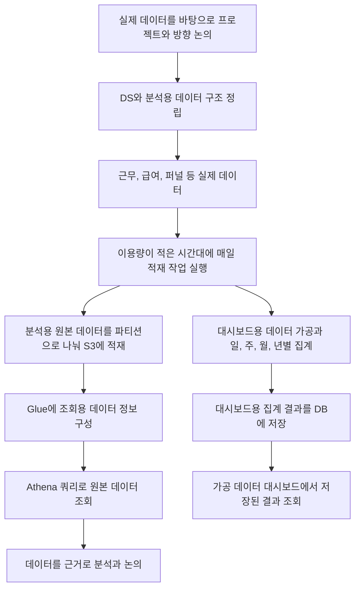

# 데이터 분석 환경과 대시보드

[플랫폼 작업 목록](README.md)으로 돌아갑니다.

## 기본 정보

| 항목 | 내용 |
| --- | --- |
| 작업 기간 | 미확인 |
| 맡은 범위 | DS와 데이터 구조 정리, 수집과 가공, 적재와 분석 환경 구성 |
| 개발 상태 | 개발 완료 |
| 운영 상태 | 운영 반영 완료 |

## 왜 시작했는지

- 시작한 이유: 내부 프로젝트와 서비스 방향을 정할 때 실제 데이터를 바탕으로 논의하는 방식이 자리 잡지 않은 상태였다.
- 추가 문제: 가공 데이터를 보여주는 대시보드에서 조회할 때마다 집계하면서 서버 자원 사용이 커지는 문제가 있었다.

## 역할 분담

- 함께 정한 내용: DS와 분석에 필요한 데이터 구조를 정립했다.
- 본인: 데이터 수집과 적재, 대시보드용 가공, 파티셔닝, S3, Athena, Glue 구성을 맡았다.

## 기술 스택

| 구분 | 기술 |
| --- | --- |
| 스토리지 | AWS S3 |
| 데이터 분석 | AWS Glue, AWS Athena |

## 어떻게 해결했는지

- 분석 대상: 근무 데이터, 급여 데이터, 사용자가 단계별로 이동하거나 이탈하는 흐름을 보는 퍼널 데이터 등.
- 원본 데이터: 대시보드용 집계와 별도로, 그 밖의 데이터는 원본 형태로 S3에 적재했다. Glue에 조회에 필요한 데이터 정보를 구성하고 Athena에서 쿼리로 조회할 수 있게 했다.
- 적재 주기: 하루 한 번. 한국 서비스의 이용량이 적은 시간대에 진행했다.
- 대시보드 개선: 가공 데이터 대시보드에 한해, 조회할 때마다 계산하던 방식을 일, 주, 월, 년별 집계 결과를 미리 DB에 저장하고 조회하는 방식으로 바꿨다.

## 결과와 현재 상태

- 결과: 분석 담당자가 운영 데이터를 조회하고 활용할 수 있는 환경을 만들었다.
- 운영 개선: 가공 데이터 대시보드의 반복 집계로 발생하던 서버 자원 문제를 개선했다. 세부 자원 항목과 개선 수치는 미확인.
- 서비스에 반영하고 실제 운영까지 진행했다.
- 서비스 반영 날짜: 미확인.

## 데이터 분석 흐름

