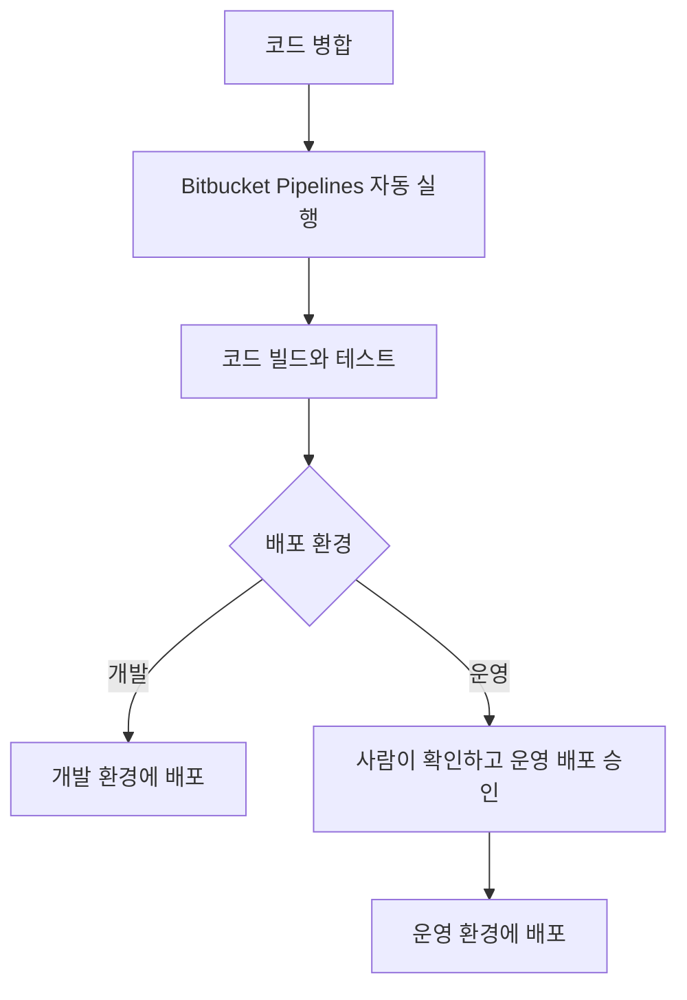

# 자동 배포

[플랫폼 작업 목록](README.md)으로 돌아갑니다.

**작업 기간:** 근무 기간인 2021-07 ~ 2024-01 중 진행. 정확한 작업 기간은 확인되지 않았다.

## 시작한 이유와 문제

- 이전 방식: EC2에 직접 배포했다.
- 시작한 이유: 직접 배포하는 반복 작업을 줄이고 배포 절차를 일정하게 만들 필요가 있었다.

## 맡은 일과 역할 분담

- 맡은 일: Bitbucket Pipelines 설정을 작성했다.
- 역할 분담: 선임 개발자가 Elastic Beanstalk 구성을 맡고, 본인은 해당 환경으로 배포하는 파이프라인을 작성했다.

## 사용 기술

- 직접 사용한 기술: Bitbucket Pipelines.
- 연결한 배포 환경: AWS Elastic Beanstalk.

## 처리 방법

- 배포 환경: 개발과 운영 두 환경으로 나눴다.
- 실행 조건: 코드가 합쳐지면 파이프라인이 자동으로 실행되도록 했다. 운영 배포는 사람이 확인하고 승인한 뒤 진행하도록 했다.
- 처리 방법: 코드 빌드와 테스트를 거쳐 Elastic Beanstalk에 배포되도록 연결했다. 개발은 자동 배포하고 운영은 사람의 승인을 거쳐 배포했다.

## 결과와 현재 상태

- 결과: 수동 작업을 줄이고 같은 절차로 배포할 수 있게 했다.
- 반영 기록: 서비스에 적용한 세부 범위와 날짜는 확인되지 않았다.

## 배포 방식 변경

이전에는 EC2에 직접 배포했다. 변경 후에는 아래 흐름으로 배포하도록 구성했다.

배포 대상은 선임 개발자가 구성한 Elastic Beanstalk 환경이다. 운영 배포는 사람의 승인을 받아 진행했다.
