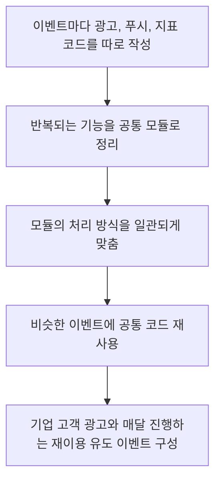
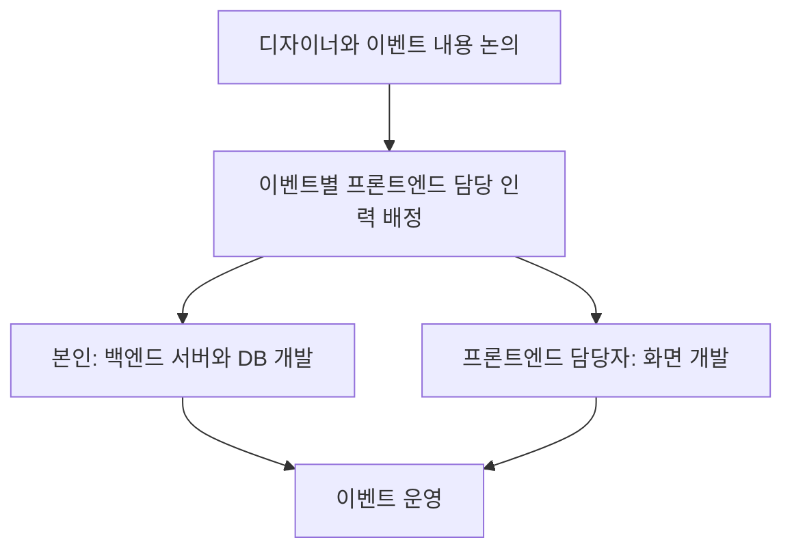

# 이벤트 공통 코드 정리

[플랫폼 작업 목록](README.md)으로 돌아갑니다.

**작업 기간:** 근무 기간인 2021-07 ~ 2024-01 중 진행. 정확한 작업 기간은 확인되지 않았다.

## 시작한 이유와 문제

- 시작한 이유: 기업 고객 대상 광고와 매달 진행하는 재이용 유도 이벤트를 만들 때, 이벤트별로 코드를 따로 작성하고 있었다.
- 해결할 문제: 비슷한 이벤트에도 같은 코드를 반복해서 작성해야 했고, 처리 방식이 서로 달라질 수 있었다.

## 맡은 일과 역할 분담

- 맡은 일: 관련 코드를 공통 모듈로 정리해 처리 방식을 맞추고, 비슷한 이벤트를 재사용 가능한 코드로 만들 수 있게 했다.
- 직접 맡은 범위: 공통 코드 정리와 이벤트 운영에 필요한 백엔드 서버와 DB 개발.
- 진행 방식: 디자이너와 논의한 뒤 이벤트별로 프론트엔드 담당 인력을 정해 함께 진행했다.
- 역할 분담: 디자이너와 내용을 논의하고, 본인은 백엔드 서버와 DB를 맡았다. 화면 개발은 각 이벤트의 프론트엔드 담당자가 진행했다.

## 사용 기술

- 사용 기술: Node.js, MongoDB, AWS Lambda, AWS EventBridge.

## 처리 방법

- 대상 기능: 광고를 통한 사용자 유입과 단계별 행동 확인, 푸시 발송, 지표 수집, 지표 알림.
- 처리 방법: Node.js와 MongoDB로 운영 API를 만들고, Lambda와 EventBridge로 예약 실행 흐름을 구성했다.

## 결과와 현재 상태

- 결과: 광고, 푸시, 지표 수집과 알림의 공통 코드를 재사용해 비슷한 이벤트를 반복해서 만들 수 있게 했다.
- 반영 기록: 서비스에 적용한 세부 범위와 날짜는 확인되지 않았다.

## 이벤트 코드 정리 흐름

## 이벤트별 협업 흐름

## 기록 근거

본인이 제공한 경력 문서와 대화를 기준으로 적었습니다. 관련 커밋과 PR은 아직 연결하지 않았습니다.
