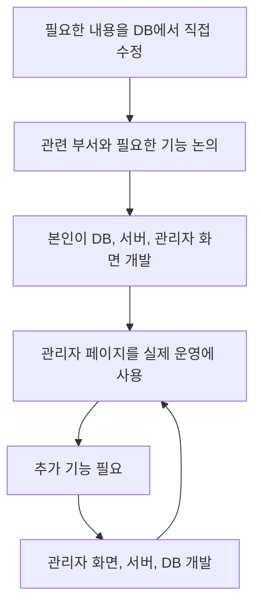

# 관리자 페이지 개발과 기능 추가

[플랫폼 작업 목록](README.md)으로 돌아갑니다.

**작업 기간:** 2021-07 ~ 2024-01 근무 기간 동안 필요에 따라 기능 추가. 초기 개발 기간은 미확인.

## 시작한 이유와 문제

- 시작한 이유: 운영에 필요한 내용을 DB에서 직접 수정하고 있었다.
- 해결할 문제: 관련 부서가 필요한 작업을 관리자 화면에서 처리할 수 있게 해야 했다.

## 맡은 일과 역할 분담

- 기능 정리: 관련 부서와 논의하고 회의하며 필요한 기능을 정리했다.
- 초기 개발: 사내 사이드 프로젝트로 시작해 DB, 서버, 관리자 화면을 혼자 설계하고 개발했다.
- 이후 작업: 근무 기간 동안 필요한 기능이 생기면 관리자 화면, 서버, DB를 풀스택으로 개발했다.

## 사용 기술

- 사용 기술: Node.js, Express, Vue.js, Nuxt.js, MongoDB.

## 처리 방법

- 만든 기능: 정산 요청 확인, 수기 내역 기록, 상태 변경, 사용자 관리, 인증, 운영 기록 조회.

## 결과와 운영 상태

- 결과: 수작업으로 처리하던 일을 관리자 도구에서 처리할 수 있게 했다. 이후 내부 도구를 개선할 기반을 만들었다.
- 운영 상태: 서비스에 반영하고 실제 운영까지 진행했다.

## 개발과 운영 흐름

관련 작업: [급여 정산과 환불](settlement.md)
