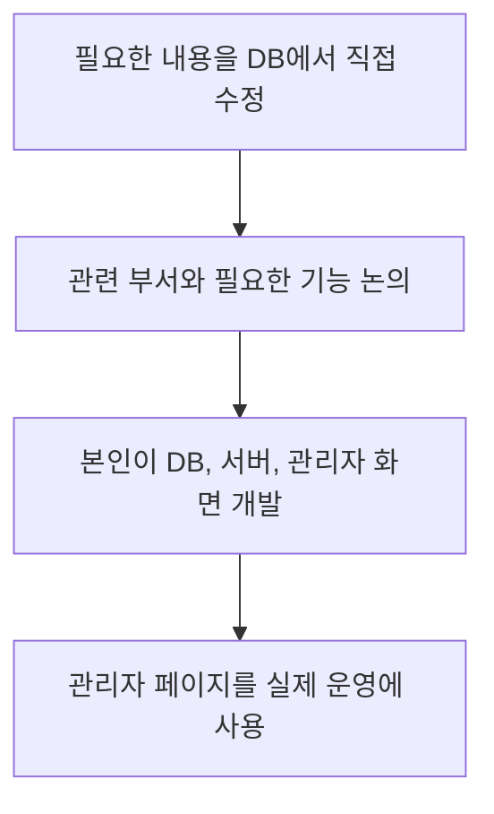

# 초기 관리자 페이지

[플랫폼 작업 목록](README.md)으로 돌아갑니다.

**작업 기간:** 근무 기간인 2021-07 ~ 2024-01 중 진행. 정확한 작업 기간은 확인되지 않았다.

## 시작한 이유와 문제

- 시작한 이유: 운영에 필요한 내용을 DB에서 직접 수정하고 있었다.
- 해결할 문제: 관련 부서가 필요한 작업을 관리자 화면에서 처리할 수 있게 해야 했다.

## 맡은 일과 역할 분담

- 기능 정리: 관련 부서와 논의하고 회의하며 필요한 기능을 정리했다.
- 진행 방식: 사내 사이드 프로젝트로 진행했다.
- 맡은 일: DB, 서버, 관리자 화면을 혼자 설계하고 개발했다.
- 역할 분담: 관련 부서와 필요한 기능을 논의하고, 개발은 본인이 혼자 맡았다.

## 사용 기술

- 사용 기술: Node.js, Express, Vue.js, Nuxt.js, MongoDB.

## 처리 방법

- 만든 기능: 정산 요청 확인, 수기 내역 기록, 상태 변경, 사용자 관리, 인증, 운영 기록 조회.

## 결과와 현재 상태

- 결과: 수작업으로 처리하던 일을 관리자 도구에서 처리할 수 있게 했다. 이후 내부 도구를 개선할 기반을 만들었다.
- 현재 상태: 실제 운영에 사용했다.

## 개발과 운영 흐름

급여 정산과 환불 목록, 관련 정보 확인, 실제 근무 여부 확인, 관리자 권한 처리는 [별도 정산 프로젝트](settlement.md)에 정리했습니다.

회사 업무를 개선하기 위한 사내 사이드 프로젝트로, 회사 경력에 포함합니다.

## 기록 근거

본인이 제공한 경력 문서와 대화를 기준으로 적었습니다. 관련 커밋과 PR은 아직 연결하지 않았습니다.
