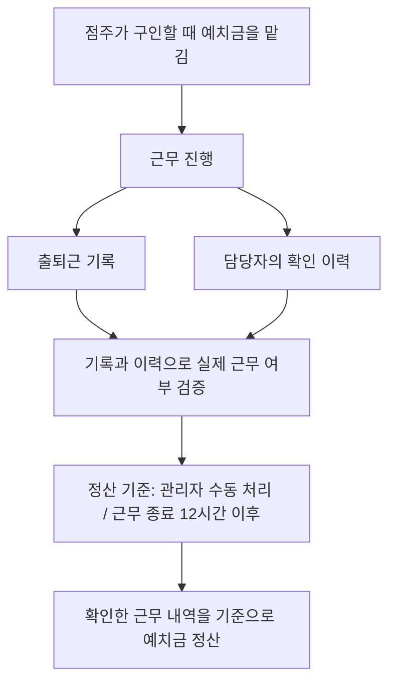
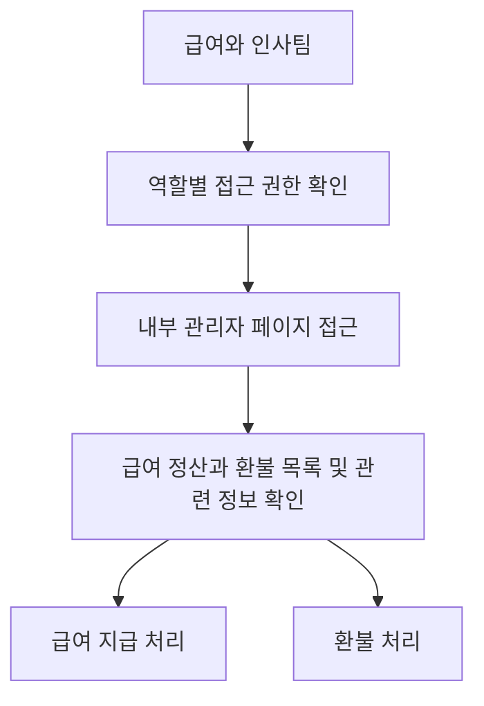
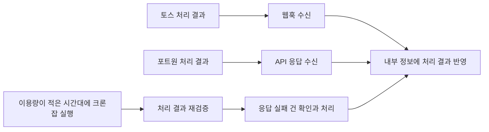

# 급여 정산과 환불 관리

[플랫폼 작업 목록](README.md)으로 돌아갑니다.

## 기본 정보

| 항목 | 내용 |
| --- | --- |
| 구분 | 회사 |
| 회사 설명 | 기업과 개인을 대상으로 단기 구인구직 서비스를 제공하는 플랫폼 기업 |
| 근무 기간 | 2021-07 ~ 2024-01 |
| 작업 기간 | 약 1개월. 정확한 시작일과 종료일은 확인되지 않음 |
| 관련 서비스 | 포트원, 토스 |
| 화면 개발 기술 | Vue.js, Nuxt.js 2 |
| 서버 기술 | Node.js, Express |
| DB | MongoDB |
| 직접 맡은 범위 | 서버, DB, 관리자 화면 전체 풀스택 개발 |
| 개발 방식 | 정산 관련 개발은 혼자 담당 |
| 관리자 접근 범위 | 급여와 인사팀만 역할에 따라 접근 |

## 시작한 이유와 문제

- 포트원과 토스의 관리자 화면에서 각각 환불을 처리하고 있었다.
- 그 과정에서 외부 서비스와 내부의 환불 정보가 서로 맞지 않는 문제가 발생했다.
- 급여 지급과 환불을 내부 관리자 페이지에서 처리하고 관련 정보를 맞춰 관리할 필요가 있었다.
- 실제 근무 여부를 확인할 데이터가 필요했다.
- 정산 관련 정보는 관리자 권한이 있는 사람만 볼 수 있어야 했다.

## 정리한 기능

- 급여 정산과 환불 내역을 목록으로 확인할 수 있게 했다.
- 급여 지급과 환불 실행을 내부 관리자 페이지에서 처리할 수 있게 했다.
- 포트원과 토스에서 확인하던 관련 정보를 내부 관리자 페이지에서 최대한 확인할 수 있게 정리했다.
- 외부 서비스 정보와 내부 정보가 서로 맞도록 정리했다.
- 출퇴근 기록과 담당자의 확인 이력을 검증한 뒤 예치금을 기준으로 정산하도록 구성했다.
- 급여와 인사팀에만 역할별 접근 권한을 부여했다.
- 이용량이 적은 시간대에 크론잡으로 처리 결과를 다시 확인하고 응답 실패 건을 처리했다.

## 예치금과 정산 흐름

1. 점주가 구인할 때 예치금을 맡긴다.
2. 출퇴근 기록과 담당자의 확인 이력을 확인해 실제 근무 여부를 검증한다.
3. 관리자 수동 처리와 근무 종료 12시간 이후 정산을 기준으로 운영한다.
4. 검증한 내용을 기준으로 맡겨 둔 예치금에서 정산한다.

### 예치금 정산 순서도

### 내부 관리자 페이지 처리 흐름

## 처리 결과를 반영한 방법

- 토스: 웹훅으로 전달받은 처리 결과를 내부 정보에 반영했다.
- 포트원: API 응답으로 받은 처리 결과를 내부 정보에 반영했다.
- 결과 재확인: 한국 서비스의 이용량이 적은 시간대에 크론잡을 실행했다. 처리 결과를 다시 검증하고 응답 실패 건을 처리했다.

## 결과와 현재 상태

- 내부 관리자 페이지를 실제 운영에 사용했다.
- 정산과 환불에 필요한 정보를 내부 관리자 페이지에서 확인할 수 있게 정리했다.
- 급여 지급과 환불 실행까지 내부 관리자 페이지에서 처리하도록 만들었다.
- 처리 결과를 다시 검증하고 응답 실패 건을 처리하는 흐름을 운영했다.

- 서비스 반영 날짜: 미확인.
