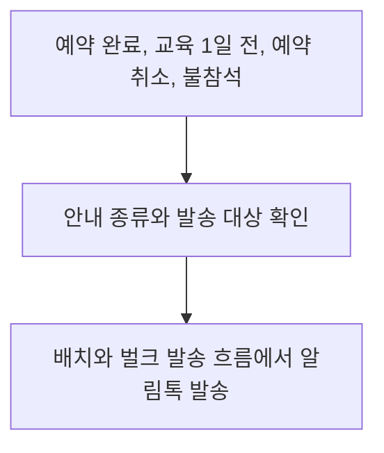

# 예약 메시지 발송 비용 개선

[공공 교육 플랫폼 작업 목록](README.md)으로 돌아갑니다.

예약 안내 메시지를 LMS에서 알림톡으로 전환해 발송 단가를 낮췄습니다.

## 기본 정보

| 항목 | 내용 |
| --- | --- |
| 작업 기간 | 2025-11 이후 근무 중 진행 |
| 맡은 범위 | 서비스 코드 검토, 비용 개선안 제안과 협의, 서버 발송 로직 개선 |
| 개발 상태 | 개발 완료 |
| 운영 상태 | 운영 중 |

## 왜 시작했는지

예약 취소와 재예약에 따른 반복 발송 비용을 줄이기 위해 알림톡 전환을 제안했습니다.

## 기술 스택

| 구분 | 기술 |
| --- | --- |
| 언어 | TypeScript |
| 백엔드 | NestJS, TypeORM |
| 데이터베이스 | MySQL |
| 메시지 발송 | NCP SENS |

## 어떻게 해결했는지

1. 서비스 전체 코드를 검토하며 기존 LMS 발송 로직과 발송 시점, 대상 규모를 분석했습니다.
2. 예약 완료, 교육 1일 전, 예약 취소와 불참석 안내를 정리하고 알림톡 전환안을 제안했습니다.
3. 관련 부서와 기획 담당자, 경영진과 개선 방향을 협의하고 승인 후 개발을 진행했습니다.
4. 배치와 벌크 발송 흐름의 LMS 의존 구간을 알림톡 기반으로 변경했습니다.
5. 개선한 발송 구조를 운영 서비스에 반영했습니다.

## 발송 흐름

## 비용 산정

계약 지역 10곳, 대상 38,000명에게 예약 완료와 교육 1일 전 안내를 각각 한 번 보낸다고 가정했습니다.
이 두 가지 안내만 계산한 발송량은 76,000건입니다.

| 항목 | LMS | 알림톡 |
| --- | --- | --- |
| 적용 단가 | 30원 | 7.5원 |
| 예상 발송 비용 | 2,280,000원 | 570,000원 |

이 조건에서 예상 절감액은 1,710,000원이며, 발송 단가와 예상 비용은 75% 낮아집니다.
실제 청구 금액을 비교한 실적이 아닌, 위 단가와 발송량을 적용한 예상 금액입니다.
취소, 불참석 안내와 반복적인 취소 및 재예약에 따른 추가 발송은 이 계산에 포함하지 않았습니다.
따라서 실제 발송량과 기존 LMS 비용은 이 예시보다 커질 수 있습니다.
같은 단가를 적용하면 추가 발송량에 비례해 알림톡 전환으로 줄일 수 있는 비용도 늘어납니다.

## 결과와 현재 상태

알림톡 전환을 운영 서비스에 반영했습니다.
계약 지역과 대상 인원이 늘어날 때 메시지 발송 비용의 증가를 줄일 수 있는 구조를 마련했습니다.
