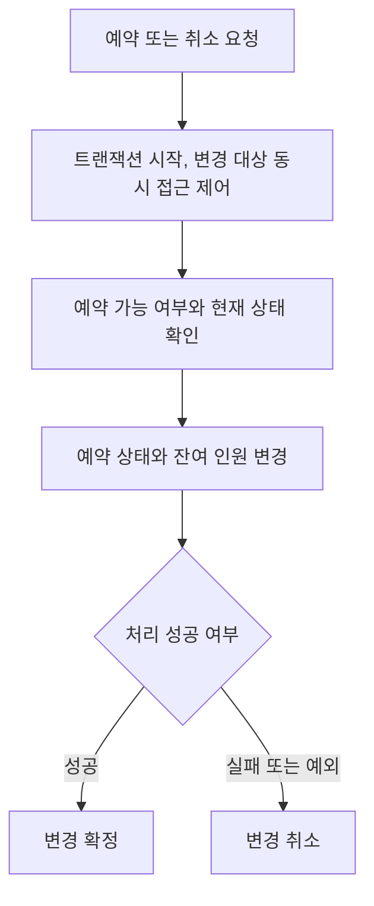

# 예약과 취소의 동시 요청 처리 개선

[공공 교육 플랫폼 작업 목록](README.md)으로 돌아갑니다.

예약과 취소에서 상태 변경과 잔여 인원 갱신을 하나의 처리로 묶었습니다.

## 기본 정보

| 항목 | 내용 |
| --- | --- |
| 작업 기간 | 2025-11 이후 근무 중 진행 |
| 맡은 범위 | 예약과 취소 서버 로직, DB 동시 접근 처리 개선 |
| 개발 상태 | 개발 완료 |
| 운영 상태 | 운영 중 |

## 왜 시작했는지

예약 가능 인원과 예약 상태를 카운트 기반으로 관리하고 있었습니다.
예약과 취소 과정이 트랜잭션으로 묶이지 않아 동시 요청 시 초과 예약이나 잔여 인원 불일치가 생길 수 있었습니다.

## 기술 스택

| 구분 | 기술 |
| --- | --- |
| 언어 | TypeScript |
| 백엔드 | NestJS, TypeORM |
| 데이터베이스 | MySQL |
| 인프라 | NCP |

## 어떻게 해결했는지

- 예약 가능 여부 확인, 예약 생성, 상태 변경과 잔여 인원 갱신을 하나의 트랜잭션으로 묶었습니다.
- MySQL 데이터 갱신 구간의 동시 접근을 제어하도록 DB 잠금 처리를 적용했습니다.
- 예약 성공, 실패, 취소와 예외 상황에서 상태와 인원 수가 함께 반영되도록 정리했습니다.

## 처리 흐름

## 결과와 현재 상태

동시 요청에서 예약 상태와 잔여 인원이 어긋날 위험을 줄였습니다.
예약과 취소의 상태 변경을 일관되게 처리하도록 개선하고 운영 서비스에 반영했습니다.
