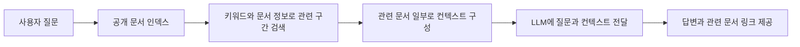

# 사이트 소개

백엔드 개발자로 일하며 해결한 문제와 프로젝트 경험을 정리한 개인 사이트입니다. 근무 이력과 프로젝트별 설계, 개발, 운영 기록을 담고 있습니다.

## AI 질문 기능

공개 문서 검색 결과를 컨텍스트로 활용하는 LLM 질문 기능입니다. 질문에서 핵심 키워드를 뽑아 문서 제목, 분류, 본문과 비교하고 관련 구간을 고른 뒤 해당 내용을 LLM에 전달합니다.

임베딩이나 벡터 DB 기반 검색은 사용하지 않습니다. 답변과 함께 관련 원문 링크를 제공해 문서에서 다시 확인할 수 있게 했습니다.

## 문의와 정정

개별 문의는 [kim.h.g199510@gmail.com](mailto:kim.h.g199510@gmail.com)으로 보내 주세요. 문서 수정이나 사이트 오류는 [GitHub Issues](https://github.com/KimHG1995/work-history/issues)로 알려 주세요. GitHub Issues에 작성한 내용은 공개되므로 개인정보나 비밀값은 입력하지 마세요.

방문 분석과 질문 기능의 정보 처리는 [개인정보 안내](./privacy.md)에서 확인할 수 있습니다.
