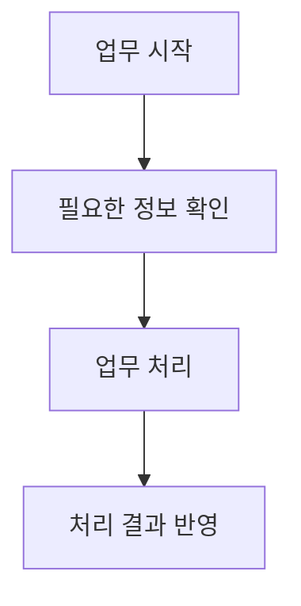

# [작업 이름]

[프로젝트 작업 목록](README.md)으로 돌아갑니다.

[어떤 일을 하며 무엇을 바꿨는지 한두 문장으로 적습니다.]

## 기본 정보

| 항목 | 내용 |
| --- | --- |
| 작업 기간 | [실제 참여 기간. 모르면 미확인] |
| 맡은 범위 | [직접 맡은 일을 한 문장으로 요약] |
| 개발 상태 | [개발 완료, 개발과 유지보수 중 등] |
| 운영 상태 | [운영 반영 완료, 운영 중, 미반영 등. 확인한 날짜가 있으면 함께 표기] |

[개발 서버 배포일 등 추가로 확인한 일정이 있을 때만 이 위치에 적습니다.]

## 왜 시작했는지

[문제와 바꾸려던 이유만 한두 문장으로 적습니다. 기존 기술 나열과 국가 등 불필요한 배경은 빼고, 필요한 세부 조건은 해결 방법에 적습니다.]

## 역할 분담

| 담당 역할 | 맡은 일 |
| --- | --- |
| 본인 | [직접 맡은 일] |
| [다른 담당 역할] | [함께 정하거나 연결한 일] |

[협업 내용이 없거나 기본 정보와 같으면 이 항목을 생략합니다. 사람 이름은 적지 않습니다.]

## 기술 스택

| 구분 | 기술 |
| --- | --- |
| 언어 | [사용한 언어] |
| 프론트엔드 | [사용한 기술] |
| 백엔드 | [사용한 기술] |
| 데이터베이스 | [사용한 기술] |
| 인프라와 배포 | [사용한 기술] |

[쓰지 않은 분류는 지우고 필요한 분류만 추가합니다. 다른 담당자가 사용한 기술은 표 아래에 구분해 적습니다. 기술 선택 이유와 사용 방법은 본문에 적습니다.]

## 어떻게 해결했는지

1. [문제를 확인한 방법]
2. [직접 고치거나 새로 만든 내용]
3. [다른 담당자와 함께 정하거나 연결한 내용]

[내용이 길면 기능별 소제목으로 나눕니다.]

## 처리 흐름

[위 그림은 양식용 예시입니다. 확인한 흐름으로 바꾸고 이 안내를 지웁니다. 구조도나 비용 비교는 필요한 경우 같은 파일에 추가합니다.]

## 결과와 현재 상태

- [실제로 달라진 점]
- [남은 작업이나 제한이 있을 때만 기재]

[실제 성과와 예상 수치를 구분합니다. 회사명, 사람 이름, 작성 경위, 빈 근거 항목은 남기지 않습니다. 코드와 저장소 링크는 사용자가 공개를 허용한 경우에만 넣습니다.]
