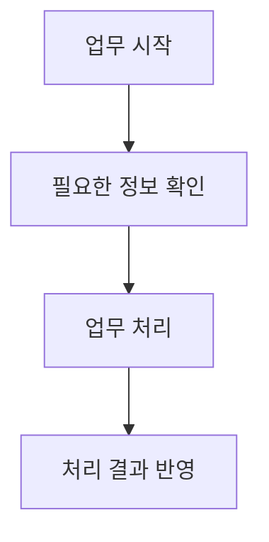

# [작업 이름]

이 파일을 `projects/<묶음>/<작업>.md`로 복사해 씁니다.
복사한 뒤 이 안내를 지우고 같은 폴더의 `README.md`로 돌아가는 링크를 넣습니다.
대괄호 안 안내는 실제 내용으로 바꿉니다.
모르는 내용은 `확인 필요`, 관련 없는 내용은 `해당 없음`으로 적습니다.
회사 이름이나 별칭, 사람 이름이나 계정 이름은 적지 않습니다.

[어떤 일을 하며 무엇을 바꾼 작업인지 한두 문장으로 설명합니다.]

## 기본 정보

| 항목 | 내용 |
| --- | --- |
| 실제 참여 기간 | [시작일 ~ 종료일 또는 진행 중] |
| 커밋으로 확인한 기간 | [첫 작업일 ~ 마지막 작업일 또는 확인 필요] |
| 내가 맡은 범위 | [책임지고 맡은 기능과 일] |
| 개발 상태 | [시작 전, 진행 중, 개발 완료, 확인 완료, 보류 등] |
| 운영 상태 | [실제 서비스 반영일, 미반영, 확인 필요 또는 해당 없음] |
| 기록 기준일 | [YYYY-MM-DD] |

## 왜 시작했는지

- 이전 상황: [기존에 처리하던 방식]
- 문제와 영향: [무엇이 불편했고 누구에게 영향을 줬는지]
- 시작한 이유: [왜 필요했고 무엇을 바꾸려 했는지]

## 역할 분담

사람 이름 대신 `화면 개발 담당자`처럼 역할을 적습니다.
프로젝트 전체 작업과 내가 직접 한 일을 나눠 적습니다.

| 담당 역할 | 함께한 기간 | 맡은 일 | 함께 정하거나 연결한 일 |
| --- | --- | --- | --- |
| 본인 | [기간] | [직접 맡은 일] | [다른 담당자와 함께한 일] |
| [다른 담당 역할] | [기간] | [확인한 담당 범위] | [함께한 일] |

## 언어와 기술

| 구분 | 팀이나 프로젝트에서 쓴 기술 | 내가 직접 쓴 기술 | 사용한 곳 |
| --- | --- | --- | --- |
| 언어와 개발 도구 | [기술] | [직접 쓴 기술] | [어떤 작업에 썼는지] |
| 데이터 저장 | [기술] | [직접 쓴 기술] | [어떤 작업에 썼는지] |
| 실행과 배포 | [환경과 도구] | [직접 쓴 환경과 도구] | [어떤 작업에 썼는지] |

필요한 기술 항목을 추가합니다. 버전은 확인한 경우에만 적습니다.

## 어떻게 해결했는지

1. [문제를 확인한 방법]
2. [직접 고치거나 새로 만든 내용]
3. [다른 담당자와 함께 정하거나 연결한 내용]

- 방법을 고른 이유: [상황에 맞았던 이유]
- 비교한 다른 방법: [다른 방법과 차이 또는 해당 없음]
- 남은 제한: [아직 해결하지 못한 문제 또는 해당 없음]

### 필요한 구조

작업을 이해하는 데 필요한 화면, 서버, 저장소, 폴더만 적습니다.

| 구성 요소나 폴더 | 하는 일 | 연결된 대상 | 내가 바꾼 부분 |
| --- | --- | --- | --- |
| [이름이나 경로] | [담당하는 기능] | [요청이나 데이터를 주고받는 곳] | [직접 작업한 내용] |

## 업무 순서도

아래는 양식용 예시입니다. 실제 기록이 아니므로 확인한 업무 흐름으로 바꿉니다.
누가 시작하고 무엇을 처리하며 결과를 어디에 반영하는지 보여줍니다.

- 실행 조건: [언제, 어떤 조건에서 시작하는지 또는 확인 필요]
- 실패 처리: [실패할 때 하는 일 또는 확인 필요]
- 확인이 필요한 흐름: [아직 모르는 단계 또는 해당 없음]

긴 흐름은 같은 파일 안에서 업무 처리와 외부 서비스 결과 수신으로 나눕니다.

## 결과와 현재 상태

| 바꾸기 전 | 바꾼 후 | 확인 방법과 날짜 | 근거 |
| --- | --- | --- | --- |
| [이전 상태] | [달라진 점] | [확인 조건, 방법, 날짜] | [문서나 이슈 주소] |

수치는 같은 조건의 전후 값을 적습니다. 확인하지 못한 결과는 `확인 필요`로 둡니다.

- 끝낸 일: [완료한 범위]
- 진행 중인 일: [현재 작업 또는 해당 없음]
- 남은 일: [추가 작업 또는 해당 없음]
- 서비스 반영: [반영일과 확인 근거, 미반영 또는 확인 필요]
- 보류나 되돌린 변경: [이유와 다시 시작할 조건 또는 해당 없음]

코드를 합친 사실만으로 실제 서비스에 반영됐다고 적지 않습니다.

## 근거와 주요 변경

같은 목적의 커밋은 묶어 적습니다. 커밋 수로 기여도나 진행률을 정하지 않습니다.
커밋 날짜와 실제 참여 기간은 따로 확인합니다.

| 날짜 또는 기간 | 종류 | 주소 또는 커밋 번호 | 바꾼 내용과 이 작업의 관계 |
| --- | --- | --- | --- |
| [기간] | [커밋, PR, 이슈, 문서] | [주소 또는 번호] | [무엇을 바꾸거나 확인한 근거인지] |

## 배운 점

[다음에 같은 일을 할 때 도움이 될 내용을 짧게 적습니다.]
